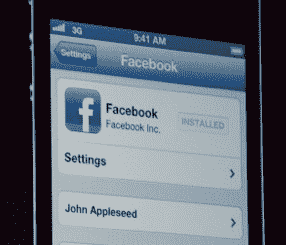
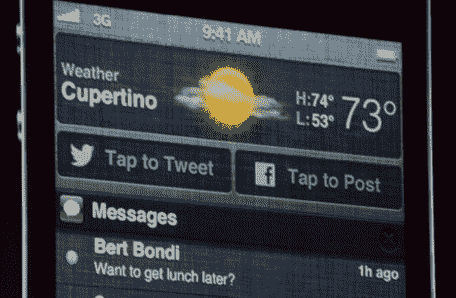
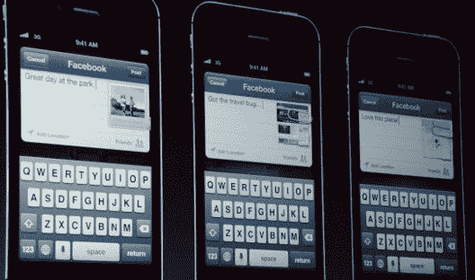

# 苹果让脸书与 Siri、分享、应用商店、API  深度整合到 iOS 6 中

> 原文：<https://web.archive.org/web/https://techcrunch.com/2012/06/11/facebook-apple-wwdc/>

苹果刚刚在 2012 年 WWDC 大会上宣布，[脸书将深度集成到 iOS 6](https://web.archive.org/web/20230406154442/http://www.apple.com/ios/ios6/#facebook) 中，包括应用的单点登录、通知的快速共享、Siri 集成、联系人同步、iTunes 和应用商店中的共享按钮、游戏中心与朋友的交流以及公共 API。

这种令人震惊的全面整合可能会让苹果和脸书联手对抗谷歌 Android，并共同推出更多产品。脸书现在在 iOS(和 OS X Mountain Lion)中的出现将比 Twitter 更加广泛——这与几个小时前 140 个字符是苹果社交方式的巨大逆转。

随着今年秋季 iOS 6 的发布，整合将为脸书带来大量内容，吸引人们到它的新闻源，通过广告赚钱。关于应用商店点赞的数据也有利于广告定位。正如我昨天详述的，由于 iOS 应用程序现在是带有类似按钮的开放图形对象，喜欢它们的人可以成为广告的目标。开发者可能愿意支付高额溢价，向类似应用或竞争对手应用的用户投放定向广告。

与此同时，苹果获得了更无缝的用户体验，人们不必做大量的复制、应用切换和粘贴来与朋友分享。它还将从链接到 iTunes 和 App Store 的故事驱动的推荐流量中获得销售收入。

以下是 iOS 6 中一些新的社交功能:

*   在 iOS 6 设置中授权脸书激活所有新的共享选项，并始终在原生移动应用程序上登录脸书。

*   一个“点击发布”到脸书的按钮，以及一个“点击发布”的按钮，正在被添加到 iOS 通知中心，这样你就可以下拉以快速访问共享。新的分享按钮也将出现在相机和照片应用程序中。

*   将照片、网站和地图位置共享到脸书。

*   使用你在 Facebook.com 上获得的所有内容、位置标签和隐私设置撰写帖子。我们仍在确认是否可以从 iOS 6 composer 添加朋友标签。

*   喜欢并查看哪些朋友已经喜欢了 iTunes store 和 App Store 中的应用程序、音乐、电影和电视节目。

*   你的脸书好友列表和 iOS 6 设备联系人也将更紧密地同步。如果一个朋友更新了他们在脸书上的电子邮件地址或电话号码，你的联系人档案也会更新。

今天早些时候，苹果宣布 Siri 获得了打开应用程序的能力，很快它还将允许你在脸书发布帖子。你也可以在游戏中心和你的脸书朋友“打嘴仗”。

由于基于脸书的公共 API，第三方开发者将能够为我们创造新的方式来与世界上最受欢迎的社交网络分享。开发者已经在向我询问这个 API 将允许什么，我们已经联系了脸书和苹果，一有消息就会在这里发布。

#### 苹果+脸书的下一步是什么？

此前，苹果公司首席执行官蒂姆·库克告诉 D10 观众“敬请期待”与脸书的新合作，并证实了 TechCrunch 的 MG·西格勒关于整合的早期报道。这代表着苹果和脸书之间冷淡关系的解冻，当脸书在最后一刻退出 iOS 4 时，这种关系恶化了。

将脸书烘焙到 iOS 中可能只是一种有限的集成，就像去年 iOS 5 中添加 Twitter 作为原生共享选项一样。尽管如此，它可能会导致脸书使用率的大幅提升，就像 iOS 5 的集成给 Twitter 带来的注册人数 3 倍的增长一样。

不过，脸书对 iOS 的嵌入比预期的更深，不仅仅是分享，还有 Siri 和通知。一年后，唯一出现的其他 Twitter 集成是它与脸书一起出现在[新的 Safari 共享按钮](https://web.archive.org/web/20230406154442/https://techcrunch.com/2012/06/11/new-version-of-safari-adds-gestures-icloud-tabs-twitter-integration/)中，以及与[脸书提醒和新 OS X Mountain Lion 通知中的帖子编辑器](https://web.archive.org/web/20230406154442/http://www.apple.com/osx/whats-new/)一起出现在“推文表”和推文编辑器中。

随着 iOS 6 被脸书淹没，这似乎更有可能是库克和扎克伯格的公司之间更强关系的[开始，这可能有助于击退他们共同的竞争对手谷歌。脸书现在是苹果青睐的社交网络，因为它出现在 iOS 和 OS X 的所有 Twitter 地方，但联系人同步是一个独家集成。](https://web.archive.org/web/20230406154442/https://techcrunch.com/2012/06/10/apple-facebook/)

也许脸书不需要马上造一部手机，因为主要的移动操作系统已经提供了大量的手机。

苹果和脸书可以继续在价值交换方面合作，苹果可以获得更好的用户体验和增强的病毒式传播，而脸书可以获得更多将内容传送到新闻提要的共享挂钩。

苹果多年来一直专注于硬件和内容商店，并通过 Ping 证明了社交不是它的最佳选择。但现在，随着脸书和 Twitter 在 iOS 用户可能需要它们的地方随处可见，以及社交网站悄悄进入 OS X 的迹象，苹果可能会满足于借用社交网站，而不是构建它。

*【图片来源:】The Verge*

