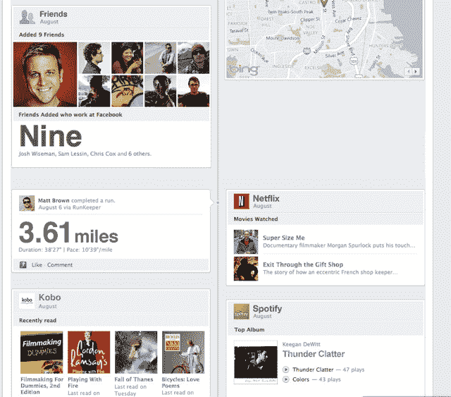

# 脸书应用现在可以在你的个人资料中嵌入内容

> 原文：<https://web.archive.org/web/http://techcrunch.com/2011/09/22/facebook-apps-can-now-embed-content-in-your-profile-again/>

# 脸书应用现在可以(再次)在你的个人资料中嵌入内容

如果你在脸书呆了一两年以上，你可能还记得在你的个人资料中嵌入第三方应用程序的时候。最初，可以在你的个人资料中嵌入应用程序插件(还记得那时每个人都有一张涂鸦图吗？)，但它们后来被归入单独的标签，因为它们导致了类似 MySpace 的混乱。最终，他们被完全从个人资料中删除。

今天，在 f8 的主题演讲中，脸书首席执行官马克·扎克伯格刚刚宣布，作为新的[时间轴功能](https://web.archive.org/web/20230203130811/https://techcrunch.com/2011/09/22/facebook-timeline/)的一部分，脸书应用程序将被重新引入用户档案中(这让你的档案看起来很像 Tumblr 博客)。

扎克伯格解释说，人们希望使用应用程序在他们的个人资料上表达自己，但脸书必须找到一种方法来防止它们变得笨拙。

这就是时间线出现的原因。应用程序现在可以创建时间线帖子，看起来像在脸书自己创建的帖子(如照片上传)。我们只是在屏幕上短暂地看到了它们，但它们看起来很适合，不像外国的小部件。我们将很快更新照片。

