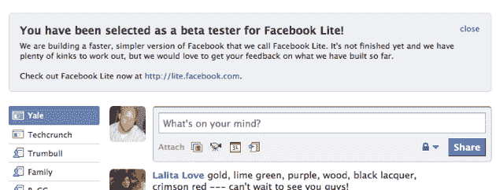
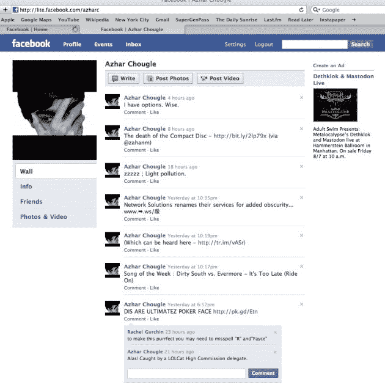
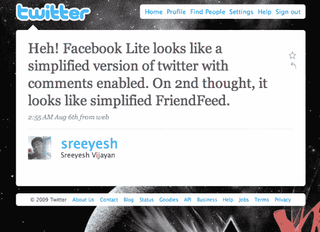

# 脸书开始测试脸书 Lite，一个更快更简单的服务版本 

> 原文：<https://web.archive.org/web/https://techcrunch.com/2009/08/11/facebook-begins-testing-facebook-lite-a-faster-simpler-version-of-the-service/>

看起来脸书今晚开启了一项名为“脸书精简版”的功能，供一些用户测试。我们被关于它的建议轰炸，我们中的一些人也看到了。不幸的是，它似乎可能还没有完全准备好黄金时间，但我们有更多的信息和下面的截图，所以继续阅读。

*【更新:见底部脸书的回应，今晚测试被错误地推广给了比预期更多的用户。]*

那是什么呢？嗯，它看起来就像它说的那样，是脸书的一个更轻的版本。测试信息显示:

> 我们正在构建一个更快、更简单的脸书版本，我们称之为脸书精简版。它还没有完成，我们还有很多问题要解决，但是我们希望得到你对我们目前所做的反馈。

该功能的网址是[http://lite.facebook.com](https://web.archive.org/web/20230216121936/http://lite.facebook.com/)。到目前为止，用户报告说没有看到这个网站有什么不同。

你应该还记得，MySpace 在 4 月份为其个人资料推出了“精简”版本。

**更新**:好的，虽然看起来大多数收到这条消息的用户并没有看到太大的不同，但在本周早些时候，看起来有极少数人可能已经在脸书 Lite 上偷偷看了一眼。根据他们在上面的推文，它看起来更像 Twitter。一个用户[注意到](https://web.archive.org/web/20230216121936/http://twitter.com/sreeyesh/statuses/3164197993)，“T14”看起来像一个简化版的 twitter，并且启用了评论。转念一想，它看起来像简化的 FriendFeed。

这当然非常有趣，因为脸书昨天刚刚以大约 5000 万美元收购了 FriendFeed。

**更新 2** :我们刚刚发现了一张[截图](https://web.archive.org/web/20230216121936/http://twitgoo.com/23vh0)很明显是这样的。这是几天前拍的。

**更新 3** : FriendFeed 联合创始人 [Paul Buchheit](https://web.archive.org/web/20230216121936/http://www.crunchbase.com/person/paul-buchheit) 在 FriendFeed 上分享了我们的故事[，所以我很自然地问他是否事先知道这件事。“今天早些时候有人提到过。这听起来很有希望，”他说。](https://web.archive.org/web/20230216121936/http://friendfeed.com/paul/ca9eead2/facebook-begins-testing-lite-faster-simpler)

以下是脸书的官方回应:

> 我们目前正在测试 Facebook.com 的简化替代方案，它可以快速有效地加载一组特定的功能。与你在手机上获得的脸书体验类似，脸书“精简版”是一个快速加载的简化版脸书，使人们能够发表评论，接受好友请求，在别人的墙上写字，以及查看照片和状态更新。我们目前正在一些国家测试脸书 Lite，在这些国家，我们看到很多新用户第一次来到脸书，他们希望从更简单的体验开始。
> 
> 今天晚上，测试被错误地临时暴露给了更多的用户。我们目前还没有向所有用户开放 lite.facebook.com 的访问权限。那些没有参加测试并试图访问“Lite”的人将照常被引导到 Facebook.com。

哎呦，看起来脸书有人在这个新功能上抢了先。太糟糕了，看起来我们大多数人都要等一段时间才能尝试。

**更新 5** :下面是[脸书 Lite 到底是什么](https://web.archive.org/web/20230216121936/https://techcrunch.com/2009/08/12/what-facebook-lite-actually-is-hint-its-not-twitter/)。

**更新 6** :这里还有一些[脸书 Lite](https://web.archive.org/web/20230216121936/https://techcrunch.com/2009/08/12/facebook-lite-in-pictures-so-much-damn-faster-says-user/) 的照片。

我们正在更新这个。

*【感谢所有发来此文的人】*