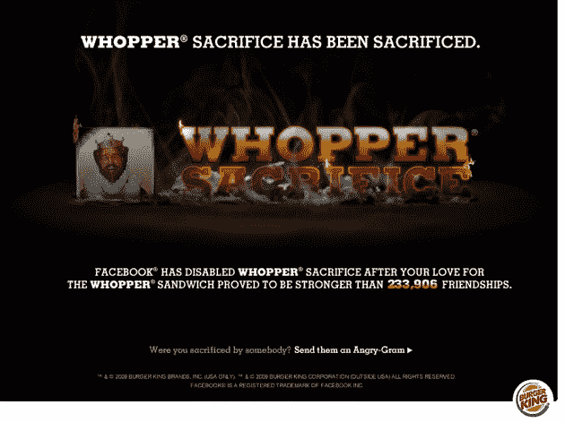

# 脸书错失良机 

> 原文：<https://web.archive.org/web/https://techcrunch.com/2009/01/14/facebook-blows-a-whopper-of-an-opportunity/>

# 脸书错过了一个绝好的机会

汉堡王通过他们疯狂创意的广告代理 Crispin Porter + Bogusky(见他们最近的[汉堡王香水发布会](https://web.archive.org/web/20230203133410/https://techcrunch.com/2008/12/18/burger-king-launches-a-perfume-that-smells-like-meat-crispin-porter-must-be-behind-this/))发布了一个脸书应用程序，鼓励用户删除脸书好友。牺牲其中的十个，你就可以得到一个免费的巨无霸。233906 个好友在不到一周的时间里被 82771 人移除。

脸书喜出望外，对不对？这是一个很好的例子，向麦迪逊大街的广告公司展示了一个大品牌如何获得用户的真正参与。这是广告的未来。或者，如果脸书没有以隐私问题为由[关闭](https://web.archive.org/web/20230203133410/http://www.insidefacebook.com/2009/01/14/whopper-sacrifice-shut-down-by-facebook/)，它本来是可以的:

> 我们鼓励使用 Facebook 平台的开发者和品牌的创造力，但我们也必须确保应用程序符合用户对隐私的期望。当用户删除好友时，该应用程序会通知用户，这为违反用户隐私的活动提供了便利。我们已经向开发商提出了建议的解决方案。与此同时，我们正在采取必要的措施来确保用户对脸书的信任得以维持。

有人在扣动扳机之前和销售部门谈过吗？所有发生的是被 dissed 的用户得到一个消息告诉他们，这有助于应用程序的病毒式传播。如果没有这个功能，这个应用程序的功能就会大大降低。这里没有真正的隐私问题，只是脸书的一个政策决定，当你删除他们的好友时，不应该通知他们。

脸书一贯告诉用户，他们不能以隐私的名义做事情，尽管这些用户很清楚他们在做什么。

当然，除非投资者和合伙人[微软让他们这么做](https://web.archive.org/web/20230203133410/https://techcrunch.com/2008/11/14/the-very-curious-microsoft-facebook-user-data-relationship/)。