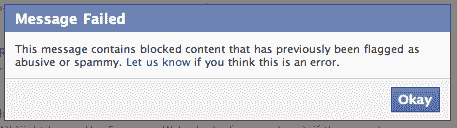
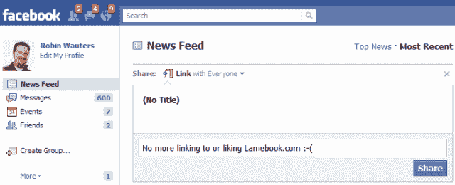

# 今天的教训:惹脸书生气，他们会审查你直到你被遗忘

> 原文：<https://web.archive.org/web/https://techcrunch.com/2010/11/22/facebook-censorship/>

脸书正在成为人们与朋友分享链接、照片和其他内容的最流行方式。对于许多网站来说，它正在成为一个强大的新的流量驱动力——让人们“喜欢”你的东西，脸书的网络效应会把它展示给他们的几十个朋友。

只是确保不要做可能让脸书生气的事情。否则，它可能会毁掉你网站的每一个链接，扼杀你辛辛苦苦建立起来的这条流量河。

这是脸书今天发出的信息，它审查了到 [Lamebook](https://web.archive.org/web/20230202214524/http://www.lamebook.com/) 的链接，这是一个在社交网络上发布淫秽对话的幽默网站。脸书已经证实，它将自动屏蔽 Lamebook 的所有链接，并删除了该公司的“粉丝”页面。提醒你，不是因为内容令人不快，而是因为脸书不喜欢蹩脚书。

**更新:**脸书首席技术官 Bret Taylor 写了这份声明，解释这是一个错误。请注意，这个故事最初是在今天早上披露的，我下午大部分时间都在和脸书联系，所以这显然不仅仅是一个 bug:

> 这是我们的一个错误。在处理一个关于张贴到脸书的一些链接的常规商标侵权问题的过程中，我们在脸书屏蔽了所有提及短语“lamebook”的内容。我们致力于促进脸书的言论自由。我们对此事的错误表示歉意，我们正在努力修复导致此事发生的流程。
> 
> 布雷特·泰勒
> 首席技术官

这一举动是由两家公司之间的法律纠纷促成的。Lamebook 在本月早些时候提交了一份声明性判决，声称它没有侵犯脸书的商标(双方显然已经就此进行了一段时间的谈判)。不出所料，脸书随后提起诉讼，指控 Lamebook 侵犯了其商标。

好吧，所以脸书不喜欢 Lamebook 的名字。我不同意脸书的立场，但很公平——它不是第一个在保护商标方面过于热心的大公司。但是通过屏蔽 Lamebook 的内容，脸书越界了。

不仅目前不可能分享一个 Lamebook 链接到你的新闻订阅源或朋友的脸书墙——你甚至不能将它们作为直接消息或电子邮件的一部分发送给朋友(你会收到一条错误消息，表明它是“辱骂性的或垃圾的”，这甚至不准确)。这太离谱了，这是一个警告信号，就在脸书宣布新的混合电子邮件/即时消息/短信产品的几天后。你真的希望有人审查你的出站邮件吗？

谷歌如此成功的一个原因是人们信任它。如果你起诉谷歌，它不会威胁把你的公司从搜索索引中除名。同样，脸书需要与其用户分享的内容保持距离。不，它不会很快放弃它的[条款](https://web.archive.org/web/20230202214524/http://www.facebook.com/terms.php)，该条款禁止“仇恨、威胁或色情”的内容；煽动暴力；或包含裸体、图形或无端暴力。”但是原则上屏蔽内容和阻止公司起诉你是有区别的。这是一个令人不安的先例。

我联系了脸书，询问除了商标声明之外，是否还有其他原因促使其决定屏蔽 Lamebook——也许还有其他原因会让他们的决定看起来不那么奥威尔。我还问脸书以前是否屏蔽过与它有法律纠纷的其他网站的内容。

脸书发言人表示，他无法回答这些问题。然而，他确实给了我以下陈述，这与脸书以前就这个问题说过的话相似:

> 我们感到失望的是，在与 Lamebook 合作数月后，他们转向了诉讼。我们认为他们的网站是不正当的企图利用脸书的知名度和声誉，我们将继续保护我们的品牌和商标。正如我之前告诉 Robin 的，我们的条款禁止在脸书上发布侵犯他人权利的材料或其他活动。我们保留删除任何我们认为侵权的内容的权利。这包括链接到我们认为侵权的材料。我们还明确禁止使用任何脸书或容易混淆的相似标志(参见 SRR Sec。5.1、5.2 & 5.6 http://www . Facebook . com/terms . PHP)。

**更新:**截至太平洋标准时间下午 6:00 左右，看起来 Lamebook 链接又开始工作了。我已经问过脸书，他们是否已经改变了决定，或者这仅仅是一个错误。
