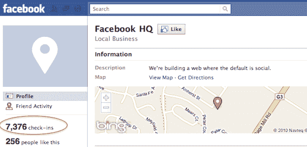

# 几个月来，脸书封锁了数以千计的登记。令人印象深刻。TechCrunch

> 原文：<https://web.archive.org/web/https://techcrunch.com/2010/08/20/facebook-check-ins/>

# 几个月来，脸书封锁了数以千计的登记。令人印象深刻。

正如我们几天前提到的，脸书为解释他们的新地点功能制作的视频[有点苹果风格](https://web.archive.org/web/20221007171234/https://beta.techcrunch.com/2010/08/19/facebook-places-video/)。但他们最近做的其他事情甚至更像苹果:围绕他们的位置发布的秘密。

当然，[我们几个月前就发现了它的代码，](https://web.archive.org/web/20221007171234/https://beta.techcrunch.com/2010/05/09/facebook-places-check-in/)当时一个过分热心的工程师可能过早地将代码(而不是实际的功能)推到了网站的 touch.facebook.com 版本。每个人都知道太空中的某样东西来自他们。但奇怪的是，在过去的几个月里，我们没有收到任何人在野外使用它的消息。我们获得的最好成绩是在三月份，当时有人看到了它的早期测试版。正如我们当时指出的那样:

> 一个见过它的人注意到定位功能的图标在地图上有一个图钉。这显然是一个应用程序的测试版，但如果脸书选择使用它，它的功能可能会被内置到广受欢迎的脸书 iPhone 应用程序中。

那个人还告诉我们，这个功能的建立是为了让它可以从 Foursquare 和 Gowalla 引入签到。显然，所有这些最终都与实际发布的非常接近——但那是五个月前的事了！从那以后再也没出现过。

对于脸书这样规模的公司来说，这种秘密是罕见的——当然，在无限循环的公司之外。

在他们的活动中，脸书透露他们已经认真地工作了大约 8 个月。如果你看一下脸书上的[脸书总部位置页面](https://web.archive.org/web/20221007171234/http://www.facebook.com/pages/Facebook-HQ/110506962309835)，你会发现在过去的几个月里，大约有 7000 名员工登记入住。

在 Foursquare 上，旧金山& T 公园的[是一个大规模活动的地方。总共入住了多少次？20，000 —这超过了 18 个月。脸书总部在短短几个月内通过 Places 获得了 7000 多份入住登记。很明显，很多员工都在用它。](https://web.archive.org/web/20221007171234/http://foursquare.com/venue/2892796)

然而，在那段时间里，我们没有看到近 1500 名员工中有任何一个人真正泄密。不是关于应用程序，甚至不是关于脸书广场的页面。

是的，我们中的很多人都知道会发生什么([和我一样，例如](https://web.archive.org/web/20221007171234/https://beta.techcrunch.com/2010/08/17/foursquare-facebook-twitter/))，但是除了五个月前的那个消息来源(嗯，还有那个代码)，其他的都是来自二手消息和直接的猜测。在过去的五个月里，我从实际使用过该产品的人那里并不了解该产品。我不知道脸书以外有谁这么做过。这是相当惊人的。这似乎是在对一家掌控一切、与员工保持健康(或至少令人恐惧)关系的公司说话。

(顺便提一下:看起来脸书可能正在对这些之前的入住记录进行数据清理，因为这些数字到处跳跃，有时几周前的入住记录根本不会出现。)