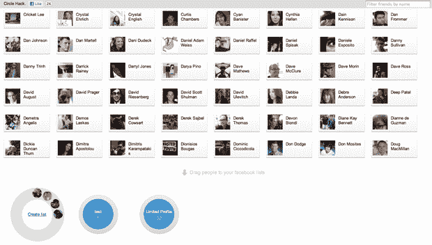

# 脸书工程师打造受 Google+启发的脸书黑客 

> 原文：<https://web.archive.org/web/https://techcrunch.com/2011/07/01/facebook-circles/>

# 脸书工程师打造受 Google+启发的脸书黑客

随着许多[断言](https://web.archive.org/web/20230123003523/https://techcrunch.com/2011/06/29/does-the-google-interface-remind-you-of-facebook-youre-not-the-only-one/)Google+受到脸书的严重影响，脸书的工程师[弗拉基米尔·科列斯尼科夫](https://web.archive.org/web/20230123003523/http://www.facebook.com/voloko)、[范鹏](https://web.archive.org/web/20230123003523/http://www.facebook.com/pefa1)、[扎汉·马尔卡尼](https://web.archive.org/web/20230123003523/http://www.facebook.com/zahanm)、[布莱恩·罗森塔尔](https://web.archive.org/web/20230123003523/http://www.facebook.com/rosenthal)已经扳动开关，并从新颖的 Google Circles 设计中获得灵感，使用 [Circlehack](https://web.archive.org/web/20230123003523/http://www.circlehack.com/) ，一个更简单的工具来建立脸书好友列表。

现在，你在脸书上创建列表的唯一方法是进入好友页面，点击账户下拉菜单，然后点击“编辑好友”，再点击“创建列表”和一堆其他繁琐的东西。

这是一个混乱，但如果你想实现与脸书上的 Google+相同的粒度共享功能，这是至关重要的(你可以通过进入“隐私设置”，点击“定制”，然后在“打开”下，点击哦地狱[谷歌一下](https://web.archive.org/web/20230123003523/http://www.facebook.com/help/?page=768))。

虽然 Circlehack 没有 Google+的所有设计功能，例如，你朋友所在的圈子不会在悬停时发光，你也不能在应用程序中自动设置群组或隐私设置，但这是一个开始，至少对脸书来说是这样。

干得好，伙计们，干得好。