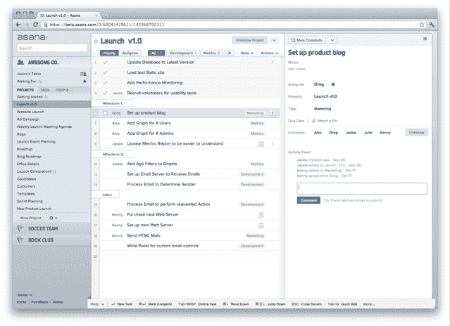

# 脸书联合创始人的生产力创业公司 Asana 向公众推出 

> 原文：<https://web.archive.org/web/http://techcrunch.com/2011/11/02/facebook-cofounders-productivity-startup-asana-launches-to-the-public/>

基于网络的生产力服务 Asana ，脸书的联合创始人[达斯汀·莫斯科维茨](https://web.archive.org/web/20230205134732/http://www.crunchbase.com/person/dustin-moskovitz)是其创始人之一，今天向公众推出。不，它一点也不像脸书，但如果你正在寻找一个新的生产力解决方案，它可能正是你所希望的。

你会认为 Asana 已经推出了，这是情有可原的，因为你已经听说它很长时间了——因为它是由莫斯科维茨和脸书早期员工贾斯汀·罗森斯坦创建的，该公司自成立之初就一直受到科技专家的密切关注。

2009 年 11 月在 T4，该公司宣布已经从 Benchmark Capital 和 Andreessen-Horowitz 融资 900 万美元，此前一年春天，该公司还获得了 120 万美元的天使投资。从那时起，这项服务进入了漫长的私人测试阶段。他们在今年二月——也就是他们第一次开始工作的两年后——进行了一次幕后展示，并从那时起继续对产品进行迭代。就在几周前，该网站又进行了一次重大的用户界面更新，今天，他们终于准备好让大众进入了。

我将包括一些关于该产品如何工作的高层次细节，但现实是这样的:你真的需要亲自尝试一下，看看它是否适合你，因为 Asana 的大部分潜力来自于你可以根据自己的需要来塑造它。你可能还想看看下面的视频，它很好地展示了一些基础知识。也就是说…

当你第一次登录时，不会有一个新的特性立即跳出来让你眼花缭乱。让我们明确一点:这是企业生产力，并不是特别性感。但它仍然很强大。在屏幕的底部，你会注意到几个视频，解释了如何以各种方式使用体式——使用案例多种多样。在一次讨论这个消息的电话中，创始人和员工 Kenny Van Zant 向我解释了它是如何被成功地用于管理从入站员工应用程序到敏捷软件开发的一切事情的。

【YouTube = ' http://www . YouTube . com/watch？v=liO5VbbIqIs']

Asana 没有任何聊天或状态更新功能，你也不会在上面找到你同事的工作历史。它不是一个社交网络。相反，Asana 的创始人说，他们没有建立一个围绕人的网络，而是着手建立一个以你的工作项目为中心的网络。

在屏幕的左侧你会发现主导航栏，它包括公司项目、标签和公司人员的列表。在顶部，你会发现一个项目，上面有*你的*任务，你可以用它来计划(并告诉其他人)你正在做什么。

在主面板的右侧，您可以浏览任务。项目可以包括任务的层次结构，每个任务都可以委托给同事和团队。点击一个任务会在屏幕右侧出现一个新的窗格，显示附加信息:谁参与了，任何相关的文件附件和电子邮件，等等。

在整个过程中，你会注意到一件事:体式很快。创始人表示，他们一直痴迷于让 Asana 基于 HTML5 的应用感觉更自然，这一点也体现了出来。集成键盘快捷键(大部分)很直观，当你四处导航时几乎没有延迟。还有一些其他不错的功能，包括深度电子邮件集成——你可以将收件箱中的邮件转发到一个特殊的电子邮件地址，以将其分配给某个项目，甚至某个人。这也有助于只有一小部分员工注册 Asana proper 的公司，因为没有注册的员工可以通过电子邮件参与。

这项服务对 30 人以下的团体是免费的——超过这个数目，公司最终会开始收费。今后，他们还可能提供额外的付费功能。

在过去的几天里，我一直在修补 Asana，我很喜欢迄今为止我所看到的，以至于我渴望看到我们是否可以将它融入 TechCrunch 的内部工作流程(我们几乎完全依赖 Yammer，它对于围绕单个任务进行协作来说并不太好)。也就是说，肯定有一个学习曲线，尽管该服务正在尽一切努力确保这种体验不需要一整天的培训，新用户就可以知道它是如何工作的。

【T2