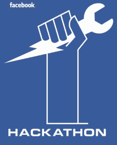
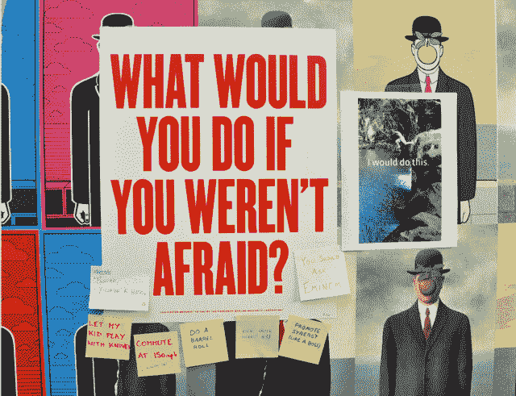

# 脸书新的“创意实验室”让这个拥有 6000 名员工的巨头像初创公司一样快速运转

> 原文：<https://web.archive.org/web/https://techcrunch.com/2014/01/30/facebook-creative-labs/>

在十亿人的注视下进行实验是很艰难的。在这种规模下，脸书的“快速行动，打破常规”和“完成比完美更好”的口号不太管用。但脸书需要的正是这些理念，来发现人们想要的简单、单一的移动体验。这就是为什么它成立了脸书创意实验室。

这是一项举措，让小团队能够自由地在公司内部组建，并构建独立的应用程序或其他位于核心脸书体验之外的项目。它不是一个物理空间或公司的正式重组，而是一种探索新的社会联系形式的方式。

今天，脸书发布了创意实验室的第一个孩子，一个名为 Paper 的新闻阅读器应用程序。一个 15 人的团队花了一年多的时间来开发这个独立的应用程序，它将新闻订阅重新想象成一份高度触觉化、视觉上身临其境的手机报纸。[查看我们的完整报道:[脸书宣布推出 Paper，这是一款策划的视觉新闻阅读器，将于 2 月 3 日在 iOS 上推出](https://web.archive.org/web/20230404070707/https://techcrunch.com/2014/01/30/facebook-paper/)

脸书告诉我，Paper 的产品设计师迈克·马塔斯(Mike Matas)把在脸书的主要应用程序和网站中进行建设比作“进入并搞乱十亿人的家具”。尝试一个新的导航机制，改变一个功能的工作方式，或者重新设计一部分用户界面，一定会有一部分用户会抓狂。

![2_Sections[7]](img/255e1d7c1d02a55547fb97479a4e9f25.png)

当脸书还是一家小型初创公司，更关心尽一切努力实现增长时，这种风险并不大。但是现在它在一个季度内就赚了 26 亿美元，并且拥有超过 6000 名员工。微小的变化会对脸书的商业产生巨大的影响。这使得它在 iOS 和 Android 上与 Facebook.com、m.facebook.com 和脸书打交道变得越来越保守。

例如，脸书在 2013 年 3 月举办了一场浮华的新闻发布会，宣布对新闻源进行重大重新设计。但是，虽然能够轻松地将提要分类为内容类型，如照片、页面和公众人物、音乐或在移动设备上推出的游戏，但它从未到达网络。

正如彭博商业周刊所描述的，脸书停止了网络发布，因为它发现用户“不喜欢它”。这可能是俚语，意思是少用它。更少的使用意味着更少的人际关系，这是脸书的使命，更少的广告收入，这是脸书对股东的受托责任。

到目前为止，脸书对修补者的出路是其频繁的内部黑客马拉松，员工们会花一个晚上研究随机的宠物项目，把它们展示给公司，有些人会被整合。[商业内幕](https://web.archive.org/web/20230404070707/http://www.businessinsider.com.au/hackathon-project-facebook-features-2013-1#yes-an-intern-came-up-with-the-novel-idea-of-tagging-people-in-comments-8)称，聊天、活动日历、视频上传和其他功能最初是由脸书黑客马拉松项目发起的。但是您会注意到，这些更多的是附加功能，而不是对关键功能的更改。

脸书创意实验室允许员工从事更雄心勃勃的项目。不仅仅是在构建它们所需的时间和团队成员的意义上，而是在如果将它们塞进现有产品中，它们将如何彻底改变我们所知的脸书。

如果脸书鲁莽地用报纸[取代新闻订阅，那将是在拿用户参与度和忠诚度做赌注。通过允许创意实验室团队将其作为一个独立的应用程序来构建，风险要低得多，并且 Paper 可以更加大胆地打破常规。](https://web.archive.org/web/20230404070707/https://www.facebook.com/paper)

【太平洋时间 2014 年 1 月 31 日下午 3 点更新:通过创意实验室而不是脸书本土开发应用程序的另一个巨大好处是什么？他们不需要赚钱。就像初创公司一样，Creative Labs 应用程序可以专注于建立人们喜欢的东西，并在担心赚钱之前做大。

Paper 的产品经理 Michael Reckhow 告诉我，Paper 团队还没有考虑广告在内容阅读器中的样子，他们也没有试图达到的参与度指标。“我们的重点是刚刚推出，并希望获得一批真正喜欢它的核心人群。”如果它变得足够受欢迎，以至于从脸书的主要应用中吸引大量的使用，而该公司确实在赚钱，那么 pap 团队认为弄清楚它如何赚钱是一个必须应对的挑战。

还有什么可以得到创造性的待遇？

纸张只是众多创意实验室应用中的第一个。脸书举行了一场特殊的黑客马拉松来发起这项倡议，这次活动持续了三天，而不是通常的那一天，员工们被要求提前一个半月做好准备。扎克伯格告诉《商业周刊》，大约有 40 个想法来自黑客马拉松，“今年可能会在创意实验室的保护伞下推出多达 6 个想法。

当我在脸书开发者日的一次私人活动中主持[与他的台上谈话](https://web.archive.org/web/20230404070707/https://techcrunch.com/2014/01/29/one-app-at-a-time/)时，扎克伯格向我提到了团体。“所以，我认为我们在脸书移动应用程序中已经有一段时间的想法是，我们可能添加的体验，无论是团体还是事件或类似的事情，都可以接触到很多人，因为绝大多数手机上都有脸书，人们每天都在使用脸书，”他说。

他向《商业周刊》发出了同样的信号，并在昨天的财报电话会议上表示，现在有 5 亿人使用该集团 2010 年 10 月重新推出的产品脸书，让更小范围的人能够进行私人分享。通过从脸书的主要体验中挖掘出这一功能，使用它会有更少的摩擦，类似于[脸书如何将 Messenger](https://web.archive.org/web/20230404070707/https://techcrunch.com/2014/01/29/one-app-at-a-time/) 解绑。

Events 可以发展成为一个更加成熟的日历应用，除了你的脸书活动邀请、你可能喜欢的附近活动的建议以及朋友生日的提醒之外，还可以从其他应用中获取约会。随着事件发现背后更多的算法力量，一个独立的应用程序可以回答“你今晚想做什么？”

扎克伯格昨天在财报电话会议上提到了游戏。在网络全盛时期，脸书控制着世界上最受欢迎的游戏平台之一，但在移动时代，苹果的 iOS 和谷歌的 Android 窃取了平台所有权。脸书只是成为了一个社交登录和分享层，并没有获得应用内购买 30%的分成。也许脸书创意实验室可以建立一个脸书街机应用程序，提供来自第三方开发者的一套轮流策划的游戏，利用应用程序商店充斥着垃圾的情况。

脸书的一个很棒的功能从来没有得到关注，那就是隐藏在脸书主应用菜单中的移动本地商务搜索。加强和发展后，它可以成为一个合法的社交 Yelp 竞争对手，利用你朋友的签到和脸书知道的关于你的一切来击败陌生人对 Yelp 的评论。脸书最近[收购了 Branch](https://web.archive.org/web/20230404070707/https://techcrunch.com/2014/01/13/facebook-acquires-branch/) ，其创始人乔希·米勒已经[建议](https://web.archive.org/web/20230404070707/https://medium.com/product-design/75627c94a0b2)脸书解决约会和就业问题。

如果脸书推出了其中的任何一款，并且大受欢迎，它可以从其主要应用程序中建立联系，为它们带来更多用户。如果人们认为他们很蠢，他们可以删除这些应用程序，然后继续使用老脸书。

硅谷经常宣扬其对快速失败并再次尝试的尊重，但当一家公司随着一级又一级的管理层不断壮大时，说起来容易做起来难。我从脸书的离职员工那里听到的一个常见抱怨是，永远做一些永远不会出货的东西一点也不好玩。

谷歌过去的 20%时间和现在的谷歌风投致力于阻止顶级人才离开山景城家族，[考虑到](https://web.archive.org/web/20230404070707/https://techcrunch.com/2013/07/15/josh-williams-leaving-facebook/) [脸书](https://web.archive.org/web/20230404070707/https://techcrunch.com/2013/02/22/director-of-product-blake-ross-leaving-facebook/) [大脑](https://web.archive.org/web/20230404070707/https://techcrunch.com/2012/07/24/facebook-carl-sjogreen/) [流失](https://web.archive.org/web/20230404070707/https://techcrunch.com/2013/07/02/facebook-web-chat-stickers/)在过去的几年里，它需要一种方法来让摇滚明星留在门洛帕克。

它可能没有谷歌 X 的无人驾驶汽车和智能隐形眼镜 moonshots 那么性感，但脸书创意实验室可以让其员工感觉他们是在哈佛宿舍里以黑客方式做事情的人。

*【图片鸣谢:[本巴里](https://web.archive.org/web/20230404070707/http://designforfun.com/display.php?id=115)*