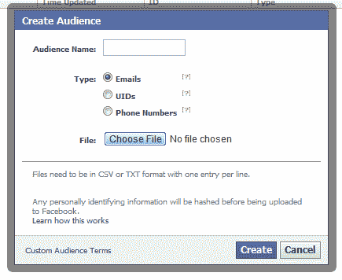
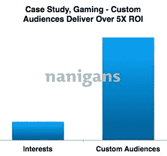
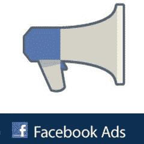

# 初步结果出来了:脸书新的定制受众 CRM 广告提高了转化率，降低了成本

> 原文：<https://web.archive.org/web/https://techcrunch.com/2012/10/11/facebook-custom-audience-ads/>

就在脸书正式推出定制观众广告(可以通过电子邮件地址或电话号码列表来锁定目标人群)三周之后，TechCrunch 获得了关于他们表现的第一份报告，他们很有希望。脸书和三家广告技术初创公司表示，虽然没有脸书交易所的重定向广告那么神奇，但它们提高了点击量和转化率，降低了成本，带来了投资回报。

[定制受众广告](https://web.archive.org/web/20221006211646/http://developers.facebook.com/docs/reference/ads-api/custom-audience-targeting/)让商家上传一个受隐私保护的电子邮件地址、电话号码或用户 id 的散列文件，然后选择这些人群作为广告目标。这使得企业能够[与现有客户](https://web.archive.org/web/20221006211646/https://beta.techcrunch.com/2012/09/20/facebook-crm-ads/)或联系人重新建立联系，并且是 Salesforce 和脸书 ads 等客户关系管理系统之间的纽带。

通过将脸书的传记、兴趣和社交广告定位参数放在这些列表的顶部，企业可以通过比没有脸书的帮助更高度个性化的信息来细分和接触客户。

#### 脸书说定制观众广告有效

脸书对两个客户的研究表明，定制受众带来了实实在在的好处。一家电子商务公司瞄准了他们的电子邮件列表，将其注册转化率提高了 43 %,并将每条线索的成本降低了 30%。不过，考虑到该公司拥有这些电子邮件地址，这些邮件已经部分加密了。

另一家电子商务公司 OpenSky 希望让其网站上从未购买过商品或在过去 30 天内没有购买过商品的会员购买商品。它使用脸书 Like targeting 来细分其电子邮件列表，并向对食品和电子产品感兴趣的人发送其畅销产品的广告。例如，它展示了向喜欢健康生活页面的人兜售凝胶枕头的广告。

OpenSky 通过针对定制受众的方式，使其脸书广告的转化率提高了 30%。如果公司用电子邮件发送整个清单，它将不知道展示什么产品和展示给谁。尽管它不得不为广告付费，而不是使用免费的电子邮件，但脸书让它将受欢迎的产品与可能购买它们的人匹配起来，从而大大促进了销售。不惊人，但肯定值得努力。

#### 广告技术初创公司表示，它们也能工作，只是不如 FBX

《华盛顿邮报》的广告部门 SocialCode 表示，一项定制受众活动将每名粉丝的成本降低了 15%。另一个帖子的参与度是标准广告的三倍，点赞、分享和评论等病毒性参与度是标准广告的两倍。

SocialCode 的首席执行官劳拉·奥肖内西(Laura O'Shaughnessy)说:“我们对这些早期结果感到鼓舞。这为营销人员提供了另一个渠道，通过量身定制的信息接触特定的受众群体，以奖励忠诚的客户，赢回以前的客户，或通过补充产品增加客户份额。”脸书广告公司 [Nanigans](https://web.archive.org/web/20221006211646/http://www.nanigans.com/) 的首席执行官 Ric Calvillo 告诉我，“定制受众可以极大地增加广告支出的回报。我们已经看到，与标准的兴趣定位相比，定制受众在广告支出上实现了超过 5X 的回报。”

这些最初的统计数据得到了广告巨头 Kenshoo 的证实。该公司产品营销高级总监托德·赫罗德告诉我，“我们有客户测试定制受众定位，并看到了很好的效果。转化率高于基准。”

仅仅得分高于基准可能不像脸书希望的那样积极。卡尔维洛补充说，“在某些情况下，我们看到了使用其他再营销方法的更大回报。”

具体来说，他可能指的是[脸书交易所基于 cookie 的重定向广告](https://web.archive.org/web/20221006211646/https://beta.techcrunch.com/2012/09/13/facebook-exchange-results/)，早期的报告显示这种广告明显更强大。AdRoll 的第一批 FBX 广告获得了高达 16 倍的投资回报和 2.2 倍的点击后转换率，而 Triggit 的利润和点击后转换率分别比传统广告交易高出 4 倍、2.2 倍和 6.5 倍。TellApart 甚至发现 FBX 的表现比谷歌的重定向广告要好一些。

迄今为止，脸书主要被视为品牌广告的大本营。不过，如果它想保持收入增长，就需要让自己对其他类型的广告客户变得必不可少。

许多企业都有重大的预算调整，FBX 正让脸书利用这些预算。如果脸书及其合作伙伴能够拿出更多确凿的证据，证明定制受众广告比电子邮件和电话营销活动更能吸引现有客户，那么就会有更多的资金流入。重要的是，这些广告是其他人无法提供的。谷歌重新定位了，但是只有[脸书知道你是谁](https://web.archive.org/web/20221006211646/https://beta.techcrunch.com/2012/09/30/no-ads-on-facebook/)，你认识谁*和*你喜欢什么。

 *了解脸书最新广告计划:*

[脸书赞助搜索结果](https://web.archive.org/web/20221006211646/https://beta.techcrunch.com/2012/08/22/facebook-search-ads/)

[脸书交易所基于 Cookie 的重定向广告](https://web.archive.org/web/20221006211646/https://beta.techcrunch.com/2012/06/13/facebook-exchange/)

[脸书的应用外移动广告网络](https://web.archive.org/web/20221006211646/https://beta.techcrunch.com/2012/09/18/facebook-mobile-ad-network/)

[脸书移动赞助故事](https://web.archive.org/web/20221006211646/https://beta.techcrunch.com/2012/06/19/facebook-mobile-ads/)