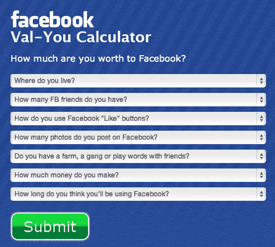

# 脸书也许值 1000 亿美元，但对脸书来说你值多少？

> 原文：<https://web.archive.org/web/http://techcrunch.com/2012/05/16/facebook-data-val-you-calculator/>

快到了。大日子。你能感受到兴奋吗？是的，如果周五一切按计划进行，马克·扎克伯格[将穿着连帽衫敲响纳斯达克的钟声](https://web.archive.org/web/20230128063205/https://techcrunch.com/2012/05/14/facebook-rings-bell-ipo-menlo-park/)，蓝色巨人社交网络将进行互联网公司历史上最大的 IPO 之一，市场将达到狂热程度，末日四骑士将更新他们的状态——而我们其他人将继续使用 Twitter。

尽管如此，脸书[预计](https://web.archive.org/web/20230128063205/https://twitter.com/#!/CNBC/status/202182417249861633)上市时的估值在 920 亿至 1030 亿美元之间。因此，脸书对我们的价值是显而易见的(真的，对市场而言)，但真正的问题是:你对脸书有多少价值？嗯？

多亏了[在线隐私公司 Abine](https://web.archive.org/web/20230128063205/https://techcrunch.com/2010/06/15/abine-launches-to-help-web-users-regain-control-over-their-privacy-acquires-t-a-c-o/) ，我们现在有了一个简单的工具来计算我们对脸书的货币价值。用旧美元和美分。

为了说明脸书在维持其高得离谱的估值/指标的压力下忽视个人(及其隐私)重要性的可能性，Abine 创建了一个名为[“Val-You Calculator”](https://web.archive.org/web/20230128063205/https://goprivate.abine.com/)的测验，根据你对七个问题的回答，确定你作为用户所代表的美元价值。

例如，这些问题会问你住在哪里(脸书的大部分广告收入来自北美公司)，你有多少朋友，你是否玩 Zynga 游戏，所有这些都是为了证明你的个人数据具有隐含的美元价值。

[据 Abine](https://web.archive.org/web/20230128063205/https://www.abine.com/blog/2012/facebooks-going-public-but-you-dont-have-to-goprivate-with-abine/) 称，其 Val-You 计算器使用了脸书 S-1 文件中的数据，以及“独立的金融和市场研究分析师、脸书广告商以及我们自己的内部建模和估计数据”一点点魔法，很快，你就可以看到你为小蓝社交网络创造了多少收入。

当然，当谈到首次公开募股时，随着大量财务信息的首次披露，放大镜自然会出现，书籍会被仔细审查，商业模式会被调戏，等等。不管是好是坏。不管专家们怎么说，隐私将继续成为脸书用户今后严重关注的问题。事实上，就在上周，[脸书遵照爱尔兰数据保护专员的审计，对其隐私政策](https://web.archive.org/web/20230128063205/https://techcrunch.com/2012/05/11/facebook-privacy-policy-changes/)进行了重大更新。

在这些变化中，脸书超越了谷歌，创建了“脸书条款和政策中心”，将其 10 个关键的隐私政策文件集中在一个屋檐下。正如[社交网络在一篇博文](https://web.archive.org/web/20230128063205/https://www.facebook.com/notes/facebook-and-privacy/enhancing-transparency-in-our-data-use-policy/356396711076884)中解释的那样，这些变化是为了提高其处理用户个人数据的透明度。而且，[正如 Josh 详述的](https://web.archive.org/web/20230128063205/https://techcrunch.com/2012/05/11/facebook-privacy-policy-changes/)，在很大程度上，这些变化看起来合乎逻辑，用户友好，一点也不可疑，就像有些人可能让你相信的那样。

话虽如此，随着庞大的用户群创造出数量更惊人的大数据，并考虑到其模式围绕着来自有针对性的个性化广告的收入，隐私倡导者认为，即将到来的打破公开市场预测的压力将使我们的个人数据处于危险境地。从 A 到巨大的季度收益之间的最短直线是向营销人员出售我们的私人数据。

在最近的一项调查中， Abine 发现 75%的用户不会让脸书独自呆在一个黑暗的房间里，他们的数据，这一观点得到了[一项独立的美联社-美国广播公司民意调查](https://web.archive.org/web/20230128063205/http://www.cnbc.com/id/47413410)的证实，在该调查中，近 60%的受访者“很少或根本不信任脸书会保密他们的信息。”

通过更新其隐私政策，脸书正在努力消除这些担忧，并取得了进展。然而，正如[乔希指出的，隐私政策](https://web.archive.org/web/20230128063205/https://techcrunch.com/2012/05/15/heres-what-could-kill-facebook/)并不是它唯一关心的问题。除了采取行动遵守法律，脸书还可能面临政府对隐私的监管。例如，如果一个管理机构对公司如何推出产品或展示功能加以限制，它可能会在竞争中变得越来越脆弱。

随着脸书感受到推动高额回报的压力，它可能会被迫设计出更聪明的方式来利用数据。它可以想得更远，也将会这样做，但它必须担心移动设备。正如该公司自己承认的那样，移动是一个巨大的威胁，该公司的增长可能会受到阻碍，因为它努力保持足够的透明度，因此不得不减少每个用户显示的广告。

这是否会对长期收入产生重大影响还有待观察，不过，多亏了 Abine 和 Val-You，至少脸书将确切知道每个用户代表多少广告收入。我的朋友们，这是无价的。

可悲的是，对脸书来说，我只值 50 美元多一点。很明显，我不是一个好顾客。你呢？

关于 Abine 的更多信息，请点击[在这里找到它们](https://web.archive.org/web/20230128063205/http://www.abine.com/)，或者点击在这里获得[你自己的 Val-You 评估。](https://web.archive.org/web/20230128063205/https://goprivate.abine.com/)