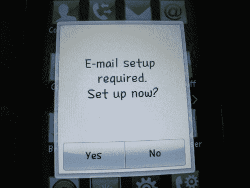

# 自 2004 年以来，脸书“考虑”提供大规模接触式出口 TechCrunch

> 原文：<https://web.archive.org/web/http://techcrunch.com/2010/11/28/facebook-deep-thoughts/>

   图片 2010[digit media Com](https://web.archive.org/web/20230202230714/http://www.flickr.com/people/45640023@N07 "click to visit the Flickr profile page for Digitpedia Com")|[更多信息](https://web.archive.org/web/20230202230714/http://www.flickr.com/photos/45640023@N07/4882794350 "get more information about the photo 'LG Cookie Fresh Email Setup'")**(via:[Wylio](https://web.archive.org/web/20230202230714/http://wylio.com/ "free pictures"))**[联系信息门](https://web.archive.org/web/20230202230714/https://techcrunch.com/2010/11/04/facebook-google-contacts/)的火焰在这个假期周末再次被点燃，这是一个特别具有煽动性的谷歌 Chrome 扩展[“脸书没有我的朋友。”我们的帖子上传几分钟后，这个扩展就被撤下了，我仍然没有听到脸书或谷歌对关闭负责的任何消息(我猜脸书在谷歌撤下这个扩展之前，已经将其邮件显示从文本切换到图像)。](https://web.archive.org/web/20230202230714/https://techcrunch.com/2010/11/25/google-facebook-disconnect/)

当在 Web 2.0 峰会上被问及这个问题时， [Mark Zuckerberg 提到](https://web.archive.org/web/20230202230714/https://techcrunch.com/2010/11/18/mark-zuckerberg/)他不确定脸书在阻止 Gmail 或其他第三方应用程序抓取网站方面*【100%正确】*，并提到你自己放入电子邮件应用程序的信息与你选择交朋友的人放入社交网络的信息之间的差异是最终通用出口政策的一个因素，*“我们正在努力思考这些事情，并尊重所有这些信息换句话说，这很复杂。*

当脸书*“思考”这些事情的时候，*似乎做出了一些大胆的举动，从[在 2008 年赶走了试图通过 Plaxo 收集联系人的超级用户罗伯特·斯考伯](https://web.archive.org/web/20230202230714/https://techcrunch.com/2010/11/09/give-us-our-data-facebook/)，到从“查找我的朋友”中完全取消了 [Gmail 选项，同时允许](https://web.archive.org/web/20230202230714/https://techcrunch.com/2010/11/20/facebook-google-2/)[无限制(尽管有问题)访问雅虎和 Hotmail 合作伙伴的联系信息](https://web.archive.org/web/20230202230714/https://techcrunch.com/2010/11/12/how-to-mass-export-all-of-your-facebook-friends-private-email-addresses/)。

为了让我们更好地了解脸书联系信息政策的演变，一位可能是第一个尝试大规模收集脸书电子邮件的线人给我们发来了以下一串他和脸书原雇员[达斯汀·莫斯科维茨](https://web.archive.org/web/20230202230714/http://www.crunchbase.com/person/dustin-moskovitz)之间的支持电子邮件，这是 2004 年试图汇总普林斯顿网络中每个人的联系信息的结果。

> 2004 年 8 月 22 日，晚上 7:52，thefacebook 一般信息写道:
> 
> 嗨，
> 
> 因为安全违规，我停用了你的账户。如果你想把它拿回来，请告诉我你在做什么。
> 
> 达斯汀@ thefacebook
> 
> ————————————————-
> 
> xxx xxxx 于 2004 年 8 月 22 日星期日写道:
> 
> 嗨，达斯汀，
> 
> 我写了一个脚本，收集普林斯顿每个人的照片、手机号码、生日、家乡和年份。然后，我使用普林斯顿 ldap 目录，查找房间电话号码、房间地址和电子邮件地址等信息。然后，我将所有这些都以 vCard 格式导出，导入到我 mac 的地址簿程序中，并放在我的 iPod 上。
> 
> 我可能应该在晚上运行它，这样我就不会对其他用户造成影响。然而，我查看了隐私政策的这一部分，并不认为我的脚本违反了任何隐私政策。但我很想听听你对此的看法。
> 
> *“本网站仅供个人会员个人使用，不得用于任何商业用途。组织、公司和/或企业不得成为会员，也不得出于任何目的使用服务或网站。非法和/或未经授权使用本网站，包括通过电子或其他方式收集会员的电子邮件地址以发送未经请求的电子邮件，以及未经授权诬陷或链接本网站，将受到调查，并将采取适当的法律行动，包括但不限于民事、刑事和禁令补救。”*
> 
> 如果你想让我停下来，我就停下来。这是你的网站。然而，如果你关心的是过度使用问题而不是隐私问题，如果你允许我从我停止的地方继续，我会很感激，那就是凯蒂培根。我不介意将它设置为夜间运行，小批量运行，或者其他方式。但是，如果你不想让我做，我就不会做
> 
> 做吧，不要问任何问题。"
> 
> 我想我会很感激找回 xxx xxx 帐户，但没有人需要或使用 ulink 帐户。
> 
> 期待收到你的来信，
> 
> xxxxxxxxxxxxxxxxxxx
> 
> ————————————————-
> 
> **From:**the face book–一般信息<info@thefacebook.comT4>
> 
> 日期:太平洋时间 2004 年 8 月 22 日下午 6:33:11
> 
> **致:**XXXXXX xxx@princeton.edu
> 
> **主题:回复:安全违规**
> 
> 你好 xxxx，
> 
> 所以速度变慢并不是一个真正的问题，但是**我们非常不希望人们聚集网站上的信息。人们愿意提供这么多信息的部分原因是因为我们在网站中构建的安全性和隐私性。**
> 
> 我很可能会假设你是为了电子邮件地址，但进一步考虑后，我可能会**将隐私政策从“收集电子邮件地址”更改为“收集电子邮件地址或其他联系信息”**。
> 
> 我们**正在开发一个功能，你可以为你的朋友(其中一个，或者所有人)导出 vcards，我们可能会很快发布它。如果你用它来代替收集普林斯顿每个人的信息，我会很感激。**
> 
> 我已经重新激活了你的账户。

这个来自过去的爆炸的寓意是什么？除了那句“脸书没有生意”之外，越多的事情改变，越多的事情保持不变也许我们还可以修改莫斯科维茨的*“我们非常不希望人们聚集网站上可用的信息，”*用*声明，“当然，除非他们是广告合作伙伴。”*

关于这次交流，最有趣的事情是，甚至在 2004 年，莫斯科维茨就意识到了能够导出你在脸书的朋友联系方式(而不是普林斯顿的每个人)的纯粹效用，并明确引用了正在开发的一个功能，你可以为你的朋友导出 VCards。毕竟你建立了这些关系。

这个虚构的 VCard 功能从未真正出现过，听起来类似于脸书利用的[通用出口](https://web.archive.org/web/20230202230714/https://techcrunch.com/2010/11/08/facebook-finds-a-new-way-to-liberate-your-gmail-contact-data/)，当时谷歌取消了对其 API 的访问，并允许你完全做短命的谷歌 Chrome 扩展在上周五被关闭前所做的事情。希望这个功能有一天会出现。

**更新:**虽然还不清楚这些是否是脸书的官方功能，[评论者](https://web.archive.org/web/20230202230714/https://techcrunch.com/2010/11/28/facebook-deep-thoughts/#comment-104618741)报道说，脸书实际上已经断断续续地试验允许 CSV 和 VCard 格式的输出功能，但都没有任何持久性。一位来自脸书的代表告诉我们，*“我们可能在很久以前就测试过这个，但不是在最近几年。”*