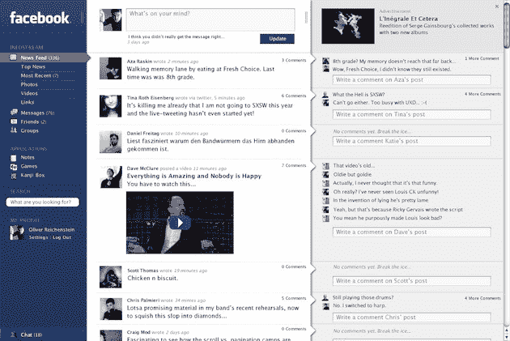
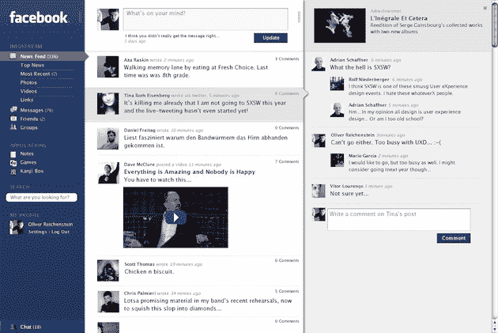
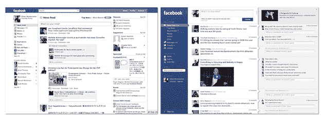

# 为什么脸书看起来不像这样？TechCrunch

> 原文：<https://web.archive.org/web/https://techcrunch.com/2010/04/21/facebook-design/>

如你所知，明天，脸书将在三藩市召开 f8 开发者大会。我们会在那里报道正在发生的事情，但看起来很多信息已经在那里了——脸书[、](https://web.archive.org/web/20221005180445/http://www.insidefacebook.com/2010/04/16/as-facebooks-f8-developer-conference-approaches-a-recap-of-its-rumored-launches/)[全脸书](https://web.archive.org/web/20221005180445/http://www.allfacebook.com/2010/04/everything-facebook-will-announce-at-f8-the-definitive-guide/)和 [GigaOM](https://web.archive.org/web/20221005180445/http://gigaom.com/2010/04/20/facebook-takes-over-the-web/) 对我们可能预期的事情有很好的报道。我们之前已经报道了一系列可能的公告，比如 Meebo Bar-clone 的[、互联网的](https://web.archive.org/web/20221005180445/https://beta.techcrunch.com/2010/03/27/facebook-meebo-bar/)[“喜欢”按钮](https://web.archive.org/web/20221005180445/https://beta.techcrunch.com/2010/03/25/facebook-to-release-a-like-button-for-the-whole-darn-internet/)以及脸书连接的[自动登录](https://web.archive.org/web/20221005180445/https://beta.techcrunch.com/2010/03/26/facebooks-plan-to-automatically-share-your-data-with-sites-you-never-signed-up-for/)。

显然，我对该公司明天可能宣布的任何地点都感兴趣——但不清楚脸书是否会实际宣布任何事情，因为他们的计划一直是不稳定的，可能仍然没有固定下来。我对脸书计划谈论的开放图形也很感兴趣。当这在 10 月份第一次被隐约预演时，脸书的意图当时对我来说似乎很清楚:[让整个网络成为它的支流系统](https://web.archive.org/web/20221005180445/https://beta.techcrunch.com/2009/10/29/with-open-graph-facebook-sets-out-to-make-the-entire-web-its-tributary-system/)。这可能是巨大的——或者是网络的另一个巨大的隐私灾难。

这些宏伟的计划是伟大的，但当我在 f8 的前一天晚上坐在这里时，我发现自己在想一个非常简单的问题:为什么使用脸书让我感到沮丧？

正如我早些时候在[我告别脸书建兴](https://web.archive.org/web/20221005180445/https://beta.techcrunch.com/2010/04/20/facebook-lite-dead/)中提到的，我认为这只是因为我发现服务太混乱，令人困惑。各种选项菜单简直是一场噩梦。所有的隐私设置都令人困惑。虽然整个网站的导航在过去的一年里有了很大的改进(再见了，怪异的底部导航条)，但我仍然发现自己经常迷路。

然后我看到[像这样的东西](https://web.archive.org/web/20221005180445/http://informationarchitects.jp/ias-2006-facebook-designs-redesigned/)。从 2006 年到 2007 年，设计团队 iA 与脸书就重新设计进行了接触。脸书最终没有使用他们的东西，但 iA 最近决定采用他们所做的，并对其进行更新，以适应脸书目前的布局。结果非常好——比脸书目前的实际状况好得多。

看看这些实物模型，但是一定要去他们的网站[看看它们的全分辨率，看看它们实际上是什么样子的。](https://web.archive.org/web/20221005180445/http://informationarchitects.jp/ias-2006-facebook-designs-redesigned/)

当然，这有点受前景的启发，但是哇，我真希望我能以这种方式游览脸书。小溪？漂亮而干净，大多数元素大小相同(像 Twitter 一样)，因为评论被推到右边的新列中(默认情况下折叠起来只显示 2 条)。评论栏看起来好得多，因为它没有被那些难看的蓝色方形背景包围，而这些背景目前把流弄得一团糟。并且有内嵌回复。

广告还在，只是在第三栏。搜索框已经从中间偏左的那个奇怪的无人区移到了左栏。导航可以清楚地显示出你正在观看的是哪一个视频流。

正如 iA 所指出的:

> 我们的基本想法是:创建一个类似邮件应用程序的界面，具有弹性的三栏布局，清楚地将过滤器、信息流和反应分开:
> 
> 过滤器:左侧栏用作分类工具
> 信息流:中间栏显示过滤结果
> 反应:右侧栏用于讨论单个饲料项目。

这似乎很有道理。更重要的是，你看着，好像有道理。

当然，很难与 4 亿用户争论——毫无疑问，大多数人都讨厌如此巨大的变化。但是脸书，也许比其他任何网络公司都更擅长于知道什么时候该忽略用户的抱怨，并努力改进产品。

我觉得他们应该再看看内务部的工作。或者至少，[更多地使用那些 FriendFeed 家伙的想法](https://web.archive.org/web/20221005180445/https://beta.techcrunch.com/2009/04/12/you-will-be-using-friendfeed-in-the-future-but-it-may-be-called-facebook/)。

还有，脸书的 iPad 应用到底在哪里？