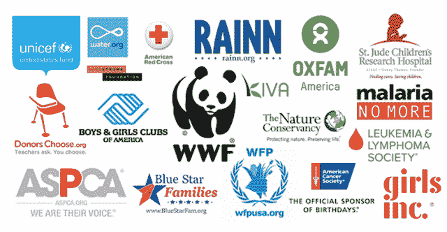
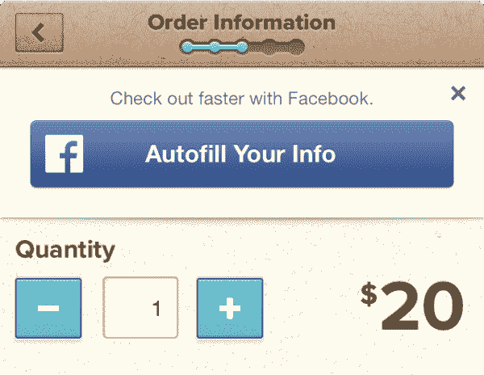

# 脸书为非营利组织推出“捐赠”按钮，同时也为自己收集账单信息

> 原文：<https://web.archive.org/web/https://techcrunch.com/2013/12/16/facebook-donate-now-button/>

脸书今天推出了一个“立即捐赠”按钮，让非营利组织更容易接受捐赠。对它的生意有好处吗？该按钮将收集脸书的信用卡号码和其他账单信息，这些信息可能有助于其电子商务和游戏计划。

19 个非盈利发布合作伙伴将开始在他们的脸书页面顶部和新闻订阅帖子底部显示“立即捐赠”按钮。其中包括 DonorsChoose.org 的 T2、美国男孩女孩俱乐部、世界野生动物基金会、联合国儿童基金会、红十字会和 Kiva。在更多的测试之后，脸书将向更多的非营利组织开放这个功能，他们可以在这里注册进入。

多亏了“现在捐赠”按钮，这些组织现在可以在脸书的一个弹出窗口中接受捐赠，而不是强迫用户离开脸书和他们的朋友。用户可以选择他们想要给多少，或者输入支付细节，或者使用已经存储在脸书的信息。弹出窗口可以提高转换率，并为需要的项目获得更多资金。

“立即捐赠”按钮还让人们可以轻松地与朋友分享捐赠号召，帮助慈善事业迅速传播。脸书不收取处理信用卡捐款的费用，而是自己支付费用，所以 100%的捐款都捐给了非营利组织。

可悲的是，有些人认为公司都是邪恶的，他们不可能真的有想要帮助非营利组织的正派人。但脸书似乎真的决心帮助这些事业，即使不可否认，按钮也可以帮助其业务。这是营利性企业发起慈善活动的趋势的一部分，从长远来看，这可以为他们赚钱。[脸书支持 Internet.org](https://web.archive.org/web/20230326183911/https://techcrunch.com/2013/08/20/facebook-internet-org/)，这是一个面向发展中国家的互联网无障碍项目，也可以让更多人注册其社交网络。就在今天早上，[康卡斯特宣布为在线教育资源汗学院](https://web.archive.org/web/20230326183911/https://techcrunch.com/2013/12/16/khancast/)提供数百万美元的支持，希望吸引更多低收入家庭使用其低价宽带服务。

或许脸书应该让捐款后删除你的信用卡信息变得更容易。现在你可以[进入你的支付账户设置](https://web.archive.org/web/20230326183911/https://secure.facebook.com/settings?tab=payments&section=methods)并移除你的信用卡。在捐赠流程中添加一个链接或删除按钮会让它变得更容易……但也会让将来向其他非营利组织捐赠变得更加困难。]

与苹果和谷歌等应用商店所有者以及亚马逊等电子商务巨头相比，脸书在收集信用卡号码的竞争中处于落后地位。没有记录付款细节会对人们在脸书游戏中购买虚拟物品或为朋友购买脸书礼品卡造成障碍。向有价值的事业捐款的道德要求可以让用户度过难关，输入他们的信用卡号码或连接另一个像 PayPal 这样的账单服务。

存档的更多支付信息也将支持脸书最新的电子商务推动:[自动填充脸书](https://web.archive.org/web/20230326183911/https://techcrunch.com/2013/09/23/facebook-partners-with-paypal-stripe-braintree-to-autofill-billing-info-in-mobile-commerce-apps/)。该系统允许第三方移动应用程序在结账流程中集成一个按钮，让用户无需太多输入就可以快速从脸书获取他们的账单和运输信息。

脸书不收取费用或收入分成，而是计划使用它通过自动填充窥探的购买数据来证明其广告的投资回报。如果你点击广告下载 JackThreads 的电子商务应用，使用脸书的自动填充功能导入你之前通过“立即捐赠”按钮输入的支付信息，并进行购买，脸书就可以告诉广告商他们的营销信息为他们赚了多少钱。

同样，这些由“立即捐赠”提供的对脸书业务的间接推动可能不是脸书建造按钮的动力，但它们是一种便利的协同作用。将人们与他们的朋友和非营利组织联系起来，恰好也使他们更容易与广告商联系起来。