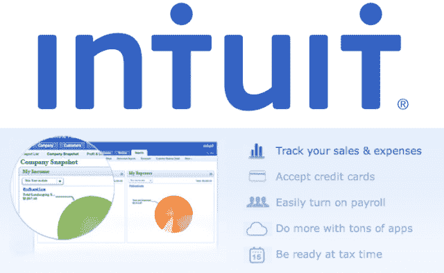
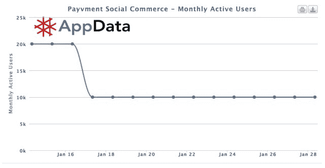

# Intuit 收购脸书电子商务平台 Payvment 的团队、技术和专利，而 Ecwid 收购其 20 万商户 

> 原文：<https://web.archive.org/web/https://techcrunch.com/2013/01/28/facebook-e-commerce-platform-payvment-shuts-down-merchants-moved-to-ecwid/>

今天早些时候，脸书电子商务平台 [Payvment](https://web.archive.org/web/20221208230642/http://www.payvment.com/) 宣布关闭其 20 万商户，并将其转移给竞争对手 [Ecwid](https://web.archive.org/web/20221208230642/http://www.ecwid.com/) ，但我们刚刚发现，这是因为 [Intuit](https://web.archive.org/web/20221208230642/http://www.intuit.com/) 正在收购 Payvment 的团队、技术和专利。更新:Intuit 已经向 TechCrunch 证实了其对 Payvment 的收购，称“Intuit 已经收购了一个高技能开发人员团队，他们将对 Intuit 的社交团队具有重要价值。”

今天早上，Payvment 网站上发布的一条消息称，该团队正在“加入一家新公司”，该平台将于 2 月 28 日结束运营。但是我们发现一些 Payvment 员工已经把他们的 LinkedIn 个人资料换成把 Intuit 作为他们的新家。消息人士证实，Payvment 暗示的公司是 Intuit，该公司购买了它的技术、人才和知识产权。Intuit 可能很快会发布正式声明。这可能是一个非常聪明的做法，因为 Payvment 可以帮助 Intuit 的小企业金融套件客户轻松在脸书等社交网站上开设店面。

Payvment 被收购的消息是在首席执行官克里斯蒂安·泰勒于今年 7 月宣布离职后发布的，他说他已经准备好开始他的“下一个大的创业”泰勒仍然是公司的董事会成员，但日常运营工作移交给了当时的首席运营官·吉姆·斯通汉姆。

他说，Stoneham 告诉我们，Payvment 刚刚超过 175，000 名卖家，并以每周 1，500 名的速度增加新卖家。据报道，其帮助付费商家购买脸书广告的广告平台也做得不错。尽管如此，根据 AppData 的数据，截至首席执行官离职时，Payvment 的注册用户中只有 2 万至 3 万人每月活跃(来源:AppData)。Intuit 有可能开始让其客户通过 Payvment 的技术为他们的企业购买脸书广告。

尽管 Payvment 已经发展到数十万商家，但它仍然面临着一个挑战，即在脸书购物——有时被随意称为“电子商务”——仍处于早期阶段。用户似乎仍然对喜欢和评论商品更感兴趣，而不是在脸书上实际交易。

这可能就是为什么 Intuit 不想接管 Payvment 的整个业务，而是只想要原材料。因此，总部位于帕洛阿尔托的 Payvment 没有关闭其店面平台，让数十万在线商家陷入困境，而是在与俄罗斯初创公司进行了三年的激烈竞争后，达成了一项协议，将他们交给 [Ecwid](https://web.archive.org/web/20221208230642/http://www.ecwid.com/) 。Ecwid 最近成为了脸书的商店建设者，拥有[最多的月活跃用户](https://web.archive.org/web/20221208230642/http://appdata.com/apps/facebook/251458316228-ecwid)(根据 AppData 的数据，超过 10 万)，在 174 个国家拥有 25 万商家。它提供了一个可以嵌入任何网站、博客或脸书页面的电子商务插件。

该公司还报告了自己的增长，指出在假日购物期间(2012 年 10 月至 12 月)，Ecwid 商店的总销售额比上一季度增长了 65%，从脸书到 Ecwid 商店的推荐(入站)链接占购买量的 8.5%。

据 Ecwid 首席执行官 Ruslan Fazlyev 称，他的服务在 2012 年赢得了脸书用户，而 Payvment 却在流失客户。“2012 年 12 月，我们赶上了 Payvment，并取得了领先，”他告诉我们。当时，Ecwid 的月活跃人数领先 10，000 人。Payvment 随后联系了 Ecwid，要求其参与竞标他们的客户群。“我们与其他一些未披露的公司一起参加了这次拍卖，并获得了胜利，现在我们使 Payvment 的客户能够免受他们关闭脸书店面的影响，”法兹利耶夫补充道。然而，该交易的条款尚未披露。

我们联系了 Payvment 首席执行官斯通汉姆，请他置评。他说

“我们这边的故事很简单——我们已经建立了一个令人惊叹的团队，并在使用社交和商业‘大数据’为中小企业赋能方面开辟了许多新天地——另一家了解我们工作和团队的公司认为他非常适合帮助他们更快地实现他们在社交和大数据方面的目标，”Stoneham 说。“这家公司不打算直接继续我们目前的业务，所以我们与一些顶尖的商务平台公司进行了交谈，并最终与 Ecwid 合作，以确保我们庞大的中小企业卖家群能够继续前进，”他补充道。

“至于我们的数字，我们继续看到相同范围内的强大卖家注册——即使在删除我们产品上的一些‘开店’链接以减少新注册者之后，”Stoneham 告诉我们。

下面，全文摘自 [Payvment 的公告:](https://web.archive.org/web/20221208230642/http://www.payvment.com/)

> *薪酬的重要变化*
> 
> *Payvment 团队正在加入一家新公司，Payvment 平台将于 2 月 28 日关闭。*
> 
> 作为过渡期的一部分，你将有一个月的时间将你的店铺转移到 Ecwid，这样你就可以继续在脸书上销售。Ecwid 是社交商务领域的全球领导者，在 174 个国家拥有超过 200，000 名卖家，并拥有与 Payvment 非常相似的强大脸书应用程序。详情请访问 ecwid.com/payvment.
> 
> *有问题吗？*
> 
> *以下是关于过渡最常见的问题，答案如下:*
> 
> *通用*
> 
> *我的商店会怎么样？丽斯怎么办？*
> *Payvment 和 Lish 商店以及 Payvment 仪表盘将在 2 月 28 日前有效。3 月 1 日，该服务将关闭。商店将停止营业，您将无法再访问您的仪表板。*
> 
> *数据和信息*
> 
> 我想继续在脸书销售。我可以将我的商店转移到不同的平台吗？
> *是的！我们已经与领先的电子商务公司 Ecwid 合作，将您的商店无缝转移到他们的平台上，您可以继续在脸书上销售。只需在您的仪表板上点击一下。点击此处了解更多信息*
> 
> 我想保存我的产品列表。我该怎么做？
> *你可以将你的产品列表转移到 Ecwid 继续在脸书(和其他地方)销售。只需点击 https://my.payvment.com*的“转移我的账户”按钮
> 
> 我可以保存我的订单信息吗？
> *您可以下载您订单信息的 CSV 文件:点击仪表板中“订单”选项卡右上角的“导出到 CSV 文件”按钮，您将获得一个包含订单详情、客户联系信息和其他详细信息的文件。*
> 
> *payment 停止运营后，我的帐户数据会发生什么变化？*
> *您的产品列表、产品图片和订单信息将于 2013 年 3 月 1 日删除。请在 2 月 28 日之前将您的帐户从您的仪表板转移到 Ecwid，以保护您的数据。*
> 
> *我可以下载我的产品图片吗？*
> *没有，但是这些会在你把店铺转移到他们平台的时候转移到 Ecwid。*
> 
> *我的电子邮件地址和帐户信息会怎么样？*
> *未经你的允许，你的地址不会给任何第三方。如果您选择将商店转移到 Ecwid，您将与 Ecwid 共享您的电子邮件地址、帐户信息以及商店数据和设置。我们不会在转移过程中共享任何存储的信用卡信息。*
> 
> *如何永久删除我的帐户？*
> *点击仪表板主页上的“删除账户”按钮。*
> 
> *买卖*
> 
> *我可以继续添加新产品和促销活动吗？我们已经禁用了添加新产品、新促销、新交易和新脸书广告的功能。在 2 月 28 日之前，您仍可以编辑现有产品。*
> 
> 顾客还能在我的商店购物吗？多长时间？
> *是的，脸书和丽斯的商店仍在营业，并将全面营业至 2 月 14 日。这让你有时间在 2 月 28 日平台关闭前收集并完成最终订单。*
> 
> *那么 2 月 14 日之后会发生什么呢？我的商店会消失吗？*
> *不，商店仍然可用，但“购买”按钮不再起作用。*
> 
> *Lish 和 Payvment 店什么时候关？*
> *所有店铺将于 2013 年 3 月 1 日起停止营业。在此之后，任何链接到你的商店或产品将重定向到 www.payvment.com。*
> 
> *营销工具:帖子、交易、每周交易、脸书广告*
> 
> *我还能为我的产品和交易创建新的促销活动吗？*
> *否。不能从您的 Payvment 控制板创建新的促销。*
> 
> 我可以提供每周优惠吗？
> *上一个每周交易周期是 1 月 28 日-2 月 1 日，因此不再可能创建新的每周交易。*
> 
> 我还能通过 Payvment 购买脸书的广告吗？如果我有现有的预定广告怎么办？
> *您不能再使用 Payvment 购买脸书广告。所有现有的广告都将获得荣誉，并将在脸书上运行。他们将继续把顾客送到你的商店，在那里他们将能够购买产品。2 月 14 日“购买”按钮关闭后，将不再投放广告。*
> 
> *支付保费*
> 
> *我的订阅刚刚续订或我刚刚订阅。我能退款吗？*
> *无论您的套餐何时续订，您都将在 2 月底继续享受高级功能，并且不会再次向您收费。在这段时间内，我们不会向每月用户退款。*
> 
> 我上周/月/等注册了年度支付保险费。我能要回我的钱吗？
> *是的。我们将自动按比例退还所有年费用户。如果您有任何问题，请通过主题行 Premium 在 support@payvment.com 联系我们。*

*更新:这篇文章经过了大量编辑，指出 Payvment 并没有完全关闭，并将其客户转移到 Ecwid。相反，它被 Intuit 收购了。*