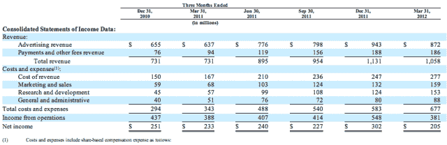
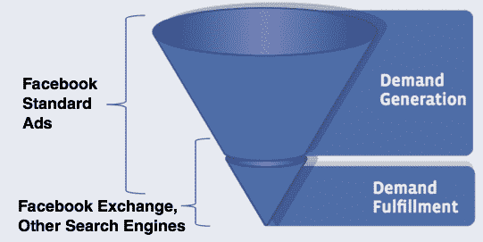

# 脸书的首次公开收益，Q2 2012，定于 7 月 26 日 TechCrunch

> 原文：<https://web.archive.org/web/https://techcrunch.com/2012/06/29/facebook-earnings/>

# 脸书的首次公开收益，Q2 2012，定于 7 月 26 日

根据刚刚发布到其投资者关系页面上的一份简要说明，脸书将于太平洋时间 7 月 26 日下午 2 点向投资者和世界首次正式公布其 2012 年 Q2 上市后的收入。目前还没有迹象表明首席执行官马克·扎克伯格是否会参加财报电话会议，或者更关注业务的高管首席运营官·雪莉·桑德伯格和首席财务官大卫·埃博斯曼是否会回答问题。

该公司 2012 年在 Q1 的收入为 10.58 亿美元，净收入为 2.05 亿美元。批评者希望看到这两者都有所增长，并可能会关注其移动收入。脸书在 2 月底才开始在手机上展示广告，但媒体货币化被认为是脸书未来成功的关键。

该公司的股价[今天收于 31.095 美元](https://web.archive.org/web/20221208011716/http://www.nasdaq.com/symbol/fb)，下跌 0.265 美元或 0.85%，低于 6 月 25 日触及的近期峰值 32.86 美元。不过，与 5 月 18 日上市以来的大部分时间相比，它仍然更接近 38 美元的发行价。以下是它在首次公开募股前在 S-1 中发布的最新收益和收入信息。

脸书的数据让潜在投资者吓了一跳，尽管其收入比 Q1 2012 年增长了 44.7%，但比 2011 年第四季度下降了 6.5%。虽然肯定受到节日广告减少的影响，但许多人怀疑这是势头放缓的第一个迹象，因为其用户群转移到了移动端，在那里它没有有效地赚钱。

但是最近由 TechCrunch 首次发布的数据显示，新闻提要中的赞助故事广告有很强的潜力使移动成为一个重要的收入来源。脸书最大的广告 API 合作伙伴显示，用户点击移动赞助故事的可能性是桌面广告的 13 倍，他们在社交网络上的收入是桌面广告的 11 倍。

脸书有意限制这些广告的出现，以免让多年来没有广告的用户感到震惊。在不降低使用率和参与度的情况下，找到可以展示的最大数量的广告，或者在用户嘴里留下酸味，将是至关重要的。

虽然他们的力量不会反映在 Q2 2012 年的收益中，但有三个新的脸书广告产品可以使未来的收益发布更加闪亮:

*   [脸书交易所](https://web.archive.org/web/20221208011716/https://beta.techcrunch.com/2012/06/13/facebook-exchange/)——一个重定向系统，让第三方网站向访问者投放 cookies，然后在脸书上向他们投放广告，旨在让他们完成他们可能正在考虑的购买
*   [超本地广告定位](https://web.archive.org/web/20221208011716/https://beta.techcrunch.com/2012/06/18/facebook-local-ad-targeting/)——虽然没有得到证实，但据报道，脸书正在开发更精确的本地广告定位，可以向用户展示与他们周围几百英尺内的企业相关的广告
*   Zynga.com 网站外的脸书广告——根据收入分成协议，脸书上周开始在该网站上展示广告，最终可能在更多的第三方网站上发展成一个利润丰厚的广告网络

考虑到这些新的发展，承销脸书首次公开募股的三家主要投资银行，JP 摩根、高盛和摩根士丹利[本周都给出了相当于“买入”的评级](https://web.archive.org/web/20221208011716/http://blogs.barrons.com/techtraderdaily/2012/06/27/fb-underwriters-decidedly-mixed-possible-miss-this-quarter/)。其他银行给出了“中性”或“持有”的评级。

许多人希望看到脸书平稳过渡到手机市场的迹象。如果它能在 7 月 26 日显示出同样的效果，并且价格保持在现在的水平，投资者可能会涌向脸书。不考虑财务状况，马克·扎克伯格(Mark Zuckerberg)出现在财报电话会议上这一事实可能会让投资者放心，他们可能担心这位年轻的首席执行官在 IPO 前路演期间错过了几次与他们的会议，因此他们远远没有优先考虑。

如果他真的加入通话，我最好不要听到一个分析师提到帽衫，扑克，或任何那些[可怕的脸书双关语](https://web.archive.org/web/20221208011716/http://friendsdontletfriendsusefriends.tumblr.com/)。