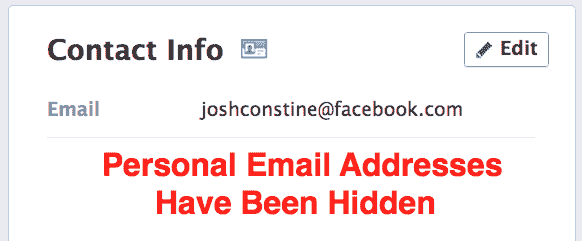
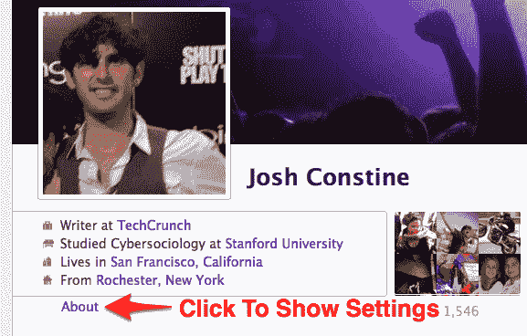
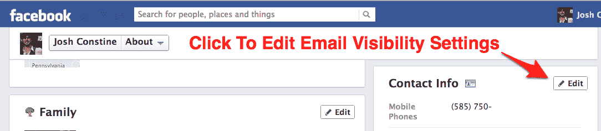
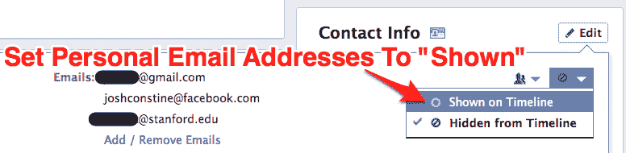

# 脸书隐藏了你的电子邮件地址，只留下@Facebook.com 可见。现在就解开这些废话 TechCrunch

> 原文：<https://web.archive.org/web/https://techcrunch.com/2012/06/25/facebook-email-address/>

为了提高电子邮件地址的隐私性，脸书搞砸了一次看起来很自私的尝试，试图增加指向你的脸书信息收件箱的 [@facebook.com 电子邮件地址](https://web.archive.org/web/20221208210609/https://beta.techcrunch.com/2012/04/13/facebook-one-ups-google-with-a-kind-of-facebook-your-fb-email-timeline-names-are-now-linked-up/)的使用率。

现在，每个人的个人电子邮件地址都从他们的个人资料中隐藏起来了，不管之前选择的隐私设置如何。相反，你的 [@facebook.com 联系信息](https://web.archive.org/web/20221208210609/http://www.facebook.com/help/?faq=224049364288051#How-do-I-use-my-@facebook.com-email-address?)是唯一一个被允许查看你电子邮件地址的人可以看到的信息。这使得朋友很难通过第三方电子邮件与您联系，除非您重设控制。

我认为脸书应该认真考虑回滚或至少一些强有力的变化通知，这样 9 亿人不会突然发现他们的电子邮件地址更加封闭和断开。

但是这个设置是多余的，因为你已经可以将他们每个电子邮件地址的隐私设置为他们想要的任何类别、列表或特定的人。如果它默认所有的地址都显示在时间线上给之前能看到它们的人，一切都会好的。不幸的是，脸书在隐私方面犯了太多错误，通过将个人地址默认为“隐藏”来锁定个人地址的可见性。

2010 年 11 月，脸书发布了其[统一消息产品](https://web.archive.org/web/20221208210609/http://www.insidefacebook.com/2010/11/16/in-depth-review-facebooks-new-message-inbox-product/)，可以让你从消息收件箱查看发送到 new @facebook.com 地址的消息、聊天和电子邮件。脸书当时让你注册了一个虚名电子邮件地址，并在 4 月份开始通知人们这是[向每个人分配通用电子邮件地址。现在](https://web.archive.org/web/20221208210609/https://beta.techcrunch.com/2012/04/13/facebook-one-ups-google-with-a-kind-of-facebook-your-fb-email-timeline-names-are-now-linked-up/)[的展示](https://web.archive.org/web/20221208210609/http://newsroom.fb.com/News/Addresses-on-Facebook-146.aspx)已经完成，所以脸书想让人们对他们所有地址的可见性有更多的控制，所以他们给每个列出的电子邮件地址添加了“显示”或“隐藏”控件。

由于任何人都可以通过你个人资料上的按钮给你发脸书消息，脸书可能认为默认@facebook.com 地址可以直接发送到时间线上“显示”的收件箱。反响是，人们认为脸书在不正当地试图提高人们对其专有电子邮件地址的认识，我从未听说有人使用这些地址。

—

—

要取消损坏并恢复到您之前的电子邮件地址可见性，请访问您的个人资料并单击封面下方右侧的“关于”链接。然后在右下角的联系信息部分点击“编辑”,在右上角将所有个人电子邮件地址的“从时间轴隐藏”切换到“在时间轴上显示”(如果你不想让电子邮件进入你的信息收件箱，请隐藏你的@facebook.com 地址)。

和以前一样，你也可以为你希望看到的任何人设置每个地址的隐私控制，例如设置一个只有朋友可见的个人地址，但朋友的朋友或公众可以看到的工作地址。那些没有改变的是主控件，所以如果脸书已经默认个人电子邮件地址为“显示”，没有新的人可以看到你的地址。

事实是，数百万人可能希望他们的朋友能够从他们的个人资料中获取他们的 Gmail 或其他个人电子邮件地址，因为他们就是这样设置的。脸书不告诉人们就修改这些设置是不负责任的。

面对如此多的反对和声称这是自私的说法，如果它做出一些改变，我不会感到惊讶，可能会默认所有电子邮件地址为“显示”，供尚未接触新控制的人使用，以便他们现有的隐私设置继续决定谁可以看到每个电子邮件地址。

也许如果你给 10 个朋友发邮件，但没有他们的两个个人邮箱地址，你可以抄送他们的@facebook.com 地址，这会很有用。也许这真的只是为了给用户更多的隐私。但如果我有目的地让朋友看到某样东西，我不希望它毫无征兆地突然消失。

该网站应该添加一个工具提示，突出显示这些变化，并解释如何恢复它们，或者它应该立即回滚更改。今天，脸书明白了更多的隐私并不总是更好。