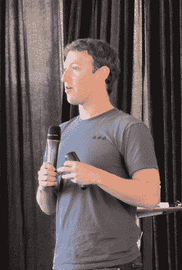

# 扎克伯格:我们的系统不是电子邮件黑仔。但是如果它因此而死亡...

> 原文：<https://web.archive.org/web/https://techcrunch.com/2010/11/15/facebook-email-killer/>

# 扎克伯格:我们的系统不是电子邮件黑仔。但是如果它因此而死亡…

今天，在他们的“[现代信息系统](https://web.archive.org/web/20230404075905/https://techcrunch.com/2010/11/15/facebook-messaging/)的发布会上，脸书首席执行官[马克·扎克伯格](https://web.archive.org/web/20230404075905/http://www.crunchbase.com/person/mark-zuckerberg)对于电子邮件将随着他们产品的推出而消亡的传言说了很多。"*这不是邮件杀手。扎克伯格说:“这是一种包括电子邮件在内的信息体验。*

当然，他接着说，如果在未来，脸书的系统从根本上改变了人们沟通的方式，电子邮件随着时间的推移而贬值，那也没什么。他说，在与现在的高中生交谈时(他们让他觉得自己“真的老了”)，他们不使用电子邮件。“这太正式了，”扎克伯格指出。

同样，如果你推断出来，这意味着电子邮件的结束。听起来好像扎克伯格只是踮着脚呼吁许多人目前使用的系统的死亡。显然，这样的说法会引起巨大的骚动(考虑到当[脸书改变字体大小](https://web.archive.org/web/20230404075905/https://techcrunch.com/2010/11/02/facebook-tests-smaller-font-in-news-feed-users-retaliate-on-twitter/)时会引起巨大的骚动，扎克伯格呼吁电子邮件死亡的想法真的很可怕)。

他还特别谈到了像我们这样的帖子，称这个新系统为“ [Gmail 杀手](https://web.archive.org/web/20230404075905/https://techcrunch.com/2010/11/11/facebook-gmail-titan/)”。扎克伯格说:“我认为 Gmail 是一个非常好的产品。但是，他本质上是在说，这是一种好产品，后代使用得越来越少。

他指出电子邮件太麻烦了。有一个主题栏，一个正式的问候，一个结尾。青少年使用短信和即时消息是因为它们更简单。这就是脸书试图将电子邮件作为某种入门药物，添加到每个人生活中的东西。

"*我们认为，我们应该取消信息传递的功能。扎克伯格说:“它应该是最小的。*

写在墙上的是电子邮件。脸书只希望这是一堵脸书墙。