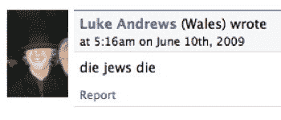

# 脸书员工就否认大屠杀发表看法 

> 原文：<https://web.archive.org/web/https://techcrunch.com/2009/06/15/facebook-employees-speak-their-mind-on-holocaust-denial/>

否认脸书大屠杀的辩论在 T2 激烈进行。脸书的立场很明确，否认大屠杀的团体和内容是好的([乳头不是](https://web.archive.org/web/20221007083311/http://www.beta.techcrunch.com/2009/05/10/jew-haters-welcome-at-facebook-as-long-as-they-arent-lactating/) ): *“仅仅是冒犯或令人反感并不能让它离开脸书。我们希望它(网站)成为一个人们可以讨论各种想法的地方，包括有争议的想法。”*

脸书还表示，在这个问题上，“我们有很多内部辩论”。根据我们从脸书员工的公开评论中看到的情况，他们仍然对公司在这个问题上的立场感到自豪。

第一个声明来自目前在公关团队的 Ezra Callahan，他写道:“你不能通过试图掩盖无知的存在来对抗无知。你直面它。脸书试图成为世界的思想警察，这对世界没有好处。”脸书发言人[兰迪·扎克伯格](https://web.archive.org/web/20221007083311/http://www.crunchbase.com/person/randi-zuckerberg)支持以斯拉，他说*“脸书雇员以斯拉·卡拉汉关于作为一名犹太雇员和支持脸书不清除否认大屠杀的团体的政策，写得非常好，表达清晰，见解深刻。”*

上周末，脸书的员工真的被这个问题激怒了。六名现任和前任员工对我写的一篇关于[广告商开始拒绝围绕这些内容展示广告的帖子发表了评论。罗伯特·斯科博注意到了这场争论，并在 MobFeed 上开始了自己的辩论。](https://web.archive.org/web/20221007083311/http://www.beta.techcrunch.com/2009/06/12/holocaust-museum-death-wont-change-facebooks-mind-on-hate-but-advertisers-may-be-able-to/)

有一个共同的主题——对言论自由的保护超过了这些内容的存在所造成的任何损害。顺便说一下，这是易贝和 T21 都已经抛弃的观点。

我认为重要的是，我们要尽可能地迫使政府不去决定什么是允许的，而不是言论。但是私营公司没有宪法强制他们出手的奢侈，言论自由专家显然认为私营公司能够并且应该在这类内容上做出自己的决定。他们有在对与错之间做出主观选择的自由。依靠宪法和争论一个被误导的概念，即他们正在追求一个更高的目标，这不仅是智力上的不诚实，也是不负责任的。看到[这种旁边放着脸书 logo 的可恶内容](https://web.archive.org/web/20221007083311/http://www.beta.techcrunch.com/2009/05/10/jew-haters-welcome-at-facebook-as-long-as-they-arent-lactating/)，让身为会员的我很尴尬。显然，大多数脸书员工一点也不尴尬。那些愿意说出来的人一致赞成保留内容。

唯一的例外是 Net Jacobsson，他已经不在公司了。这是一个可怕的信号——脸书目前的员工不会忽视这个信号。该公司有一项政策，可以利用宪法来为自己辩护。要么和我们站在一起，要么站在一边。真的没有一个现任脸书员工认为这个政策是错误的吗？

评论如下:

布雷克·罗斯:*“我是脸书的员工，所以我要公开声明:如果脸书改变它在这方面的政策，那将是错误的，我也不会感到骄傲。我们目前的政策是正确的，尽管你无可辩驳地引用了《今日美国》的一篇专栏文章。”*

布雷克·罗斯:*“我要澄清一点，我是以我自己的身份发言，而不是作为整个公司的代表。我知道这个博客对上次兰迪决定表达自己的想法感到困惑。”*

亚当·莫塞里:“我不明白一个人怎么能把审查合理化，不管信息多么错误或邪恶。政府、新闻媒体或交流平台无权告诉任何人他们能说什么或不能说什么。我是脸书的员工，我是代表自己说话，而不是代表公司。”

亚当·莫塞里(回应我，指出他支持所有的言论，不管多么充满仇恨):*“三 k 党是一个恐怖组织，对他人的安全构成了积极的威胁。对犹太人的仇恨信息是侵犯受害者权利和安全的人身攻击。否认大屠杀是荒谬和可悲的，但成立一个团体来谈论它并不是对任何人的安全的冒犯。暗示在 DC 大屠杀纪念博物馆毫无意义地谋杀一名警卫意味着所有信仰相似的人都对其他人的安全构成威胁，这不仅是不合理的，而且是对一场悲剧的恶意滥用，以推进一项不尊重受害者或其家人的政策议程。”*

达姆·莫塞里(继续):*“我认为因为你不同意某人的观点而审查他是错误的，但我承认我们对用户安全的责任高于言论自由。拿下包含特定线索的三 k 党网页是必要的。你说这些否认大屠杀的团体，其中没有一个成员超过 140 人，对其他人的安全构成了威胁，我不同意。这些组织对 DC 谋杀案的凶手的行为没有责任，而你在暗示相反的事情。你可以诋毁我的观点，如果你喜欢，可以叫我绵羊，但我对我是一名员工这一事实持开放态度，顺便提一下，这并不意味着我没有权利保留自己的观点。”* 

戴夫·威尔纳:*“完全披露——我也是脸书的员工，只是表达我自己的观点。我发现你明显无法接受公司里的人真的不同意你的观点，这很了不起。我们完全理解你认为脸书在这个问题上的立场是错误的。但是，如果你真的想要占据某种道德制高点，你至少应该对那些与你意见相左的人礼尚往来。该公司采取的立场基本上符合美国政府对言论定罪能力的宪法限制。在任何人提出谣言之前，我完全理解并完全接受脸书不受这些限制的约束。然而，我也不认为这个事实与支持这个论点的论点的道德力量有关。除了直接威胁使用暴力的情况之外，使用强制权力审查他人在道德上是可疑的，或者不是。如果是的话，那么脸书的政策是正确的。如果不是，那么美国激进的言论自由保护是错误的。让一家私营公司来做审查不会改变道德考量。”*

戴夫·威尔纳(回应另一位评论者):*“仔细和详细地思考一个影响超过 2 亿人的问题不是“精神体操”，而是一种责任。不要用人身攻击和错误的断言来回避问题。反驳论点。如果保护言论自由，除了直接威胁的情况下，是一种道德义务，那么它是一种道德义务。如果你认为不是，请解释原因。我愿意被说服……但只能是通过实际的推理，而不是通过对事实的断言、恶意的指控和简单的等价陈述。”*

布雷克·罗斯:*“说到底，你只是想和你的同事们打成一片。”我对这些奇怪的合理化感到困惑。脸书是一个非常直言不讳的多元化群体。员工每天一整天都在和对方以及公司发生分歧，而且相当大声。我首先要说的是，我们确实时不时会把事情搞砸，但幸运的是，这不是其中之一。我们不同意你，因为我们认为你错了。我们内部也有同样的争论。”*

安德鲁·博斯沃思:*“杰西卡——我很确定你刚刚指责戴夫·威尔纳在同一篇文章中发表空洞的言论，你把他比作纳粹。具有讽刺意味的是，他提出了一个有效的观点，而你除了发泄仇恨什么也没做。你没意识到这对世界上真实的人的生活有真正的影响吗？你不仅仅是支持它，你是它的一部分！这场争论是整个问题的缩影，在什么程度上，对仇恨言论的判决只是多数人对少数人的看法？在拥挤的大楼里大喊失火不受保护(法律上或道德上),因为这直接侵犯了他人的人身安全，而根据我们的道德判断，他们有权这样做。我认为很明显，这些组织并不构成迫在眉睫的威胁。它们令我们所有人感到厌恶和无知，但除非它们对他人的人身安全构成可信的威胁，例如通过暴力威胁，否则不应关闭它们。”*

戴夫·威尔纳:“如果有观点认为，除了防止直接伤害以外，保护言论自由在道德上势在必行，请提出反对意见。到目前为止，集体的反应完全包括虚假的对等、对推理思想的攻击、人身攻击、不正确/不完整/错误的断言以及脸书方面的恶意指控。我不会详细回答这些问题，因为它们根本不是论据。然而，由于我们现在的业务引用其他人，让我补充一些我自己的段落:“……应该存在最充分的自由教授和讨论，作为一个道德信念的问题，任何学说，无论不道德的可能被认为……唯一的目的是权力可以正确地行使对文明社会的任何成员，违背他的意愿，是防止伤害他人。”“沉默的意见的表达的特殊的邪恶是，它是掠夺人类；后代以及现有的一代人；那些对这个观点持不同意见的人，仍然比持有这个观点的人更多。如果意见是对的，他们就被剥夺了用错误换取真理的机会；如果意见是错的，他们就失去了几乎同样大的好处，即通过与错误的碰撞而产生的对真理的更清晰的认识和更生动的印象。”——约翰·斯图尔特·米尔，《论自由》:“我们并不害怕把令人不快的事实、外国思想、外来哲学和竞争价值观托付给美国人民。因为一个国家如果害怕让它的人民在一个公开的市场上判断真理和谬误，就是一个国家害怕它的人民。”——约翰·肯尼迪“如果我们不相信我们所鄙视的人的言论自由，我们就根本不相信它。“——诺姆·乔姆斯基”书籍不会一直被禁。它们不会燃烧。创意不会坐牢。从历史的长期来看，审查员和检察官总是失败的。反对坏主意的唯一武器是更好的主意。“-阿尔弗雷德·惠特尼·格里斯沃尔德，《纽约时报》，1959 年 2 月 24 日”

戴夫·威尔纳:*“@大卫·阿普尔特里——你仍然在回避这个问题。你不喜欢发表声明的人的政治观点，这与声明的真实性没有关系。我也不总是乔姆斯基的超级粉丝。但这与手头的事情毫无关系。@ Jessica——虽然我仍然不同意你的结论，但我想首先感谢你真诚地直接提出了这个论点。快速说明，我(仍然)在这里代表我自己，而不是公司。我不认为否认大屠杀本身就是对他人安全的威胁。虽然卑鄙和不真实，但它并不一定要求对任何人使用暴力。任何实际上直接呼吁暴力的团体，或如此直接的种族主义者，他们的偏见实际上是呼吁暴力的，都已经被清除了。不考虑讨论中的想法。我明白，试图对历史暴力提出质疑可能会被用来伤害暴力的受害者，但这根本不是直接威胁。从这个角度来看这个问题——如果脸书要删除否认大屠杀的团体，公司还应该删除哪些绝对相似的团体？除其他外，这将推动该公司删除任何辩称任何其他广泛传播的暴力历史事件没有发生/没有被接受的叙述那么糟糕的言论，例如 9/11 阴谋论，否认亚美尼亚种族灭绝，潜在的“巴勒斯坦不是国家”等团体，大量塞尔维亚民族主义团体争论脱离的国家是否是正确的国家，等等。这些例子只是触及了表面。我认为我们分歧的关键是你在文章中表达的观点，“我们希望明确——我们对合法的、有背景的、比较的和真实的政治话语没有异议。“虽然我个人对这些问题的真假有非常明确的看法，但作为一家公司，脸书不会也不应该试图判断我们内容中讨论的观点的真实价值，前提是它不符合许多非常明确的例外情况(直接的暴力威胁、试图通过垃圾邮件/网络钓鱼欺骗我们的使用等)。对真理价值做出判断必然要求脸书作为一个公司拥有一个官方版本的世界历史。对大屠杀的看法相对来说比较直截了当。但是，当你试图讨论那些在英语世界不太为人所知，但对那些受其影响的人的生活同样重要的问题时，这个命题就变得困难得多。从表面上看，让所有涉及重大暴力事件的事件真相有一个固定的版本是一个无法实现的命题。此外，这显然是苛刻的，与 Facebooks 作为交流平台的目的背道而驰。我也不相信大屠杀是特例。首先，任何事件本质上都贬低了其他人的痛苦，我认为这在道德上是很可疑的。虽然我完全同意这是历史上最严重的工业化大屠杀……但我非常谨慎地以此为由，因为我觉得这是一个薄弱的思考点。如果明天发生一场夺走更多受害者生命的类似悲剧，大屠杀会不会不那么恐怖？答案显然是否定的，但“有史以来最糟糕的”逻辑指向的答案是肯定的。如果我们接着试图以两个事件为特例，问题就变成了为什么仅仅止于这两个事件？无论如何，虽然你还没有说服我，谢谢你直接回答了这些问题。这种讨论对每个人来说都是富有成效的，尤其是在我们意见不一致的时候。”*

Dave Willner: *“如果有人想发布一个名为‘大多数同性恋者因性虐待而成为同性恋’的群组会怎样？我不知道这种说法是否真实，但难道脸书不应该把它留下，这样我们就可以一起讨论它了吗？调查一下？讨论一下。如果有人建立了一个名为“圣经反对同性恋”或“同性恋可以选择不做同性恋”的群组会怎么样？….我现在就告诉你，如果 FB 员工有自己的反对加州 8 号提案的粉丝页面，他们看到这样的团体会发疯，他们会以你头晕目眩的速度删除它们。”http://www.facebook.com/group.php?gid=2201212877 http://www.facebook.com/group.php?gid=150174035284 http://www.facebook.com/group.php?gid=87767017523 "*

戴夫·威尔纳:*“如果保护言论自由(除了直接威胁的情况下)是一种道德义务，那么它就是一种道德义务。如果你认为不是，请解释原因。”同样，如果你认为对大屠杀的讨论可以/应该与对人类历史上许多其他难以置信的恐怖事件的讨论不同，请解释原因。相反，如果您认为它属于可以/应该以不同方式处理的更广泛的悲剧类别，请具体说明哪些事件以及应该使用什么标准来选择它们。最后，引用你上面的话:“唯一让你的人采取行动的是负面宣传，诉讼的威胁，或者政府行动，等等。”如果是这样的话，我们不就已经改变立场了吗？这篇文章似乎不太受欢迎。”*

Net Jacobsson(前雇员):*“作为前脸书雇员。我真的不同意他们在这方面的政策。这与言论自由无关，而是仇恨。作为一家私营公司，脸书可以对其平台上的仇恨采取坚定的立场。甚至奥巴马总统上周在布痕瓦尔德说，否认大屠杀是仇恨..”直到今天，还有人坚持认为大屠杀从未发生，”奥巴马在集中营门口的新闻发布会上说。这种说法是“无知的、毫无根据的和可恶的”。“脸书是一个非常强大的分享、传播信息的平台&组织人们。我相信拥有如此强大的工具需要更高的道德责任感。改变永远不会太晚，说“我们错了”永远不会太晚。再说一遍，这与言论自由无关，而是与仇恨有关。”*

马克·斯里:*“迈克尔，你已经越界了。你现在正在利用对一名无辜平民的毫无意义的谋杀，并利用它来推进你反对脸书政策的个人议程。这种行为是可耻的，不诚实的。这起谋杀与脸书无关。成熟点吧。与其把这种嘲弄变成你政策改革的工具，不如让我们都给受害者和他所爱的人应有的尊重。”*

**更新:**今日脸书否认大屠杀团体的评论截图:

