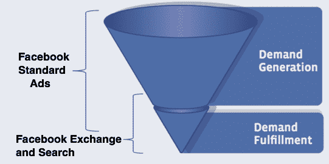

# 脸书交易所:广告商通过实时竞价广告锁定特定用户的新途径

> 原文：<https://web.archive.org/web/https://techcrunch.com/2012/06/13/facebook-exchange/>

脸书正在测试并将很快推出脸书交易所，这是一个实时竞价广告系统，第三方网站的访问者用一个 cookie 标记，然后当他们回到脸书时，可以看到与他们的网页浏览相关的实时竞价广告。这种重新定位的选择可能是脸书的一个巨大的赚钱机器，因为它将允许更多相关的直接广告。

例如，一个旅游网站可以向那些几乎在他们网站上买了机票的人提供去夏威夷的航班广告。广告商可能会为高度准确的目标支付高额费用。用户将能够通过第三方需求方平台选择退出脸书交易所，但他们不能从社交网络内部完全退出该计划。

脸书刚刚通知 TechCrunch，Exchange 目前正在测试八个广告需求端平台，在未来几周内，它将更广泛地用于传统的脸书侧边栏广告，按每千次展示收费，但不包括赞助故事或移动广告。

目前正在测试脸书交易所(或一些脸书员工内部称之为 FBX)的需求方平台有:TellApart、Triggit、Turn、DataXu、MediaMath、AppNexus、TheTradeDesk 和 AdRoll。

脸书交易所是这样运作的:

1.  一个用户访问一个旅游网站，该网站租用了一个装有脸书交易所的 DSP
2.  一个 cookie 被放到用户的电脑上，通常是在他们表现出购买意向的时候
3.  如果用户未能购买，或者广告客户希望向他们推销更多产品，DSP 会联系脸书，并向他们提供他们希望锁定的用户的匿名用户 ID
4.  广告商预先加载针对该用户的广告创意
5.  当用户访问脸书时，它会识别 DSP 丢弃的 cookie
6.  DSP 被通知并被允许进行实时出价以显示用户广告
7.  出价最高的 DSP 向用户展示其高针对性的广告
8.  如果用户不同意看到广告，并选择“X”退出，他们会看到一个到 DSP 的链接，在那里他们可以选择退出未来的脸书交易所广告

脸书的 Annie Ta 告诉我，Exchange 背后的想法是让广告商向用户展示更多相关的广告。迄今为止，脸书一直被普遍视为机构或品牌广告的大本营。然而，对直接营销人员来说，它被视为不如搜索广告有用，因为脸书的用户在谷歌等引擎上搜索相关关键词时，并没有表现出购买意图。

脸书交易所可能会改变这一切。

例如，福特可以向在其网站上查看新款 Escape SUV 的用户发送一个 cookie，但不请求本地报价。然后，福特可以出价显示用户广告，说明“福特 Escape:仅 21，000 美元”。这将比显示用户可能不感兴趣的轿车或卡车的通用福特广告更相关。福特很可能愿意支付更高的价格来获得这一合格的领先地位。

[更新:正如彭博的 Douglas MacMillan 指出的那样，FBX 也可以推动时间敏感广告，因为广告在用户浏览网站时被实时竞价并发送给用户。这允许紧急广告，例如引导用户打开当前播放的电视节目或体育赛事的广告。]

然而，脸书可能会让一些用户感到不安，以便在这一新的收入流中获利。基于 Cookie 的广告重定向在网络上很常见，脸书正在保护隐私，不允许广告商将 cookie 重定向与脸书拥有的关于其用户的大量传记、社会和行为数据结合起来。尽管如此，有些人就是不喜欢被当作目标。这些人将能够在需求方平台的网站上使用第三方选择退出来停止接收 cookies。

然而，我问脸书是否会为用户提供一种简单的点击方式，以拒绝社交网络基于所有 DSP 的 cookies 锁定他们的能力，它说目前不会提供这种方式。这部分是因为它不能控制 DSP 是否丢弃 cookies，尽管它可以决定是否使用它们。不允许重定向与脸书自己的广告定位数据相结合是一种非常强大的隐私保护，并使脸书交易所广告与网络上任何其他重定向广告一样。

如果投资者在寻找脸书如何达到 IPO 时 1040 亿美元估值的线索，脸书交易所应该会让他们兴奋。这表明脸书愿意转向略显激进的广告机制。

就在一年前，脸书的广告定位还只是基于用户输入的个人信息和兴趣，而现在，应用程序中的浏览行为和[活动都包括在内，例如在 Spotify](https://web.archive.org/web/20230404054259/https://techcrunch.com/2012/02/01/action-spec-ad-targeting/) 上收听特定艺术家的音乐。脸书已经引领了美国整体展示广告市场，2011 年总额达 124 亿美元，社交网络的市场收入份额从 2010 年的 11.5%增长到 2011 年的 14%。如果脸书交易所获得牵引力，脸书可能会超过 eMarketer 的估计，即脸书的份额将在 2012 年增长到 16.8%，预计市场规模为 153.9 亿美元。

但对脸书的长期健康最重要的是，FBX 意味着用户可以看到更多他们真正想买的东西的广告，而不是将广告视为令人讨厌的干扰。

*【图片鸣谢:[安德鲁·马吉尔](https://web.archive.org/web/20230404054259/http://www.flickr.com/photos/amagill/34754258/)，[泓](https://web.archive.org/web/20230404054259/http://www.acquisio.com/ppc/adding-value-through-facebook-advertising/)*