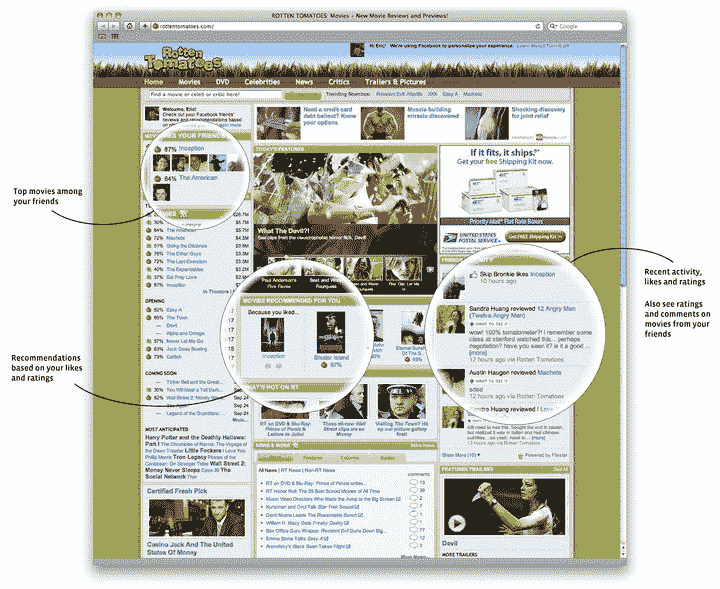

# 脸书扩大即时个性化计划，烂番茄成为 TechCrunch 的合作伙伴

> 原文：<https://web.archive.org/web/https://techcrunch.com/2010/09/17/facebook-expands-instant-personalization-program-adds-rotten-tomatoes-as-partner/>

# 脸书扩大即时个性化计划，烂番茄成为合作伙伴

脸书刚刚将其极具争议的即时个性化计划扩展到广受欢迎的电影评论社区[烂番茄](https://web.archive.org/web/20221206203814/http://www.rottentomatoes.com/)，该计划允许选定的第三方网站在不需要你登录或“连接”的情况下访问你的一些数据。在宣布这一消息的[博客文章](https://web.archive.org/web/20221206203814/http://blog.facebook.com/blog.php?post=428102667130)中，脸书说这一新功能将允许用户“立即看到与你最相关的评论，而无需注册、搜索朋友或填写个人资料。”

即时个性化是在四月份的脸书 f8 会议上首次宣布的。该功能使获得脸书许可的网站能够在你到达第三方网站时访问你在脸书上与“所有人”分享的任何信息，而无需认证。在推出时，只有三个网站提供即时个性化服务:Yelp、微软的 Docs.com 和 Pandora——这是自 4 月推出以来的首次扩展，脸书表示将在接下来的几个月里慢慢扩展。我怀疑脸书本想在此之前开始更广泛地推广这一技术，但即时个性化一经宣布就引发了对隐私的担忧。

即时个性化背后的概念是引人注目的:它提供了个性化网站的承诺，当你一到达网站，网站就知道你对什么感兴趣。但它充斥着隐私问题。即时个性化招致了倡导团体甚至一些参议员的抨击，部分原因是最初退出很困难(脸书已经改进了这一点)。

脸书认为，将这些数据交给可信的第三方是合理的，因为这只是移交用户选择与“每个人”分享的数据。当然，近一年来，脸书一直在鼓励用户在这种不那么私密的环境下分享更多的数据。

最大的推动来自去年 12 月，当时它迫使用户通过一个新的隐私向导，鼓励用户与“每个人”分享他们的更新和其他关键信息(我仍然认为这是该网站迄今为止最令人震惊的隐私举措)。后来的改变包括强迫用户将他们的兴趣转移到[公众“喜欢”上](https://web.archive.org/web/20221206203814/https://beta.techcrunch.com/2010/04/19/facebook-asks-you-to-become-a-fan-of-all-your-interests/)，这些兴趣以前可能隐藏在个人资料中。换句话说，很多人与“每个人”分享大量信息。

脸书正在逐步实现即时个性化，这是有充分理由的——即使媒体和隐私倡导者没有对这些问题发出警告，当人们到达一个网站时，它已经知道他们的朋友是谁，他们很有可能会完全抓狂。但是，就像脸书遇到的所有其他隐私相关问题一样，它的用户可能根本不在乎——他们只是喜欢在访问烂番茄时看到他们最喜欢的电影的评论。

以下是脸书发来的关于这个项目的一些数据:

*   用户控制即时个性化-当他们到达一个网站时，他们可以禁用该体验，或者他们可以在脸书设置中关闭所有网站的程序。
*   如果您之前退出了即时个性化计划，您将继续被任何新网站拒绝。
*   合作伙伴网站遵循明确的产品/安全/隐私指南，可能仅使用您的公开信息和好友列表来提供更个性化的体验。
*   所有的体验都是基于明确的行为(例如，你在个人资料中输入的信息或点击“赞”)；被动行为(你正在阅读的内容)永远不会浮出水面。
*   用户数据永远不会传输到广告网络。**更新**:脸书也澄清“该计划不会交换任何收入，合作伙伴也不会将用户数据转移给第三方广告网络。”
*   在接下来的几个月里，与一些对人们有明显价值的合作伙伴网站一起慢慢扩展该计划。专注于你已经通过现实世界中的朋友找到信息的垂直领域(例如:评论、美食、旅游、音乐、电影)。