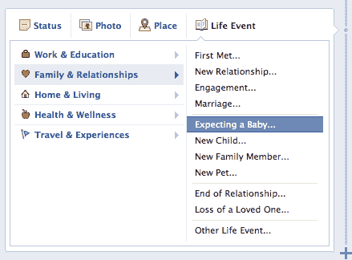
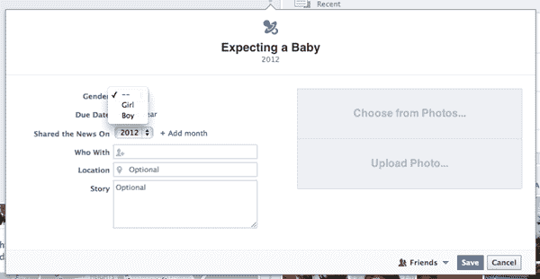
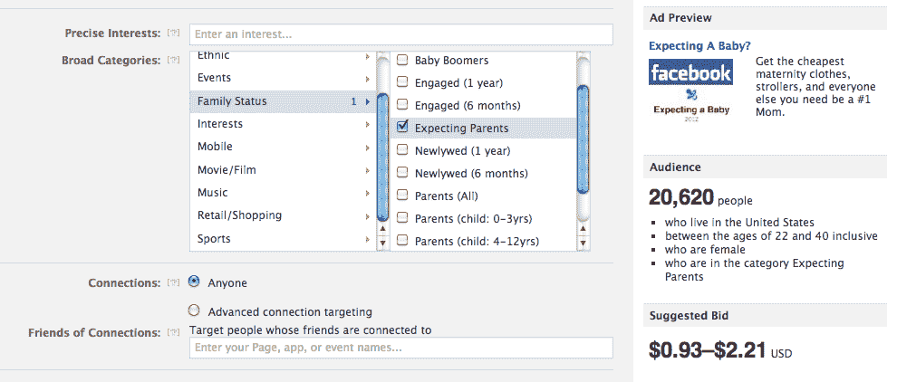
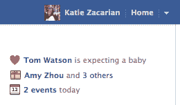

# 脸书让你宣布你怀孕了 TechCrunch

> 原文：<https://web.archive.org/web/http://techcrunch.com/2012/08/13/facebook-expecting-baby/>

# 脸书让你宣布你怀孕了

脸书似乎感觉到了它的生物钟在滴答作响，因为今天它推出了一个新的时间线事件，让你分享你正在期待一个孩子的，预产期，以及是男孩还是女孩。孩子出生的消息会出现在庆祝主页的侧边栏，在孩子出生的那一天，会出现在新闻提要中。脸书告诉我，它正在探索这一功能是否会推动现有的广告选择，以瞄准可能非常有利可图的“准父母”。

这个期待宝宝的新生活事件也打开了一个新的广告，这是另一个迹象，表明[脸书正在成熟](https://web.archive.org/web/20230209125013/https://techcrunch.com/2012/05/20/mr-zuckerberg/)，因为它从 2004 年开始的大学生原始用户群开始孵化 13 年后可以加入脸书的小家伙。

该功能取代了更令人困惑的[选项，将“预期:孩子”](https://web.archive.org/web/20230209125013/https://techcrunch.com/2011/08/02/facebook-wants-your-unborn-child/)添加到您的家庭成员列表中。您可以通过在时间线上的发布器中从人生事件下拉列表中选择公告来添加婴儿人生事件。脸书对于谁可以说自己怀孕了没有歧视。单身，在民事结合，或其他情况下，你仍然可以说一个孩子的方式。

你可以添加额外的信息，比如另一个父母是谁，地点(是怀孕了还是将在哪里出生？)，说来话长。如果您想等到凸起开始显示，可以设置未来的发布日期。此外，你可以在故事中添加一张照片，这可能会鼓励更多的超声波出现在脸书。这个从你的 feed 中删除婴儿照片的 [Unbaby.me](https://web.archive.org/web/20230209125013/https://techcrunch.com/2012/08/04/unbaby-me-yes-please/) 扩展将变得更加有用，如果它也能检测胎儿的话。

一旦发表，这个故事将立即出现在新闻提要中，并在到期日出现在朋友主页的庆祝侧栏上。脸书已经提供了大约六个月的[“期待父母”广告定位选项](https://web.archive.org/web/20230209125013/http://www.insidefacebook.com/2012/02/23/facebook-allows-advertisers-to-target-broad-categories-precise-interests-simultaneously/)，但它本质上是基于你喜欢的页面和其他选项的猜测。

现在，它将拥有关于谁是准父母的具体结构化数据。它还不会使用这些数据来推动广告定位，但你可以想象广告商会发现，通过孕妇装、育儿课程、婴儿车和其他任何人成为妈妈或爸爸所需的广告来准确定位预期父母的能力是多么有用。这些广告很可能会受到 T2 迅速涌现的 T4 婴儿科技公司的欢迎，这些公司追逐人们为成为世界级的父母而支付的大笔金钱

今天的专题报道增加了宣布你即将在脸书结婚的[日期的功能。谁知道呢，也许这是扎克微妙的表达方式，表示他和他的新娘 T4 怀孕了。开玩笑的。这是关于让脸书成为你生命中最重要时刻的主人，也许还能从这些时刻中赚些钱。](https://web.archive.org/web/20230209125013/https://techcrunch.com/2012/07/12/facebook-releases-weddings-and-celebrations-feature-maturing-with-executives/)