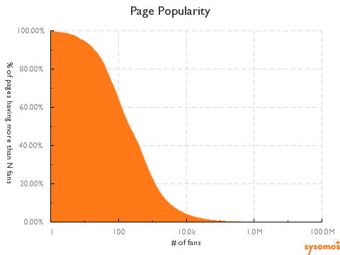
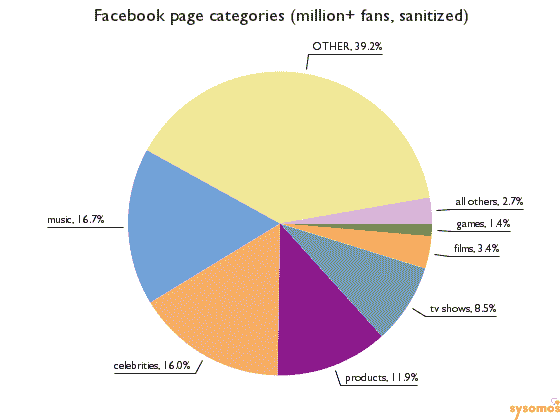

# 受欢迎并不容易。77%的脸书粉丝页面拥有不到 1000 名粉丝 

> 原文：<https://web.archive.org/web/https://techcrunch.com/2009/11/28/facebook-fan-pages-77-percent/>

在这个网络名人迅速走红的时代，任何人都可以成名 15 秒钟(改写安迪沃霍尔经常被引用的格言)。但是，当任何人都可以拥有一个脸书粉丝页面——那些由品牌、媒体、名人和想成为名人的人在脸书建立的公共页面——时，著名到底意味着什么呢？事实证明，受欢迎并不像看起来那么容易。根据社交媒体监测和分析公司 [Sysomos](https://web.archive.org/web/20230217010547/http://www.sysomos.com/) 即将发布的一份报告，整整 77%的脸书粉丝页面的粉丝数不到 1000 人。

一旦粉丝页面建立起来([这是我们的](https://web.archive.org/web/20230217010547/http://www.facebook.com/techcrunch))，脸书上的任何人都可以成为你的“粉丝”，这就像在 Twitter 上关注某人一样，不需要建立互惠的友谊。Sysomos 分析了脸书上的 60 万粉丝页面，得出了上图中的分布曲线。大量的粉丝页面拥有 10 到 1000 名粉丝。只有 4%的人拥有超过 1 万名粉丝，不到 1/20 的人拥有超过 100 万的粉丝。它细分如下:

*   95%的页面拥有超过 10 个粉丝
*   65%的页面拥有超过 100 名粉丝
*   23%的页面拥有超过 1000 名粉丝
*   4%的页面拥有超过 1 万名粉丝
*   0.76%的页面拥有超过 10 万的粉丝
*   0.047%的页面粉丝超过百万(共 297 个)。

互联网长期以来一直在定义名人，现在我们知道是多少(如果你接受脸书，世界第四大最受欢迎的网站，拥有超过 3 亿会员，是整个网络的最好代表)。要成为脸书的名人，你只需要一个相当受欢迎的粉丝页面，其中最大的一部分(42%)拥有 100 到 1000 名粉丝。另外 30%的人拥有 10 到 100 名粉丝。

脸书粉丝页面的类别分布非常均匀。按类别划分，名人、产品、商店、餐馆、酒吧和俱乐部、网站、音乐、组织和非营利组织各占粉丝页面的 6.9%至 7.5%。

所谓的名人只占所有粉丝页面的 7%。当然，也有一些真正的名人(去世的和活着的)在他们的脸书粉丝页面上吸引了大量的追随者。好吧，只有 297 个。例如，[迈克尔·杰克逊](https://web.archive.org/web/20230217010547/http://www.facebook.com/michaeljackson)拥有 1040 万粉丝的最大粉丝页面，这还没算上 [R.I.P .迈克尔·杰克逊【我们想念你】](https://web.archive.org/web/20230217010547/http://www.facebook.com/pages/RIP-Michael-Jackson-We-Miss-You/132749984408)的粉丝(可能重叠了 470 万)。动作电影明星[范·迪塞尔](https://web.archive.org/web/20230217010547/http://www.facebook.com/VinDiesel)拥有 700 万粉丝，超过了[巴拉克奥巴马](https://web.archive.org/web/20230217010547/http://www.facebook.com/barackobama)(690 万)或[梅根·福克斯](https://web.archive.org/web/20230217010547/http://www.facebook.com/MeganFox)(500 万)。是的，脸书的人是白痴(梅根·福克斯比范·迪塞尔热多了)。相比之下，Twitter 上最受欢迎的人阿什顿·库彻有 400 万粉丝，而奥巴马的 Twitter 账户只有 275 万——尽管这是[甚至没有尝试](https://web.archive.org/web/20230217010547/https://techcrunch.com/2009/11/15/president-obama-twitter/)。

最大的产品页面是[脸书自己的页面](https://web.archive.org/web/20230217010547/http://www.facebook.com/facebook)，拥有 580 万粉丝(嘿，这是作弊吗？)，其次是 510 万的[星巴克](https://web.archive.org/web/20230217010547/http://www.facebook.com/Starbucks)(页面充斥着诸如“MMMMM 南瓜香料拿铁！”).Sysomos 进一步挖掘，查看了拥有超过一百万粉丝的 297 个页面，并对它们进行了适当的分类——或者至少尝试了分类。事实证明，他们中的许多人(39.2%)没有什么特别之处，比如“和朋友出去玩”但其余的可以细分为音乐(16.7%)、名人(16.0%)、产品(11.9%)、电视节目(8.5%)、电影(3.4%)和游戏(1.4%)。

这就像现实世界一样。如果你有超过 100 万的粉丝，很有可能你不是摇滚明星就是演员。

在 Twitter 上，受欢迎程度与你发了多少条 T4 的微博相关，而脸书的粉丝页面往往每 16 天才更新一次。这就是脸书粉丝和推特粉丝之间的巨大差异。在 Twitter 上，你关注某人是因为你想听听他们想说什么。在脸书，你扇他们只是为了表示你对亲和力的支持。太多时候，这是一个一次性的姿态。但是，名声是短暂的。