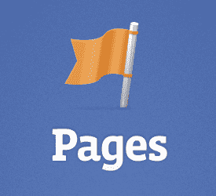
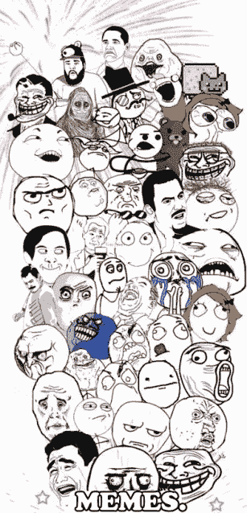

# 脸书 Feed Change 惩罚发布垃圾迷因的页面

> 原文：<https://web.archive.org/web/https://techcrunch.com/2013/08/23/facebook-feed-changes/>

脸书正在打击那些试图欺骗你的新闻源的网页。今天，它宣布了一项针对页面的 feed 算法变更，为来自可信来源的及时、相关、可共享的内容提供了更多可见性。与此同时，它惩罚那些要求人们喜欢他们的帖子和发布“低质量”模因的页面。这一更新可以在遏制垃圾邮件发送者的同时，将更多的流量导向声誉良好的页面。

本月早些时候，脸书宣布将开始公布新闻订阅的变化。它显示，在为每个人定制反馈时，需要考虑成千上万的信号。脸书没有悄悄地调整算法，而是决定对用户和企业的影响如此之大，以至于最好保持透明，并详细解释这些变化。

[的第一组变化](https://web.archive.org/web/20230404083513/https://techcrunch.com/2013/08/06/facebook-story-bumping/)集中在来自朋友的内容上。其中包括“故事碰撞”,以确保你不会错过精彩的帖子,“最后一个演员”,向你展示更多关于你最近互动过的人的信息，以及“按演员排序”,这仍在测试中，但可以帮助人们跟踪实时更新。

现在，脸书正在关注页面如何出现在提要中，这是一个更敏感的话题，因为许多企业已经开始依赖新闻提要获取内容。许多页面管理员公开批评脸书开始要求他们付费来获得现有的粉丝。这种热情很大程度上源于脸书同时对降级垃圾帖子更加严格。

问题是脸书并没有提前意识到这些变化，这导致了疯狂的猜测，它试图通过不在 feed 中显示页面来敲诈页面，除非他们付费。通过弄清楚这次发生了什么，脸书应该可以避免很多反弹。

### 页面的新闻提要是如何变化的

脸书表示，它对用户进行了一项调查，询问他们认为是什么让一个页面帖子值得一看。这些问题包括:

*   这是及时和相关的内容吗？
*   这些内容来自你信任的来源吗？
*   你会分享给朋友还是推荐给别人？
*   你真的对这些内容感兴趣吗，或者它是在试图欺骗新闻提要的分发？(例如，要求人们喜欢该内容)
*   你会把这称为低质量的帖子或迷因吗？
*   你会抱怨在你的新闻订阅中看到这些内容吗？

它利用用户反馈，建立了一个更好的机器学习算法，可以区分高质量和低质量的帖子，然后在提要中显示最好的帖子。

脸书表示，在对这些变化的测试中，“我们看到与这些内容的互动(喜欢、评论、分享)显著增加”，“测试组的人总体上隐藏的故事也更少”。这表明算法调整是成功的，因此它将在未来几周内开始推出更新。脸书说，对大多数网页来说，影响应该很小。

对于 Pages 来说，了解这一变化最重要的是，发布 Lolcats 风格的[模因](https://web.archive.org/web/20230404083513/https://www.facebook.com/Memes.fr?ref=br_rs)并在图片上覆盖文字可能不是未来的最佳策略。我问脸书的机器学习算法是否能够识别[这类帖子](https://web.archive.org/web/20230404083513/https://www.facebook.com/big.memes3?ref=br_rs)并将其降级，似乎可以。公司告诉我:

> “产生一些低质量、模因内容的页面预计会略有减少。专门发布低质量、模因内容的页面可能会看到更大的下降。对于创建高质量内容的页面来说，变化的幅度最大。一般来说，这些网页的发行量应该会增加。”

总的来说，网页应该关注于发布伟大的、吸引人的内容的策略，而不是使用肮脏的手段来获得喜欢。这应该意味着你在新闻提要中看到的更多内容值得你的宝贵关注。