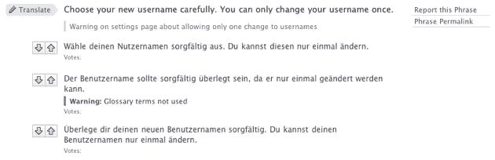
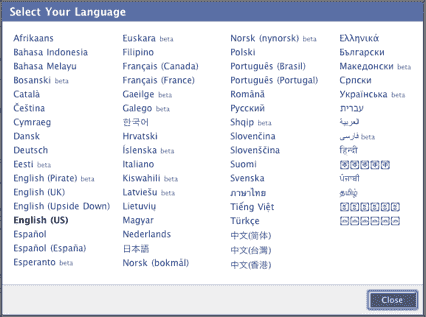

# 脸书想拥有众包翻译的想法 

> 原文：<https://web.archive.org/web/http://techcrunch.com/2009/08/26/facebook-files-for-patent-on-crowdsourced-translations/>

# 脸书想拥有众包翻译的想法

脸书是世界上最大的社交网络，所以直到 2008 年初，它还没有提供任何网站的本地化版本，这可能会让一些人感到惊讶。该公司通过一个名为[翻译](https://web.archive.org/web/20230203032909/http://www.facebook.com/apps/application.php?id=4329892722)的应用程序成功启动了其国际业务，该应用程序承担了翻译网站和众包的耗时且昂贵的任务，要求该网络的数百万用户伸出援手。这一过程被证明是非常高效的:脸书在 2008 年 2 月推出了一个[西班牙语](https://web.archive.org/web/20230203032909/http://blog.facebook.com/blog.php?post=10005792130)网站，仅仅在推出应用程序后的几周，到 6 月份，它已经支持了 16 种语言。现在已经超过 60 种，包括像希伯来语这样的从右向左阅读的语言。现在，脸书正试图为帮助其成为国际巨人的过程申请专利。

脸书在 2008 年 12 月向美国专利商标局提交了专利申请，但是直到最近才在网上发布。该申请目前正在通过办公室的审查过程，你可以肯定的是，许多网站都希望它不会通过。

这是专利的摘要:

> 本发明的实施例提供了用于翻译社交网络中的文本的技术。在一个实施例中，从社交网络的成员接收文本短语的翻译。这些文本短语包括社交网络系统中显示的内容，例如来自社交网络对象的内容。向特定成员提供包括第一语言的文本短语的内容，并且该成员请求翻译成另一种语言。响应于该请求，从一组可用翻译中选择文本短语的翻译。该选择基于社交网络中成员的朋友的动作，这些动作与该组可用翻译相关联。这些动作可以例如由朋友查看或批准翻译。然后，所选择的翻译被呈现给请求翻译的成员。

通俗地说，脸书的翻译应用程序向用户提供需要翻译的单词，他们提交自己的条目。然后，系统邀请其他用户使用 Reddit 风格的向上/向下箭头投票，选出最佳翻译。这不仅有助于生成技术上准确的翻译，还有助于消除笨拙或过于正式的措辞。

这是一种非常有效的技术，以至于其他社交网络也推出了自己的实现。Hi5 [在 2008 年春天推出了](https://web.archive.org/web/20230203032909/http://www.insidefacebook.com/2008/05/21/hi5-launching-crowd-sourced-translation-service-for-hi5-and-apps/)众包翻译模式(当时该网站已经被专业翻译成 23 种语言)，甚至在去年秋天为 OpenSocial 开发者推出了众包[翻译工具](https://web.archive.org/web/20230203032909/http://www.marketwire.com/press-release/Hi5-903786.html)。但是对免费众包翻译的接受并不总是积极的——LinkedIn 最近进行了一项[调查](https://web.archive.org/web/20230203032909/http://blog.linkedin.com/2009/06/19/nico-posner-translating-linkedin-into-many-languages/),以评估其用户希望帮助其翻译专业社交网站的动机。结果呢？大多数用户会对某种形式的免费认可感到高兴，无论是通过排行榜还是在他们的个人资料上，这就是脸书所做的，但 45%的人预计会因为他们的努力而获得“升级账户”。

当然，脸书并不是第一个使用网络众包本地化的网站。Meebo 从 2006 年初就开始使用用户编辑的翻译维基来生成网站的翻译，尽管网站的投票机制没有那么强大。现在要由专利局来决定这些其他网站所采用的技术是否代表现有技术，从而使脸书的专利无效。你可以肯定这是许多人所希望的——如果社交网络不能像脸书那样利用自己的社区，那将会非常令人沮丧。

