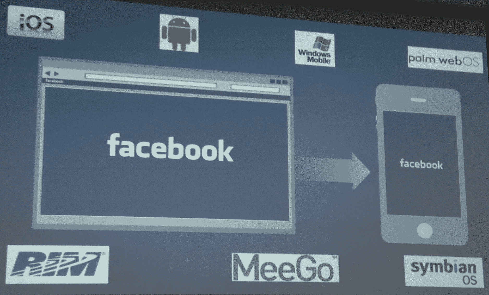

# 自重新发布以来的三周内，iOS 应用的脸书评论平均分从 1.5 星攀升至 4 星

> 原文：<https://web.archive.org/web/https://techcrunch.com/2012/09/13/facebook-for-ios-review/>

# 自重新发布以来的三周内，iOS 应用的脸书评论平均分从 1.5 星攀升至 4 星

脸书仍将推动 HTML5 创新，但剥离它以加速 iOS 应用的脸书已经非常成功。脸书今天在总部告诉记者，其一半的 iOS 用户在短短四天内更新了他们的应用程序，自重新推出以来，其应用程序商店的平均评论从 1.5 星上升到 4 星。

移动产品经理 Mick Johnson 回应了[首席执行官 Mark Zuckerberg 的 TechCrunch Disrupt talk](https://web.archive.org/web/20230404075310/https://techcrunch.com/2012/09/11/zuckerberg-the-leader/) ，称 iOS 用户在更新后消费的新闻报道是以前的两倍，这意味着向他们展示新闻报道广告的机会也是以前的两倍。

Johnson 讨论了围绕 HTML5 构建脸书移动应用的错误。“当我们将它嵌入到我们的原生应用程序中时，性能并没有达到我们用户的预期，也没有让他们满意。功能是有的，但感觉不像是我们想要使用、想要构建的体验。”尽管如此，他表示，“我长期看好 HTML5 的一切”，这表明一旦 html 5 有所改善，脸书可能会回到 html 5，并将继续依赖它来实现移动领域的长尾效应，特别是在国外。

脸书平台负责人道格·波弟解释说，“人们认为‘这是 HTML5 或原生的’，但它的‘和’。”这是因为 HTML5 驱动的 m.facebook.com 对于处理移动碎片至关重要。“我们不可能为 7000 台设备开发本地应用，”波弟说。这就是为什么它将继续推动移动浏览器供应商使用其 [Ringmark HTML5 测试标准](https://web.archive.org/web/20230404075310/https://techcrunch.com/2012/04/20/facebook-google-apple-html5/)，并改善相机访问、图形和速度。

但是直到重新启动之前，HTML5 启动原生 iOS 应用程序、浏览提要和查看照片的速度缓慢拖累了它的评论，但也让用户感到沮丧，以至于他们会过早地退出应用程序，或者在只有片刻时间的时候不打开它。这意味着生成的内容更少，发送的回访通知更少，查看新闻源花费的时间更少。由于脸书正试图成为一家移动广告公司，而这些广告会出现在新闻提要中，所以速度慢就意味着收入损失。

照片产品经理表示，新的 iOS 应用程序让用户更开心，分享更多照片，而约翰逊表示，这感觉更有活力。我也感觉到了。当我在咖啡馆排队或在其他地方有 30 秒空闲时间时，我更有可能拿出脸书，而不仅仅是当我知道我有几分钟时间等待它加载新闻时。这些额外的会话让脸书为我提供更多关于我朋友喜欢的页面或他们正在使用的应用的广告。

脸书收到的反馈发生了变化。以前人们只是要求应用程序变得更快，现在他们基本上是说它工作得很好，但这里有他们想要的新功能。这种新的见解将有助于脸书继续改进这款应用。事实上，Johnson 说脸书现在正转向 iOS 的两个月发布周期和 Android 的一个月周期。

**更新**2012 年 9 月 20 日:脸书现在[在一篇工程博客文章](https://web.archive.org/web/20230404075310/https://www.facebook.com/notes/facebook-engineering/timed-releases-for-mobile-apps/10151078442213920)中详述了这个定时发布周期

