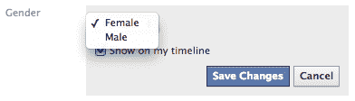
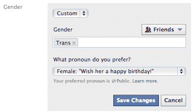
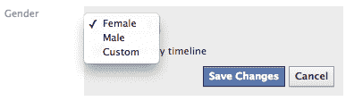
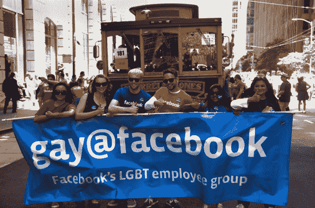

# 脸书开放了对 LGBTQ 友好的性别认同和代词选项

> 原文：<https://web.archive.org/web/https://techcrunch.com/2014/02/13/facebook-gender-identity/>

脸书[刚刚更新了](https://web.archive.org/web/20230404151915/https://www.facebook.com/photo.php?fbid=567587973337709&set=a.196865713743272.42938.105225179573993&type=1&stream_ref=10)，让用户选择他们联想到的性别代词。除了通常的“男性”和“女性”选项，用户[可以从 50 多个选项中选择](https://web.archive.org/web/20230404151915/https://www.facebook.com/help/276177272409629)多达 10 个不同的性别定义来描述自己，包括“异性恋”、“变性人”和“双性人”

这不仅会显示在用户的“关于”页面上，还会显示在网站上所有其他指代该用户的代词中。这样，用户不仅会显示为他/他和她/她，而且有些人可能会显示为中立的他们/他们。所以不是得到“在乔伊的墙上写生日礼物”的提示，而是“在乔伊的墙上写生日礼物”

你可以在“关于”页面的“设置”菜单中点击“性别选项”来改变这一点。除了男性和女性，你会看到一个“其他”选项。当选择“其他”时，将出现 10 个更细微的选项列表。

以前，脸书的性别选择器是这样的:

 

但现在它增加了 LGBTQ 选项:

“虽然对许多人来说，这种变化可能意义不大，但对那些受影响的人来说，这意味着很多，”脸书公关威尔·霍奇斯在一封电子邮件中说。“我们认为这是让脸书成为人们表达真实身份的又一途径。”

根据这封邮件，脸书与 LGBT 激进组织密切合作，编制了新的性别身份选项列表。脸书还增加了一个新的隐私选项，让用户选择谁可以看到他们的性别:

> “我们还增加了一项功能，让人们可以控制他们想与之分享自定义性别的观众。我们认识到，有些人在与他人分享自己的真实性别身份时面临挑战，这种环境让人们能够以真实的方式表达自己。”

这使得用户可以阻止某些不太宽容的人看到他们的性别身份。

三年前，脸书增加了 [LGBTQ 友好关系状态](https://web.archive.org/web/20230404151915/http://www.insidefacebook.com/2011/02/18/relationship-status-types-ad-tool/)，包括“民事结合”和“家庭伴侣关系”

多年来，脸书在性别和性偏好问题上一直表现出进步的态度。该公司获得了[男女同性恋反诽谤媒体联盟奖](https://web.archive.org/web/20230404151915/http://www.huffingtonpost.com/2012/06/03/glaad-media-awards-2012-san-francisco-_n_1565933.html)，因为它公平准确地代表了 LGBTQ 群体和影响他们的问题。为了打击偏见，它发布了统计数据，指出 70%的美国脸书用户[有一个朋友将自己列为 LGBTQ](https://web.archive.org/web/20230404151915/https://techcrunch.com/2012/06/25/tech-gay-pride/) 。

2013 年，700 多名员工和首席执行官马克·扎克伯格[参加了旧金山骄傲游行](https://web.archive.org/web/20230404151915/https://techcrunch.com/2012/06/25/tech-gay-pride/)。它甚至在门洛帕克总部的院子里涂上了彩虹色的 Hack 标志。【T2

通过其服务选项和公司文化，脸书为科技如何促进宽容树立了一个积极的榜样。这可能有助于它吸引 LGBTQ 人才和用户，并推动其他公司建立对所有人的同情。

**