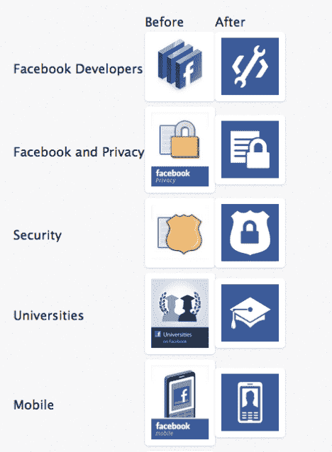

# 扁平设计的另一个胜利是脸书给它的 F 标志和其他图标一个更平、更干净的外观 TechCrunch

> 原文：<https://web.archive.org/web/https://techcrunch.com/2013/04/19/facebook-goes-flat/>

# 扁平设计的另一个胜利是脸书给了它的 F 标志和其他图标一个更平、更干净的外观

脸书对其主要的“f”标志图标进行了改头换面，通过移除底部的淡蓝色条来扁平化设计，这给了图标一种反射光泽/轻微的 3D 效果，以及移动 f 的位置，使其现在从底部流血。整体效果是一个简化，不浮华和干净的外观设计，f 更清楚地跳出来。今天，脸书发布了新标志作为记者们的可下载资源。

设计师汤姆·沃丁顿(Tom Waddington)向 TechCrunch 报告了这一更新，他在[的博客](https://web.archive.org/web/20221209234952/http://tom.waddington.me/blog/2013/04/19/facebook-logo/?utm_campaign=new-facebook-logo&utm_content=stage-1-1&utm_medium=email&utm_source=chase-up)中提到了这一变化，这似乎是脸书更广泛的图标春季大扫除的一部分，脸书各种官方页面上使用的大量其他图标也采用了同样的扁平和更具视觉冲击力的风格。这些图标包括开发者图标、隐私和安全相关图标以及移动图标等。更新似乎发生在上周。

以下是一些其他的图标重新设计——参见汤姆的[博客](https://web.archive.org/web/20221209234952/http://tom.waddington.me/blog/2013/04/19/facebook-logo/?utm_campaign=new-facebook-logo&utm_content=stage-1-1&utm_medium=email&utm_source=chase-up)中他注意到的所有例子:

近年来，扁平化设计的影响力已经遍及整个科技行业及其界面——从微软扁平的、基于磁贴的 Windows Phone 用户界面，到谷歌对其产品界面进行流媒体滚动的偏好，再到许多其他的[应用](https://web.archive.org/web/20221209234952/http://pinterest.com/warmarc/flat-ui-design/)和[网站](https://web.archive.org/web/20221209234952/http://thedesigninspiration.com/articles/25-best-examples-of-flat-ui-design-websites/)。最突出的——或者更确切地说——当然是苹果公司，它继续偏爱图标和界面设计的 skeuomorphic 风格，试图通过融入阴影和/或纹理来重现现实世界中物体或形状的外观。

Cupertino 因为在数字世界的其余部分正在减少像素和变得平坦时突出而受到了全面的嘲笑(这里有一个关于平坦和 skeuo 辩论的双方的伟大剖析[这里](https://web.archive.org/web/20221209234952/http://sachagreif.com/flat-pixels/))但是从可用性的角度来看，平坦的设计可能会造成混乱，例如，网站或界面的哪些部分是设计来点击的。然而，当谈到像脸书的 f 标志一样明显的东西时，似乎没有理由坚持淡蓝色的酒吧。作为一种营销信息，新图标更加响亮和自豪，尽管它更扁平。

根据脸书的标识和商标指南[第](https://web.archive.org/web/20221209234952/https://www.facebook.com/brandpermissions/logos.php)页,“f”标识可用于:

1.  你的脸书页面
2.  你的脸书集团
3.  你通过 Facebook 平台提供的应用程序
4.  您对脸书连接的实施

很明显，这也是脸书最显眼的品牌家具之一——例如，出现在它的 favicon 和它的移动应用图标上。新的外观标志已经在脸书自己的脸书页面上运行。而反向版本的徽标(白色正方形，蓝色 f)会出现在脸书搜索栏上(如果您启用了图形搜索)。沃丁顿在他的博客中指出，新的 f 标志下载是完全透明的，即 f 完全被删除——这可能解释了反向搜索栏版本。

最初的 f 图标是由总部位于纽约的设计公司[古巴委员会](https://web.archive.org/web/20221209234952/http://www.cubancouncil.com/)在 2006 年设计的，该公司告诉 TechCrunch，自那以后它就没有与这个标志或脸书合作过。“古巴委员会在 2006 年为肖恩和马克制作了主要的单词 mark，”迈克·巴扎德在一封电子邮件中写道，“从那以后，我们再也没有和这个标志或公司合作过。”他推测新的图标系统可能是脸书 2011 年收购 T2 沙发公司的结果。迈克和古巴委员会的其他一些人去年在[加入谷歌，从事谷歌+](https://web.archive.org/web/20221209234952/https://beta.techcrunch.com/2012/07/17/google-quietly-acq-hires-part-of-design-firm-cuban-council-for-google/) 的工作。

当我们问及图标重新设计时，脸书拒绝置评。

除了整个行业都在推动更扁平的设计之外，TechCrunch 的内部脸书跟踪者 Josh Constine 认为，这种杂乱的设计可能是国际化的标志——即更好地将脸书品牌传达给非英语用户，他们可能会对明显连接和延伸 f 符号的水平线感到困惑。他指出，最初的设计是在脸书还是一家只针对美国用户的国内公司时构思的。