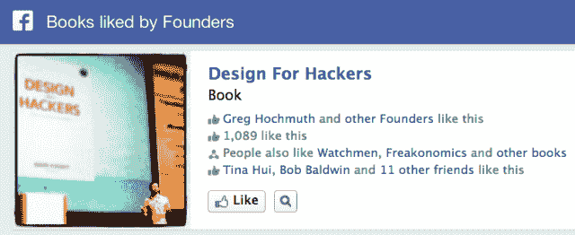

# 脸书给更多人提供图形搜索，让那些被排除在外的人嫉妒

> 原文：<https://web.archive.org/web/https://techcrunch.com/2013/02/21/facebook-graph-search-sorting/>

发布五周后，脸书今天在门洛帕克总部向记者展示了“图表搜索的现状”。它已经从最初的 10 万用户扩展到“几十万”，现在一个新闻提要故事正在吸引人们的朋友注册早期访问等待名单。

今天早上，我注意到脸书正在接纳一大批等待名单上的人加入图形搜索。这是因为现在当新的人获得访问权限时，脸书会自动发布一个新闻提要故事，例如“埃里克·埃尔登刚刚获得图形搜索”点击最后几个字，人们也可以[注册提前使用](https://web.archive.org/web/20221217072238/https://www.facebook.com/about/graphsearch)。脸书告诉我，这是一种病毒式的驱动力，意在增加候补名单的注册人数。故事框架图搜索作为一个很酷的新功能，你应该愿意乞求获得访问权。

除了用户数量和推出，今天的“图形搜索白板会议”见证了脸书的一些首席工程师深入研究人们如何使用其[新的内部搜索引擎](https://web.archive.org/web/20221217072238/https://techcrunch.com/2013/01/15/facebook-announces-its-third-pillar-graph-search/)，以及它如何在后端工作。

Graph Search 主管 Tom Stocky 指出，早期的使用模式显示，人们使用 Graph Search 的目的与他们使用社交网络的目的相同:查看朋友和照片。“但是排名第三”Stocky 说，这对当地企业来说是一个令人鼓舞的信号。兴趣没有那么多的询问。

让脸书吃惊的一件事是人们寻找朋友的方式。用户不是要求类似“我的‘朋友’的照片”之类的东西，而是经常键入诸如‘密友’、‘闺蜜’、‘哥们’、‘哥们’和‘朋友’之类的词语。起初，这些图形搜索很难，但一个专门的自然语言团队现在已经内置了这些，所以它们被识别为同义词。

接下来，脸书正在努力扩大图形搜索的规模——后端系统(称为 Unicorn)可以支持更多用户，推出可以继续，外语方面可以扩展到英语以外。然而，第二部分可能需要它雇用每种语言的语言学家来识别句子结构和同义词，或者找到一种方法来众包这个过程，就像翻译整个网站一样。

它还试图解决语法问题，以便人们可以运行“或”查询。现在你可以问“住在纽约喜欢《权力的游戏》和《唐顿庄园》的朋友”，但不能问“住在纽约喜欢 U2 或滚石乐队的朋友”，这可以帮助你迅速找到一起去摇滚音乐会的人。

但我认为图形搜索的真正潜力在于用只有脸书才能做到的方式对结果进行智能排序。例如，如果你搜索“在 TechCrunch 工作的人”,你会得到我们所有真正的员工，但很多人只是把 TechCrunch 列为他们的雇主，作为一个笑话，或者看起来像一个技术人员。幸运的是，Graph Search 足够聪明，可以识别出哪些在 TechCrunch“工作”的人是彼此的朋友。由于真实员工的群体通常是朋友，它知道哪些更可能是真实的，并显示在结果的顶部。脸书还研究了哪些人在个人资料中列出了一个经过验证的@beta.techcrunch.com 电子邮件地址，作为合法性的另一个标志。

术语频率-逆文档频率(TF-IDF)是脸书的一个老方法，有助于对图形搜索结果进行排序。在 Facebook Graph 搜索“创始人喜欢的书”，你不会首先看到《达芬奇密码》或《圣经》，尽管它们是最受欢迎的书。相反，由于 TI-IDF，你会看到创始人比普通人更喜欢的书。浮出水面的引爆点，并为黑客设计显示如何智能图搜索。

脸书的 Mike Curtiss 用“我朋友喜欢的电视节目”的例子向我解释了 TF-IDF 他说“在 TF-IDF 中有一个艰难的平衡。如果你不使用它，你只是在推广最受欢迎的电视节目。但是如果你能偏向这些个人的偏好，而不是客观上最受欢迎的，你会得到不同的结果。如果可以的话，使用它是很好的。这是个好信号。你可以展示最受欢迎的东西，也可以展示(你询问的)对人们来说非常独特的东西，但通常你希望在这些东西之间取得平衡，以提供最有趣的结果。”

脸书正试图利用其社交数据为每个用户创建一个定制的搜索引擎。然后，通过 TF-IDF 进一步对结果进行排序，它不仅可以构建不同于 Google 的东西，还可以在它们重叠的地方做得更好。

关于图形搜索如何直接工作的更多信息，请看我对前谷歌员工和现任脸书图形搜索主管汤姆·斯托奇和拉斯·拉斯穆森的采访。