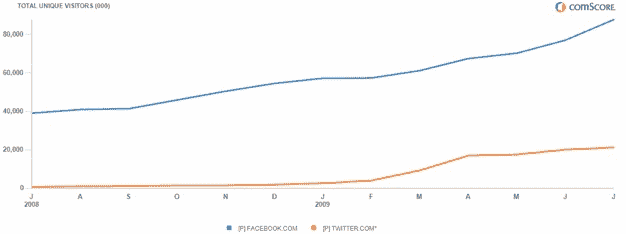

# 脸书 7 月份的增长速度是 Twitter 的两倍

> 原文：<https://web.archive.org/web/https://techcrunch.com/2009/08/12/facebook-grew-twice-as-fast-as-twitter-in-july/>

如果说周一[脸书收购了 FriendFeed](https://web.archive.org/web/20230404054259/https://techcrunch.com/2009/08/10/facebook-acquires-friendfeed/) 并开启了[实时搜索](https://web.archive.org/web/20230404054259/https://techcrunch.com/2009/08/10/facebook-flips-the-switch-on-real-time-search-goes-after-twitter-where-it-hurts/)以更好地在流媒体战争中与 Twitter 竞争还不够糟糕，并且正在玩一个更像 Twitter 的[精简版](https://web.archive.org/web/20230404054259/https://techcrunch.com/2009/08/12/what-facebook-lite-actually-is-hint-its-not-twitter/)的话，现在 Twitter 真的有些担心了。在美国，脸书的增长速度超过了 Twitter，尽管它的规模是 Twitter 的四倍多。

根据 comScore 的最新估计，7 月份，脸书在美国吸引了 8770 万独立访客，比 2009 年 6 月高出 14%。相比之下，Twitter 的网站仅有 2120 万美国独立访客，比 T8 之前的 T7 月增长了 6%。从绝对数字来看，脸书在 7 月份增加了约 1000 万新访客，而 Twitter 的新访客约为 100 万。

脸书以 8770 万的 uniques 从美国第六大网络媒体资产上升到第五，超过了福克斯互动媒体(8090 万 uniques)的合并网站，进入了 AOL(1.048 亿)的惊人范围。这还只是在美国，脸书已经是世界第四大网站(Twitter 在全球也做得更好，6 月份共有 4450 万独立访客)。

请注意，这些估计仅针对 Twitter.com，不包括 Tweetdeck、Seesmic 或 Tweetie 等移动或桌面客户端，但它应该是整体增长的良好代表。即使你把 Twitter 的数据翻倍，脸书仍然在 7 月份打败了它(脸书的数据也不包括通过脸书连接的其他网站和应用的活动)。

这些是逐月比较。以年度为基础，Twitter 的用户增长速度(2，614%)仍然比脸书(124%)快得多，因为它的初始用户基数很小，而今年是它进入高速增长的一年。但是，自 4 月底以来，这种高速增长似乎已经放缓，至少在美国是如此。4 月至 7 月，脸书的美国独立访客增长了 30%，而 Twitter 仅增长了 25%，所以这不仅仅是一个月的异常。

那么，6 月份发生了什么来加速脸书的增长呢？我不认为那是[的虚荣心网址。更确切地说，在 6 月 24 日，脸书](https://web.archive.org/web/20230404054259/https://techcrunch.com/2009/06/12/facebook-vanity-landrush-tonight-at-9-pm-pst/)[打开了“人人按钮”](https://web.archive.org/web/20230404054259/https://techcrunch.com/2009/06/24/facebook-brings-privacy-controls-to-publisher/)没有公开个人资料的脸书会员(即大多数人)突然可以选择与脸书上的其他人分享他们信息流中的项目，并且他们可以决定逐个项目地这样做。

公开共享的项目越多，可以看到它们的人就越多。我相信这就是所发生的事情(并已向脸书求证)。这不仅吸引了更多的人来脸书，而且与 7 月份相比，6 月份花在网站上的时间增加了 36%。同一时期，Twitter 在网站上的时间增长了 26 %,尽管在下面的图表中你很难看出两者的对比，因为脸书用户花费了大约 158 亿分钟，而 Twitter 为 475 万分钟。这告诉我，信息流变得越公开就越吸引人。

