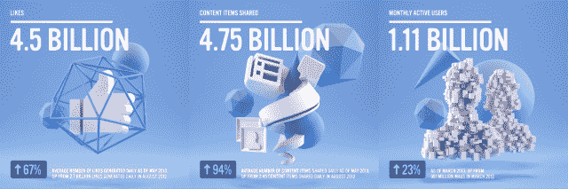
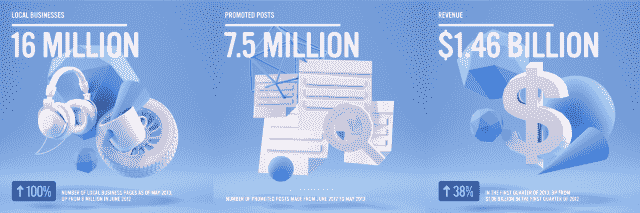
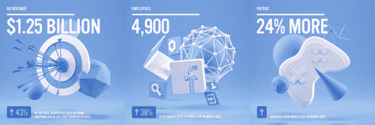

# 自首次公开募股以来，脸书增长了 12 个大数字 

> 原文：<https://web.archive.org/web/https://techcrunch.com/2013/05/17/facebook-growth/>

$FB 仍然停留在 26.25 美元，远低于其 38 美元的 IPO 价格，但自一年前上市以来，它已经取得了重要进展。日活用户增长 26%，移动月活用户增长 56%，营收增长 38%是一些亮点。在发达国家，注册的人越来越少了，但随着这种增长和看不到严重的竞争对手，它已经度过了最艰难的一年。

*   **赞数–45 亿–增长 67%**–截至 2013 年 5 月的平均赞数，高于 2012 年 8 月的每日 27 亿赞数
*   **分享的内容项–47.5 亿–增长 94%**–截至 2013 年 5 月，平均每天分享的内容项数量从 2012 年 8 月的 2.45 个增加到 2013 年 5 月的 2.45 个

[统计数据和图片由脸书提供]

点赞和分享的增长速度超过了脸书的用户数量，这表明用户参与度很高。这反驳了人们不关注脸书的谣言。[扎克伯格定律](https://web.archive.org/web/20230123163703/https://techcrunch.com/2011/07/06/mark-zuckerberg-explains-his-law-of-social-sharing-video/)，这位首席执行官的摩尔定律式理论指出，人们每年将分享两倍的份额。脸书几乎实现了马克的要求。脸书保持这个数字的增长是很重要的，因为它的共享内容让人们不断访问脸书并看到它的广告。

为了做到这一点，脸书正在开发更加身临其境的移动体验 [Home，它为其为数不多的活跃用户在脸书上花费的时间增加了 25%](https://web.archive.org/web/20230123163703/https://techcrunch.com/2013/05/09/home-preview/) 。花更多的时间可以带来更多的分享。今年，[将其广受欢迎的 iOS 和 Android 的速度提高了一倍，从 HTML5 切换到原生架构，这导致了更长的会话时间。它增加了](https://web.archive.org/web/20230123163703/https://techcrunch.com/2012/08/23/facebook-for-ios-faster/)[特定内容的新闻提要](https://web.archive.org/web/20230123163703/https://techcrunch.com/2013/03/07/facebook-launches-multiple-topic-based-feeds-bigger-images-and-a-consistent-design-across-devices/)来促进浏览，而[推出了图形搜索](https://web.archive.org/web/20230123163703/https://techcrunch.com/2013/01/15/facebook-announces-its-third-pillar-graph-search/)来从其数据中提取附加价值并让人们贡献更多。

它还一直在增强 iOS 和 Android 的移动 SDK，使应用程序更容易将内容分享给脸书。这是脸书关心帮助其开发者成长的一个重要原因——他们在互相帮助。

*   **月活跃用户–11.1 亿–增长 23%**–截至 2013 年 3 月，高于 2012 年 3 月的 9.01 亿 mau
*   **日活跃用户–6.65 亿–增长 26%**–截至 2013 年 3 月的平均日活跃用户数，高于 2012 年 3 月的平均 5.26 亿 dau
*   **移动月度活跃用户–7.51 亿–增长 54%**–截至 2013 年 3 月，高于 2012 年 3 月的 4.88 亿移动 mau
*   **insta gram–1 亿月活跃用户**–截至 2013 年 2 月

脸书仍在快速注册用户，但并非所有用户都生来平等。虽然 2013 年在 Q1，它在美国和加拿大的每用户收入为 3.50 美元，但在包括印度和巴西在内的大部分发展中国家，每用户收入仅为 0.50 美元。这些新兴市场是脸书增长最多的地方，这意味着每增加一亿用户都不如前一个用户值钱。

移动领域的增长也有类似的问题。脸书可以在桌面上每页显示多达七个广告，但它必须更加小心，不要淹没移动设备的小屏幕。因此，随着脸书的用户将他们的接入媒介转移到手机上，他们每个人的收入可能会减少。脸书希望，让开发者为移动新闻订阅广告付费，让他们的应用被发现，可以抵消这一点，随着更多企业推出应用，以及发展中国家转向智能手机，这个市场将会增长。

不过，总的来说，在上市九年后，脸书仍在强劲增长。[其无处不在的网络效应](https://web.archive.org/web/20230123163703/https://techcrunch.com/2012/01/30/facebook-worth/)不容小觑。取代脸书作为首要通用社交网络的地位，需要的不仅仅是更好，而是好得多的东西。竞争对手可能会在某些用例中挑拣，但不太可能取代它成为网络的核心身份提供者。考虑到脸书愿意收购像 Instagram(在第一世界仍在快速增长)这样的威胁，可能会避免破坏，并让它在未来几年占据主导地位。

*   **本地企业–1600 万–增长 100%**–截至 2013 年 5 月，本地企业页面数量从 2012 年 6 月的 800 万增加到 2013 年 5 月的 800 万
*   **晋升职位-750 万**-2012 年 6 月至 2013 年 5 月的晋升职位数
*   **2013 年第一季度的收入为 14.6 亿美元，同比增长 38%** ，高于 2012 年第一季度的 10.6 亿美元
*   **2013 年第一季度，广告收入为 12.5 亿美元，同比增长 43%** ，高于 2012 年第一季度的 8.72 亿美元
*   **截至 2013 年 3 月，员工人数从 2012 年 3 月的 3539 人增加到 4900 人，增加了 38%**
*   **从 2012 年 3 月到 2013 年 3 月，游戏付费用户增加了 24%**

这是毫无疑问的。上市让脸书更加专注于赚钱。它的移动收入从接近零增长到每季度 3.75 亿美元，约占其总广告收入的 30%。这在很大程度上得益于去年年底推出的移动应用安装广告。这让开发者可以在脸书新闻订阅中推广他们的应用，广告直接链接到苹果应用商店和谷歌 Play 的下载页面。这些商店被越来越多的应用程序堵塞，促使开发者向脸书付费以找到他们。

脸书在脸书交易所也取得了很大进展，它的重定向广告利用人们的浏览历史向他们展示高度相关的广告。FBX 正在吸收为重新定位预留的广告客户预算。进入直接电子商务的脸书礼品公司不太成功。 [Gifts 未能产生有意义的收入，可能需要彻底改革，以让更多用户为他们的朋友购买现实生活中的礼物。支付收入的增长也相对缓慢，因为越来越多的游戏开发商从脸书赚取 30%利润的网络画布转移到苹果和谷歌获得提成的移动领域。](https://web.archive.org/web/20230123163703/https://techcrunch.com/2013/02/28/how-many-gifts-has-facebook-sold/)

让投资者兴奋的一个机会是，脸书开始在图片搜索中显示广告。虽然他们现在使用标准的脸书定位，但预计他们会加入关键词定位，这可能使他们成为谷歌利润丰厚的 AdWords 业务的直接竞争对手。当地企业日益增长的技术悟性未来可能会给脸书带来好处。目前，他们中很少有人积极购买社交广告，但预计未来收入将转向脸书，远离针对性较低的印刷和电话簿广告。

尽管如此，脸书并没有尽可能多的赚钱。又一年过去了，没有电视广告风格的自动播放视频广告(尽管有传言说他们正在接近这一点)，它甚至暂停了移动广告网络的试验。如果脸书建立了这些流，可能会激怒一些人，或者让他们觉得数据被利用了，但这肯定会带来收入的巨大增长。站外和应用外广告网络可以让脸书利用其巨大的个人数据财富在其他地方推广广告，这样它就可以在自己的网站上不显示更多广告的情况下赚钱。这种可能性比任何其他可能性都更能说明脸书为何被低估。

最重要的是，脸书赚更多钱的努力并没有严重阻碍其连接世界的使命。脸书上的广告肯定更多，尤其是在移动设备上，但数据显示[它们还没有让用户讨厌到足以](https://web.archive.org/web/20230123163703/https://techcrunch.com/2013/01/30/facebook-users-dont-hate-news-feed-ads/)降低他们的参与度。

脸书已经长大了。它不再是每年用户数量翻一番的热门创业公司。成熟的公司不会通过从数据和使用中榨取每一分钱来获取惊人的利润。但脸书经受住了上市的风暴，没有让它破坏对用户体验的重视。它现在是世界上大部分地区的基本公用事业。如果它能够避免变得过于贪婪，并专注于其社区的长期健康，它将有足够的时间来思考如何将世界的生活故事转变为严肃的商业。