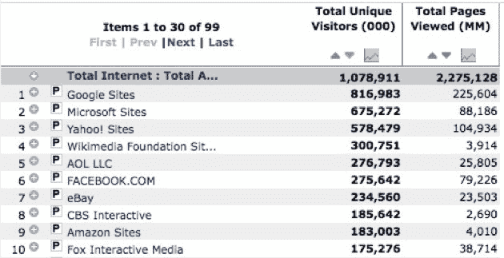
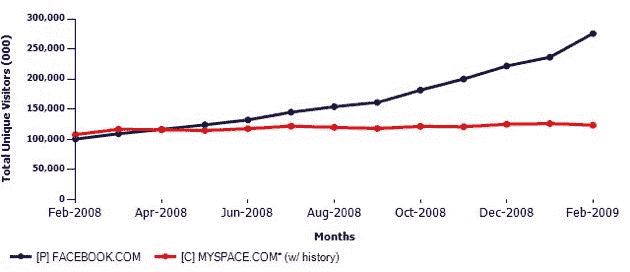

# 脸书曲棍球棒，MySpace 萎靡不振 

> 原文：<https://web.archive.org/web/https://techcrunch.com/2009/03/23/facebook-hockey-sticks-while-myspace-languishes/>

# 脸书曲棍球棒，MySpace 萎靡不振

2008 年 11 月的糟糕局面开始变得非常糟糕——根据康姆斯克最近的全球数据，脸书现在的规模是 MySpace 的两倍多。更糟糕的是，MySpace 正在失去观众，而脸书绝对是曲棍球棒:MySpace 在短短一个月内失去了 2%的用户，而脸书仅在二月份就增加了近 4000 万会员。MySpace 目前每月有 1.24 亿独立访客，而脸书只有 2.76 亿。

这是脸书*一个月内 16.6%的增长率。对于已经拥有数亿用户的网站来说，这根本不会发生。不到一年前,, MySpace 和脸书的规模相当。*

康姆斯克表示，超过 1/4 的互联网接入用户上个月访问了脸书。就独立用户而言，他们在顶级网站中排名第六，总浏览量排名第三(仅次于谷歌、微软和雅虎)。

MySpace [不断有高管离职](https://web.archive.org/web/20230130133815/http://techcrunch.com/2009/03/04/smart-execs-leave-before-the-fall/)，目前还不清楚创始人[克里斯·德沃夫](https://web.archive.org/web/20230130133815/http://www.crunchbase.com/person/chris-dewolfe)和[汤姆·安德森](https://web.archive.org/web/20230130133815/http://www.crunchbase.com/person/tom-anderson)在今年晚些时候合同到期后是否会继续留任。我们预计今年夏天会有更多人离职，母公司福克斯互动媒体可能会进行重组。

