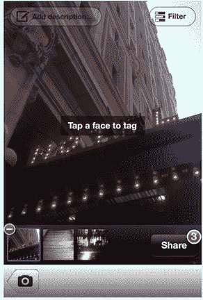

# Facestagram:脸书+ Instagram 可能推出五项新功能

> 原文：<https://web.archive.org/web/https://techcrunch.com/2012/04/09/facebook-instagram-features/>

图片能够过滤您的脸书照片，或使用您的 Instagrams 作为脸书签到。尽管 Instagram 仍将是它自己的“独立”应用，但它被脸书以 10 亿美元收购可能会推动这两家照片分享服务的许多改进。

[Instagram](https://web.archive.org/web/20230326200007/http://instagr.am/) 创始人凯文·斯特罗姆和马克·扎克伯格向用户保证，他们喜爱的 Instagram 不会消失。但是什么会改变呢？以下是我们认为这两种服务可以合作的五种方式，以进一步主导照片共享，赚更多的钱，并给你更好的体验。

感谢宣布收购的官方帖子，我们可以肯定地知道一些事情。Systrom 在 [Instagram 博客帖子](https://web.archive.org/web/20230326200007/http://blog.instagram.com/post/20785013897/instagram-facebook)上解释说:

> *“insta gram 不会消失，这一点很重要……我们将继续为该产品添加新功能，并寻找新的方式来创造更好的移动照片体验……你仍然会有同样多的人关注你。你仍然可以分享到其他社交网络。你仍将拥有让这款应用如此有趣和独特的所有其他功能。”*

此外，脸书首席执行官马克·扎克伯格在他的日程表上写道:

> “现在，我们将能够与 Instagram 团队更加紧密地合作……我们相信[脸书和 Instagram]是不同的体验，可以相互补充。但为了做好这一点，我们需要注意保持和发展 Instagram 的优势和功能，而不是试图将一切都融入脸书。这就是我们致力于独立构建和发展 Instagram 的原因……我们计划保留一些功能，比如发布到其他社交网络的能力，如果你愿意，不在脸书上分享你的 insta gram 的能力，以及拥有关注者并在脸书上与你的朋友分开关注他人的能力。”

作为背景，下面是这些服务目前是如何协同工作的。Instagram 的“查找你的朋友”工具可以让你发现并关注所有已经在该应用上的脸书朋友。通过这种方式，Instagram 利用你的脸书社交图，让你可以快速地在 Instagram feed 中添加朋友的照片。请注意，当你注册 Instagram 时，你会创建一个独特的个人资料，而不是从脸书或 Twitter 导入。

当你发布 Instagram 时，打开脸书共享会将照片上传到你的脸书个人资料中的一个特殊的“Instagram 照片”相册。它的标签似乎是“乔希·孔斯蒂内拍摄了[一张](https://web.archive.org/web/20230326200007/http://instagr.am/p/JNfpoNy1Sl/?fb_action_ids=10100214642067373&fb_action_types=instapp%3Atake&fb_ref=ogexp&fb_source=photo)与 [Instagram](https://web.archive.org/web/20230326200007/http://instagr.am/) 的照片”，照片描述中的这些链接和一个 URL 指向其单独的 Instagram 评论页面和该公司的主页。

这创造了一个很好的价值交换，脸书可以在 Instagram 上拍摄照片，并从他们的参与、通知和页面浏览量中获益。作为回报，Instagram 获得了病毒式的增长，因为它的多个链接为它的照片和主页(显示 iOS 和 Android 应用程序的下载链接)带来了推荐流量。

如果你需要更多的证据证明两家公司将紧密合作，这是脸书产品设计师[基冈·琼斯](https://web.archive.org/web/20230326200007/http://www.facebook.com/keeg)今天拍摄的 [Instagram 团队参观 FB 总部的照片。](https://web.archive.org/web/20230326200007/https://www.facebook.com/photo.php?fbid=3024482133441&set=p.3024482133441&type=1&theater)

这就是两者的合作方式。接下来可能会发生以下情况:

#####  过滤你的脸书照片

去年，[泄露给 TechCrunch](https://web.archive.org/web/20230326200007/https://techcrunch.com/2011/06/15/facebook-photo-sharing-app/) 的文件显示，脸书正在开发 Instagram 的竞争对手——一款可以过滤、发布和浏览照片的独立应用。Instagram 现在可以作为独立的应用程序，但它的一些功能可以添加到脸书自己的界面上。你的 iPhone 或 Android 脸书应用程序可能很快就会让你在发布照片之前，为照片添加 Instagram 的滤镜，或通过“Lux”按钮自动校正照片的亮度和饱和度。这些相同的功能可以添加到脸书网络照片上传器，让你美化整个相册。

##### 导入照片

将 Instagrams 上传到脸书的唯一方法是一次上传一个。如果在 Instagram 应用程序或脸书网站界面上看到一个选项，可以将你所有的 Instagram 照片添加到你在脸书的“insta gram 照片”相册中，我不会感到惊讶。另一种可能性是 Instagram 让你选择一张你现有的脸书照片进行过滤、编辑和发布。

##### 脸书注册/登录 Instagram

如果 Instagram 被内置到脸书的身份平台中，你就不需要记住另一个密码，而且它可以加快新用户的注册过程。Instagram 可能会保留自己的登录系统作为一个选项，但这将使你可以立即找到你的脸书朋友，并将照片发布回社交网络。

##### 利用脸书的地点数据库将带有地理标签的 Instagrams 转化为签到

Instagram 目前依靠 Foursquare 的位置数据库来让你搜索或浏览附近的企业或地标，并将它们标记为照片拍摄地。脸书维护着自己的地点数据库，支持 Instagram 地理标记会让它获得你的 insta gram 下的位置图层。这样，当你在附近拍照时，脸书可以通知你的朋友有机会见面，将你的照片与商业页面联系起来，并更准确地将你作为当地广告的目标。

##### 在 Instagrams 中标记脸书好友

现在你可以有点笨拙地在你的 Instagram 描述中提到其他 insta gram 用户，但没有办法实际标记照片中的人。脸书可以向 Instagram 提供移动照片标记技术，这样你就可以标记 Instagram 用户或脸书的朋友。这将让脸书通知某人他们已经被标记，并确保它显示你的甜蜜快照给他们的朋友。

*【图片来源:[汤姆·钱伯斯现代书屋](https://web.archive.org/web/20230326200007/http://www.modernbook.com./tomchambers/illuminations/images.htm)*

##### 更多关于 Instagram 收购的信息

[脸书以 10 亿美元收购 Instagram，将初露头角的竞争对手转变为独立的照片应用](https://web.archive.org/web/20230326200007/https://techcrunch.com/2012/04/09/facebook-to-acquire-instagram-for-1-billion/)

两年内从 0 到 10 亿美元:Instagram 的玫瑰色辉煌之旅

[就在被收购之前，Instagram 以红杉、Thrive、Greylock 和 Benchmark 的 5 亿美元估值完成了 5000 万美元的交易](https://web.archive.org/web/20230326200007/https://techcrunch.com/2012/04/09/right-before-acquisition-instagram-closed-50m-at-a-500m-valuation-from-sequoia-thrive-greylock-and-benchmark/)

[通过 Instagram Buy，脸书正式推动 M &超越“收购-雇佣”的战略](https://web.archive.org/web/20230326200007/https://techcrunch.com/2012/04/09/facebook-instagram-m-and-a-strategy/)

[Insta-Backlash:Twitter verse 对脸书收购 Instagram 反应过度，用户删除账户](https://web.archive.org/web/20230326200007/https://techcrunch.com/2012/04/09/insta-backlash-twitterverse-overreacts-to-facebooks-instagram-acquisition-users-delete-accounts/)