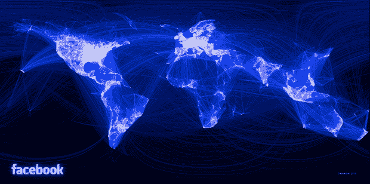

# 脸书实习生比你聪明，创建世界友谊的数据可视化技术

> 原文：<https://web.archive.org/web/http://techcrunch.com/2010/12/13/facebook-intern/>

# 脸书实习生比你聪明，创建世界友谊的数据可视化

脸书工程实习生保罗·巴特勒利用脸书社交图谱数据中的 1000 万对朋友样本，制作了上面这张令人惊叹的国际人际关系图。[他的方法论？](https://web.archive.org/web/20230203102317/http://www.facebook.com/note.php?note_id=469716398919)

*“我将每对城市的权重定义为它们之间的欧几里德距离和它们之间的朋友数量的函数。然后，我用权重在两对城市之间画了线，这样，友谊最深的城市被画在其他城市的上面。我使用了从黑色到蓝色到白色的颜色渐变，每条线的颜色取决于它的重量。我还改变了一些线条，以环绕图像，而不是跨越大半个世界。”*

嘿，谷歌人力资源人员，保罗巴特勒。这是 P-A-U-L-B-U-T-L-E-R。在[脸书](https://web.archive.org/web/20230203102317/http://www.facebook.com/paulgb)和/或 [LinkedIn 上与他联系。](https://web.archive.org/web/20230203102317/http://www.linkedin.com/in/paulgb)不客气。