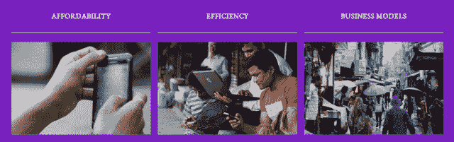
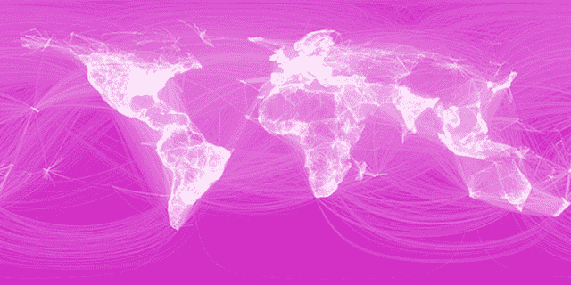
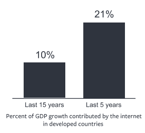

# 脸书和 6 家电话公司推出 Internet.org，让每个人都能负担得起

> 原文：<https://web.archive.org/web/https://techcrunch.com/2013/08/20/facebook-internet-org/>

脸书刚刚宣布与三星、爱立信、联发科、诺基亚、Opera 和高通合作推出 Internet.org 项目，旨在为 50 亿没有互联网的人提供负担得起的互联网接入。两家公司将在数据压缩技术和廉价、高质量的智能手机上合作，让网络变得更便宜。

虽然看起来整个世界都连接在一起，但全球只有三分之一的人口可以接入互联网，而且普及率仅增长了 9%。Internet.org 的目标是加快这一速度。

扎克伯格写道，“发展中国家在连接和加入知识经济方面存在巨大障碍。Internet.org 汇集了一个全球伙伴关系，将努力克服这些挑战，包括为那些目前负担不起的人提供互联网接入。”扎克伯格在一篇名为“[连通性是一种人权吗？”的论文中阐述了他对可访问性的想法。](https://web.archive.org/web/20230404035849/https://www.facebook.com/isconnectivityahumanright/isconnectivityahumanright.pdf)

该伙伴关系的三项主要倡议是:

**通过更便宜的智能手机让上网变得负担得起**，并与移动运营商合作，将互联网接入扩展到服务水平低下的社区。

**更有效地使用数据**这样人们就不会增加高昂的成本。Internet.org 的合作伙伴可能会寻求建立数据压缩工具，提高网络效率，改善数据缓存。

**帮助企业推动接入**可持续发展移动业务。合作伙伴将致力于为应用开发者、设备原始设备制造商和运营商创造互利的激励机制，让更多人上网。两家公司还将合作帮助移动设备支持更多语言，以消除使用障碍。

这种推动植根于利他主义和全球社区，但最终可能会促进所有移动公司的业务。通过扩大蛋糕——让更多的人上网——移动业务中的每个人都能受益。这包括脸书和率先开展这一项目的设备制造商，还包括运营商、应用开发商、电子商务公司、广告商，甚至通过移动设备发布作品的艺术家。

谷歌长期以来一直是无障碍项目的先驱。其最新项目 [Project Loon](https://web.archive.org/web/20230404035849/https://techcrunch.com/2013/06/14/google-x-announces-project-loon-balloon-powered-internet-for-rural-remote-and-underserved-areas/) ，旨在通过巨型气球向断开连接的社区发射 3G 信号，将互联网带给他们。过去，谷歌在非洲通过短信提供免费的 Gmail 接入服务，而 Twitter 则与国际运营商合作，让人们不用为数据付费就能发布推文。

扎克伯格说，在过去的几年里，脸书已经向无障碍倡议投资了 10 亿美元，尽管他们主要关注的是将人们与自己的服务联系起来。Facebook Zero 计划通过发展中国家的运营商免费提供该社交网络的精简功能手机版本。这个想法是，如果脸书能让低技术含量的移动用户早早上钩，他们就会坚持下去，并在转向智能手机时与他们的社交网络保持联系。

### 扎克说，连通性是一项人权

愤世嫉俗者会认为脸书想提高可访问性只有一个原因:吸引眼球做广告。但不管你相不相信，脸书确实在努力实现连接世界的使命。这可能有积极的商业副作用，但它们不是驱动力。

事实上，脸书承认，帮助企业，包括它自己，是 Internet.org 的三个核心组成部分之一。这样，这可以成为一个可持续的倡议，而不仅仅是一些临时的旗帜挥舞。

扎克伯格在他的白皮书中解释道:

> “我关注这一点，因为我认为这是我们这一代人面临的最大挑战之一。不公平的经济现实是，那些已经在脸书的人比世界其他地方的人拥有的钱加起来还要多，因此，在很长一段时间内(如果有可能的话)，我们为未来几十亿人服务实际上可能并不有利可图。但我们相信每个人都应该被联系在一起。”

扎克伯格继续指出，虽然每个人都可能很快拥有智能手机，但世界上大部分地区都负担不起数据访问。“不能保证大多数人都能上网。它不会自己发生。但我认为连通性是一项人权。”

这对世界经济也有好处。扎克伯格引用了麦肯锡的一项研究，该研究表明，在过去五年中，互联网占发达国家 GDP 增长的 21%，互联网创造的每 2.6 个就业岗位中只有一个岗位流失。“知识经济是未来，”他写道，呼应了他创立的移民改革组织 FWD.us 背后的逻辑。

在他的可访问性路线图中，扎克伯格表示，公司需要将数据访问成本降低大约 100 倍，才能免费提供基本的基于文本的服务，如搜索、消息传递、社交网络和知识库。实现这一目标的步骤包括:

*   提高移动网络、数据中心、数据传输和频谱分配的效率
*   通过缓存、压缩和点对点数据传输等未来技术，减少应用程序从网络中获取的数据量
*   通过教育人们了解数据的用途，创建在最初提供免费数据访问时蓬勃发展的商业模式，以及建设信用卡基础设施，使运营商能够从预付费模式转向后付费模式以促进投资，从而使可访问性投资有利可图

如果该计划成功，移动运营商将获得更多客户，并在可访问性方面投入更多资金；手机制造商将会看到人们想要更好的设备；互联网提供商将会连接更多的人；人们将获得负担得起的互联网，这样他们就可以加入知识经济，与他们关心的人联系。

扎克伯格在论文结束时说:“我认为连接世界将是我们一生中最重要的事情之一，我每天都很感激有机会与你们所有人一起工作，让这成为现实。”

坐落在高度有线的湾区，脸书的团队成员已经感受到通过互联网与他们的朋友和家人越来越近的快乐。我们中的许多人也有过，但是知道有些人负担不起那个机会是苦乐参半的。Internet.org 可以帮助分享与整个地球联系的经验。