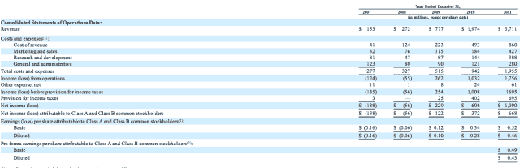

# 脸书的首次公开募股:所有收入猜测的终结

> 原文：<https://web.archive.org/web/http://techcrunch.com/2012/02/01/facebook-ipo-facebook-ipo-facebook-ipo/>

# 脸书的首次公开募股:所有收入投机的终结

你知道今天最棒的是什么吗？脸书刚刚披露了其财务状况，为上市做准备。

请原谅我:这意味着不会再有脸书收入数据的“泄露”来抬高其在二级市场的估值。不再有关于脸书如何在三藩市酒吧里“杀死它”的平庸和含糊的谈话。这意味着我再也不用用我为迈克制作的扎克伯格美元图来写另一篇关于脸书收入的[“报告:诸如此类”](https://web.archive.org/web/20230302085952/https://techcrunch.com/wp-content/uploads/2011/09/zuck-copy.jpeg?w=620)的文章了。

(也许我会改变这张图片的用途，在我们不可避免要写的文章中使用，试图确定该公司的估值和执行价格。做好准备迎接这些铺天盖地而来的消息，直到四月份事情真正公开。)

所以现在所有这些“脸书赚了多少钱？”猫从袋子里出来了！根据 S-1 报告，脸书在 2004 年收入只有 38.2 万美元，2005 年收入为 900 万美元，2006 年收入为 4800 万美元，2007 年收入为 1.53 亿美元，没有报告净亏损。

脸书公布了 2006 年后的亏损数字:2007 年收入 1.53 亿美元，亏损 1.38 亿美元，2008 年亏损 2.72 亿美元，亏损 5600 万美元，2009 年最终实现盈利，净收入 2.90 亿美元，收入 7.77 亿美元。

对于那些热衷于核实事实的人来说:7.77 亿美元和 2.90 亿美元的数字与媒体报道一致[，分析师对脸书 2010 年收入 20 亿美元和净收入 6.06 亿美元的预测也是正确的。](https://web.archive.org/web/20230302085952/https://techcrunch.com/2011/09/07/report-facebook-revenue-was-1-6-b-in-first-half-of-2011-net-income-500m/)

然而，各种各样的报告充斥着 2011 年的收入(实际上是 37 亿美元)，但却正好击中了 10 亿美元的净收入。

伙计，十亿美元的利润基本上是推动像素。有人在脸书有门路吗？

https://twitter.com/#!/alexia/status/164847708329361408