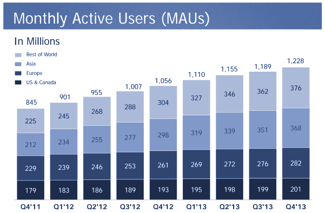

# 脸书正式成为一家移动广告公司，其 53%的广告收入来自其 9 . 45 亿移动用户

> 原文：<https://web.archive.org/web/https://techcrunch.com/2014/01/29/facebook-is-a-mobile-ad-company/>

# 脸书正式成为一家移动广告公司，其 53%的广告收入来自其 9 . 45 亿移动用户

随着今天[2013 年第四季度收益](https://web.archive.org/web/20230404142717/http://investor.fb.com/eventdetail.cfm?EventID=139165)跨过中间点，脸书达到了一个重要的里程碑，现在其移动广告收入的 53%，或其本季度[25.9 亿美元收入](https://web.archive.org/web/20230404142717/https://techcrunch.com/2014/01/29/facebook-beats-in-q4-with-revenue-of-2-59b-eps-of-0-31/)中的 13.7 亿美元。小屏幕 skrilla 的日移动用户数从第三季度的 5.07 亿增加到 5.56 亿，月移动用户数从 8.74 亿增加到 9.45 亿。总体而言，脸书的总日用户数达到 7.57 亿，月用户数从第三季度的 11.9 亿上升到 12.3 亿。

2013 年第三季度，脸书手机广告收入占比达到 49%，高于 Q2 的 41%和 Q1 的 30%。但现在其 25.9 亿美元的收入中有 53%来自移动业务。在财报电话会议上，脸书表示，第四季度是其第一个移动广告收入达到 10 亿美元的季度，2013 年第四季度移动广告收入几乎与 2012 年第四季度移动和桌面广告收入持平。

推动这一增长的是脸书的移动应用安装广告，这有助于开发者在杂乱的应用商店之外发现他们的应用。本季度，脸书还推出了新的移动应用重新参与广告，可以让用户回到他们下载并忘记的应用。首席运营官·雪莉·桑德伯格在财报电话会议上表示:“这比我们预期的还要好。”。

虽然许多人预测移动时代可能会杀死脸书，但该公司在商业方面做出了显著的转变，以利用其他人犹豫不决的新媒体。因为用户在脸书的新闻订阅上花了很多时间，而且它对他们非常了解，所以它可以显示目标明确、相关的全屏广告，带来不错的收入。这帮助每个地理区域的总收入在一年内增长了 65%或更多。

至于用户增长，脸书的纯移动用户数量从 2013 年第三季度的 2.54 亿大幅增加到第四季度的 2.96 亿。这可能意味着脸书用户正在完全抛弃他们的台式机，或者只是在台式机稀缺的发展中国家招募更多的纯移动用户。

## 

虽然脸书的总月用户数在本季度增长了 3.36%，同比增长了 16%(1.72 亿)，但在美加地区，第四季度仅增长了 1%，从 1.99 亿增至 2.01 亿。这表明脸书在这些市场已经达到饱和，可能已经开始对年轻人口失去动力。

关于上个季度的收益，它承认它看到“特别是青少年的日常用户减少”，这导致其股价下跌 15%，损害了它从强劲的第三季度财务状况中获得的增长。

美国东部时间下午 4 点 50 分，就在财报电话会议之前，脸书股价在盘后交易中上涨 10%，至 58.90 美元。但是正如我今天早上写的，[青少年有潜力创造或破坏脸书今天的股价](https://web.archive.org/web/20230404142717/https://techcrunch.com/2014/01/29/teens-using-facebook/)。你可以期待所有的耳朵都在听马克·扎克伯格在即将到来的收益电话会议上关于孩子们如何使用脸书的讲话。

更新:脸书表示没有关于青少年的新数据可以分享。在没有确凿证据的情况下，投资者对脸书获得 25.9 亿美元的收入反应良好。

有趣的是扎克伯格如何为脸书勾勒出一个新的大战略:更多的独立应用。在我的长篇特写“[脸书征服莫比尔的阴谋:](https://web.archive.org/web/20230404142717/https://techcrunch.com/2014/01/29/one-app-at-a-time/) [把自己粉碎](https://web.archive.org/web/20230404142717/https://techcrunch.com/2014/01/29/one-app-at-a-time/)”中读到了它。]

*点击下方了解更多关于脸书收入的信息:*

