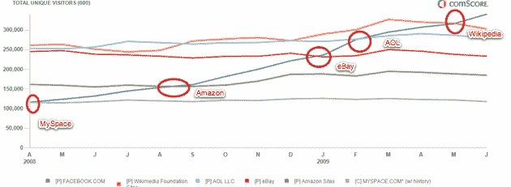
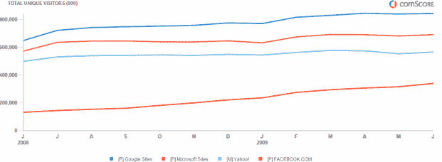

# 脸书现在是世界第四大网站 

> 原文：<https://web.archive.org/web/https://techcrunch.com/2009/08/04/facebook-is-now-the-fourth-largest-site-in-the-world/>

# 脸书现在是世界第四大遗址

脸书在全球的崛起令人震惊。与前一个月相比，仅在 6 月份，它就在全球范围内增加了 2400 万独立访客，全球独立访客总数达到 3.4 亿。根据 comScore 的数据，它现在是世界第四大网站，仅次于谷歌、微软和雅虎。脸书本身只官方承认[2.5 亿](https://web.archive.org/web/20230130124209/http://techcrunch.com/2009/07/15/facebooks-offical-user-count-now-250-million/)活跃注册用户(但你不一定要成为注册用户才能访问一些脸书页面)。

在过去的一年里，它增长了 157 %,吸引了 2 . 08 亿游客。早在 2008 年 4 月，它就在全球范围内超越了竞争对手 MySpace 。从那以后，它在上升的过程中经过了更大的站点。在上图中，蓝线代表脸书。它在 2008 年 8 月超过了亚马逊。2009 年 1 月，易贝半途而废。2009 年 2 月的某个时候，它超过了美国在线，就在上个月，它终于超过了维基媒体基金会的网站(包括维基百科)。

所以现在它排在第四位。要赶上世界三大巨头:谷歌、微软和雅虎，还需要一段时间。它们每个月的全球独立访客数量都比脸书多 2.4 亿到 5 亿(见下图)。但是对一个公司来说，有一个长远的目标总是好的。

全球独立访问者(2009 年 6 月)。来源:comScore

1.  谷歌网站:8.44 亿
2.  微软网站:6.91 亿
3.  雅虎！网站:5.81 亿
4.  **脸书:3.4 亿**
5.  维基媒体基金会网站:3.03 亿
6.  美国在线:2.8 亿
7.  易贝:2.33 亿
8.  CBS 互动:1.86 亿
9.  亚马逊:1.83 亿
10.  问问网:1.74 亿

在美国，脸书在 6 月份拥有 7700 万独立访问者，使其成为美国第六大网站(仅次于谷歌、雅虎、微软、美国在线和所有福克斯互动媒体网站的总和)。

