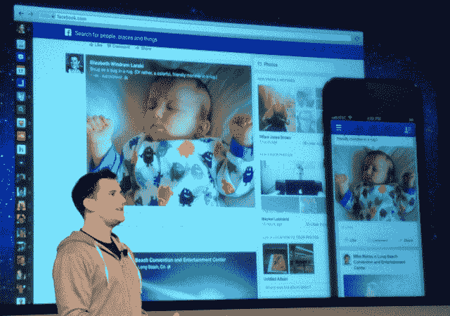
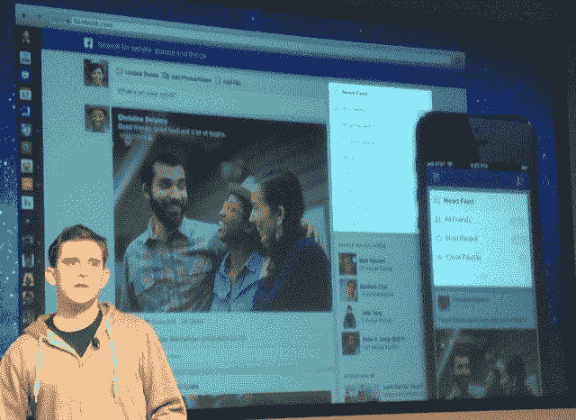

# 脸书发布照片、音乐、好友等内容的订阅源

> 原文：<https://web.archive.org/web/https://techcrunch.com/2013/03/07/facebook-launches-multiple-topic-based-feeds-bigger-images-and-a-consistent-design-across-devices/>

# 脸书推出照片、音乐、好友等内容的订阅源

今天，在脸书总部，马克·扎克伯格发布了新的新闻订阅源,该订阅源在各种设备上使用“受移动设备启发”的一致设计，允许你深入特定内容类型的订阅源，并提供更大的图片。相册也进行了改版，变得更加身临其境，分享的链接将会有更长的简介来预览你将要点击的内容。

这些变化将从今天开始推出，你将在接下来的几周内看到它们。推广将是缓慢而谨慎的，这样脸书就可以得到反馈，知道什么可行，什么不可行。这是我们的[快速动手视频](https://web.archive.org/web/20230404120439/https://techcrunch.com/2013/03/07/hands-on-with-the-new-facebook-and-its-boredom-killing-feeds-tctv/)，展示了重新设计后的外观和感觉。

其他一些新闻订阅设计的变化:现在，地方的签到有一个更大的地图，向人们显示你的确切位置；Pinterest 在脸书的帖子现在更加生动，所以你在脸书看到的“更好地反映了你在 Pinterest 上看到的”；视频看起来更大；如果多个朋友分享同一篇帖子，你会在帖子的左侧看到他们的脸。

脸书还试图改善热门内容。因此，如果你喜欢泰勒·斯威夫特，你会看到来自不同新闻来源的“最近关于她的文章”。

脸书新闻供稿团队的 Chris Struhar 展示了特殊的主题供稿，用户现在可以在右边栏的顶部选择。订阅源按照您查看的频率进行排序，因此很容易找到您最常访问的订阅源。它们都可以在网络和手机上找到。它们包括:

*   所有朋友:按时间倒序显示你朋友的帖子。
*   音乐:显示朋友们在听什么，正在发行的新专辑，以及您可能喜欢的艺术家的推荐。
*   照片:只是照片，包括直接上传到脸书的照片，也包括从 Instagram 或其他照片应用程序分享的照片。
*   以下:页面提要的改进，按你喜欢的页面显示每篇文章。
*   比赛
*   知己
*   你的兴趣列表或朋友列表

马克·扎克伯格解释道:

> 在个人层面，我们建立了一项服务，让你看到和感受到你关心的人和朋友。我们努力做的是给世界上的每个人最好的个性化报纸。它应该有来自朋友的优质公共内容。它应该有一个首页，它应该让你深入到任何你想要的主题。它应该是视觉上的，丰富的和引人入胜的。它应该不仅仅显示文本。从一开始，我们的目标与任何服务试图提供的不同。你应该能够分享你想要的任何类型的内容…和你想要的任何观众。你用照片告诉的类型完全不同。
> 
> 既然我们口袋里都有相机，新闻订阅已经变成了视觉内容。新闻提要中几乎 50%的内容是可视化的。现在，平均新闻页面帖子几乎占内容的 30%。我们分享的方式正在改变。我们都想与朋友分享，但希望从我们关心的出版物、艺术家和世界领导人那里获得更新。

这些更新与我几天前写的关于脸书将要发布的内容非常吻合。当您收到重新设计的新闻提要的 web 展示时，您会在顶部看到一个切换到它的按钮。这种推广从今天开始，但将在未来几周和几个月内慢慢扩散。脸书移动应用的新版本将在未来几周内推出。

总的来说，更新应该确保脸书总是有新的东西可以看。你可以去查看照片或音乐，而不是滚动到主页面的底部，然后离开网站。脸书看到 Instagram 和 Twitter 等更干净、移动优先的设计越来越受欢迎，现在正试图剥离其用户界面，同时确保人们花更多时间浏览订阅源、查看广告和感受与朋友的联系。

*阅读更多:*

[脸书迄今最冒险的赌注。能把十亿人的行为连根拔起吗？](https://web.archive.org/web/20230404120439/https://techcrunch.com/2013/03/07/facebook-risks-it-all)

[亲身体验新脸书和它的无聊节目【TCTV】](https://web.archive.org/web/20230404120439/https://techcrunch.com/2013/03/07/hands-on-with-the-new-facebook-and-its-boredom-killing-feeds-tctv/)

对于企业来说，脸书的重新设计意味着更大的广告，一个页面，但也是一个朋友专属的部分

[脸书专注于移动带来的一致性，目的是让脸书“不碍事”](https://web.archive.org/web/20230404120439/https://techcrunch.com/2013/03/07/facebooks-focus-on-mobile-consistency-is-all-about-getting-facebook-out-of-the-way/)