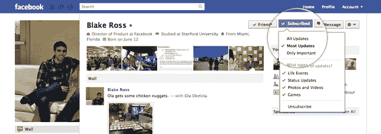

# 脸书推出类似 Twitter 的“订阅”，让你与无限用户分享 TechCrunch

> 原文：<https://web.archive.org/web/http://techcrunch.com/2011/09/14/facebook-launches-twitter-like-subscriptions-lets-you-share-with-unlimited-users/>

今天，在 f8 大会的筹备过程中，脸书推出了另一个关键的新功能:一个名为*订阅*的单向跟随模式。它有点像 Twitter，有点像 Google+，并且
它为有很多朋友的用户(或者想要广泛分享他们的状态更新的用户)解决了该服务的最大痛点之一。

它是这样工作的。当你浏览网站时，你会注意到一些用户在他们的个人资料顶部有一个写着“订阅”的按钮。点击它，你将开始在你的新闻订阅中看到该用户的状态更新，就像你是他的脸书朋友一样。但有一个很大的区别:与普通的脸书朋友不同，你订阅的人不需要批准你的订阅请求，而且对任何给定用户的订阅人数没有限制。

脸书说，这个专题将会吸引任何希望获得更广泛受众的人，比如记者、艺术家和政治人物。若要开始公开分享您自己的帖子，请转到您的个人资料照片下方的订阅标签。点击它，你就可以选择向任何订阅你的人广播你的公开更新。请注意，您将只整合标记为公开的更新；您的订阅者不会看到与好友列表共享的更新。

当然，脸书提供类似的功能*页面*已经很多年了，目的几乎是一样的(你会发现许多记者和政治家已经创建了脸书页面……因为那是脸书告诉他们要做的)。脸书说，这里的区别在于用户不再需要维护两个独立的实体；他们可以使用网站的分享设置来决定他们想要广泛分享的内容，以及只与朋友分享的内容。

脸书补充说，这绝不是页面的终结——他们说这个功能仍然会吸引品牌和主要名人，因为页面可以由多个管理员管理，并且可以通过应用程序进行定制。页面也提供见解(脸书的分析工具)，而订阅则没有。

幸运的是，脸书允许用户将他们的页面与个人资料合并，所以如果你想使用订阅功能，你不必重建你的观众。

除了订阅之外，脸书还让调整显示在你的新闻订阅上的内容的数量和类型变得更加容易。现在，当您查看用户的个人资料时，您可以点击一个按钮，从三种订阅设置中进行选择:

> 所有更新:你的朋友发布的所有内容
> 
> 大多数更新:你通常会看到的数量
> 
> 仅重要更新:仅突出显示，比如新工作或搬家

你还可以选择你想看的内容(例如，你可以选择阻止你的一个朋友的所有游戏相关的更新，但保留他们的照片更新)。

这又是一个与最近推出的 Google+有相似之处的功能。Google+采用了单向交友系统，任何人都可以开始关注其他人，无需征得他们的同意。显然，Twitter 首先普及了单向追随。这里与 Twitter 最大的不同是脸书的新闻订阅算法仍然适用，所以你不会看到你订阅的每个用户的每个更新(除非你手动调整上述设置)。

**更新** : [通过订阅，你很快就可以从脸书更新 Twitter】](https://web.archive.org/web/20230203085416/https://techcrunch.com/2011/09/14/facebook-to-twitter/ "Along With Subscriptions, You’ll Soon Be Able To Update Twitter From Facebook")