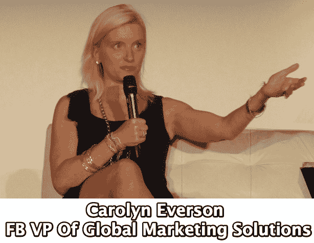

# 脸书没有证实超本地移动广告产品，但它会如何针对你 TechCrunch

> 原文：<https://web.archive.org/web/https://techcrunch.com/2012/06/18/facebook-local-ad-targeting/>

脸书告诉我，脸书也许有一天会让广告商根据移动用户当前的确切位置来锁定他们，但是副总裁卡洛因·艾弗森并没有证实这种产品正在为彭博公司工作。纽约媒体公司曲解了 Everson 的声明，他只是说你可以想象手机的位置感知所带来的产品进化。

因此，我们不会说脸书正在“准备”这样一个产品，但这并不意味着它最终不会出现。让我们想象一下它会是什么样子。实时的超本地脸书广告可以让本地企业向看到他们实体店的人做广告，或者让旅游公司瞄准那些远离家乡的人。争夺这些活跃用户的竞争可能会推高广告价格，为脸书赚更多钱。

脸书告诉我，本周在法国的[戛纳国际电影节上，艾弗森代表彭博回答的几个问题中，没有任何新的东西被宣布或确认。埃弗森只是说，脸书一直在测试新的广告产品(它已经做了多年)，人们对移动新闻订阅广告“非常感兴趣”，而且“手机可以是特定位置的，所以你可以开始想象随着时间的推移，产品的演变可能会是什么样子，特别是对零售商来说。”](https://web.archive.org/web/20221208123108/http://www.canneslions.com/the_festival/)

这远没有彭博发布的那么具体——脸书“表示，它正在开发一种基于位置的移动广告产品，该产品将允许公司通过显示用户行踪的实时数据来锁定用户。”这样一个特殊的产品没有得到证实。

但是，随着 5 亿用户通过手机访问脸书，它有很多位置数据可以依赖，脸书布列塔尼·达维尔的 T2 说，她有广告行业的消息来源说，脸书正在研究更准确的本地定位。此外，2011 年 1 月，脸书[收购了 Rel8tion](https://web.archive.org/web/20221208123108/http://www.insidefacebook.com/2011/01/25/acquires-mobile-advertising-rel8tion/) ，该公司专门从事超本地广告定位。这可以与上周宣布的新的脸书交易所实时广告竞价系统结合起来，为广告商创造一个强大的新产品。

这就是它的工作原理。当你打开你的手机应用程序(如果脸书有权限获取你的 GPS 坐标)或者当你发布一个带有位置标签的帖子时，脸书会知道你的位置，并假设你在接下来的几分钟内会在附近。广告商将预先提交在特定位置向用户展示的创意元素，以及他们为展示广告支付的最高出价。当你处于其中一个地区时，脸书会为你匹配广告商，要么自动提供最高床位的预制超级本地广告，要么要求广告商雇佣的需求方平台出价，然后展示拍卖获胜者的广告。

例如，百思买电子产品连锁店可以针对其在美国所有零售点 1000 英尺范围内喜欢百思买、其他电子商店或其销售的设备的人设置广告。当你在附近散步或开车时打开脸书应用程序，你会在你的新闻订阅中看到一个移动赞助的故事，讲述你的朋友如何与百思买互动，或者可能是百思买提供的折扣，这可能会让你更有可能去实体店。

另一个可能的流程是，像 Hipmunk 这样的旅游公司可以将广告瞄准距离他们列出的“当前城市”500 英里以上并且在热门旅游目的地的用户。因此，当我在伦敦而不是在旧金山的家里时，我可能会看到手机广告，提醒我 Hipmunk 是预订廉价航班的一种简单方式。

一些用户可能不会完全适应这种超本地定位，但脸书可能会强调，所有数据都是匿名的，没有企业会知道你的个人位置，只是他们的一个目标被成功地广告了。多年来，脸书一直在推动隐私和分享的边界，随着时间的推移，许多产品决策，如新闻订阅和签到，最终被接受甚至享受。现在，作为一家上市公司，脸书将需要看看它是否能推动同样的界限，使企业受益，而不仅仅是你与朋友的联系。

*【图片鸣谢:[科尔姆·布雷肯](https://web.archive.org/web/20221208123108/http://community.microsoftadvertising.com/en/marketers-agencies/advertising/b/advertising/archive/2010/09/29/consumer-adoption-of-new-technologies-and-what-it-means-for-marketers.aspx)*