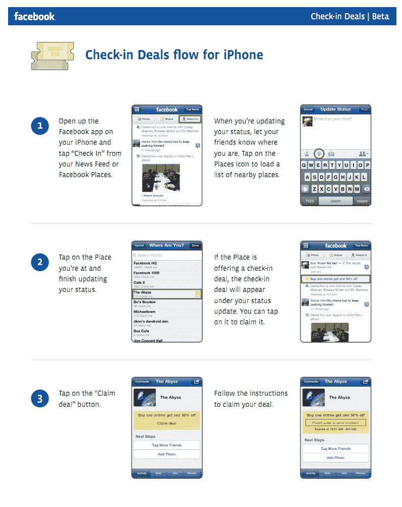

# 一年后，脸书杀光了地方...将位置无处不在 

> 原文：<https://web.archive.org/web/http://techcrunch.com/2011/08/23/facebook-location-tagging/>

差不多就在一年前，脸书推出了基于位置的服务 Places T1。阅读当时的新闻，你可能会认为这将是四方杀手，Gowalla-stranger，Loopt-header 等。不要介意脸书[和他们所有人一起合作](https://web.archive.org/web/20230205032116/https://techcrunch.com/2010/08/18/facebook-places-gowalla/)发布——那些人已经玩完了。

快进到今天:Foursquare 最近筹集了一大笔资金，对他们[的估值为 6 亿美元](https://web.archive.org/web/20230205032116/https://techcrunch.com/2011/06/24/foursquare-closes-50m-at-a-600m-valuation/)。脸书正在消灭一些地方。

需要说明的是，脸书并没有回避选址游戏本身。事实上，你可以说他们在双倍下注。但他们正在远离“签到”服务一直在玩的游戏。结果是，随着今天更大的隐私变化，一些地方被取消，被新的“附近”区域所取代。

读了脸书自己关于地点变化的帖子，还不完全清楚这些变化对入住概念本身意味着什么。但是[这一页](https://web.archive.org/web/20230205032116/https://www.facebook.com/about/location)似乎让这一点更清楚。在我看来，签到仍将是产品的一部分，但不再被强调。看起来希望人们将不再从“签到”的角度考虑位置，而是从标记你的位置到你正在做的事情的角度考虑——分享想法，发布图片等等。

正如新的位置页面所表明的，脸书现在以三种主要方式查看位置使用情况:

*   分享你去过的地方
*   分享你现在的位置
*   分享你的去向

过去。目前。未来。

这很聪明，因为这是其他定位服务还没有真正解决的问题。现在，这个位置在脸书的每个动作中都被强调(尽管它很容易被关闭)——不仅仅是在手机上——很多人都会使用它。位置作为一层语境即将得到大升级。

所有这些也是基于位置的广告策略的巧妙之处。更多的数据和更强的信号。我还不清楚这对脸书基于位置的交易服务意味着什么。去年与 Places 同时推出，这似乎从未真正启动过。脸书今天没有提到它。我已经联系他们澄清了。

位置信息页面上的视频详细介绍了位置标记的工作原理。facebook.com 的默认设置似乎是城市级别的，还有一个辅助位置按钮来添加一个实际的地点(然后插入到你的状态消息中)。您还可以将位置添加到您已经发布的照片中。

该视频还指出，在移动设备上仍然会有一个签到按钮，但功能会有所不同。它显然只会作为状态更新的一部分存在，不会再有蓝色的大“签到”按钮将你的签到插入到其他签到的流中(同样，也不会再有地方区域本身)。相反，一旦你选择了一个地方，它会被简单地添加到你的状态信息的末尾。

位置共享也将与脸书今天概述的更直接、更简单的隐私变化联系在一起。

**更新**:以下是脸书对入住交易的看法:

> 一旦有人标记了他们在脸书的位置，他们就会被导向新闻源。如果这个地方提供入住交易，交易的标题将出现在新闻提要故事的下方。然后，您可以单击交易标题，然后进入索赔流程。

下面，找到它现在将如何工作的流程图。

