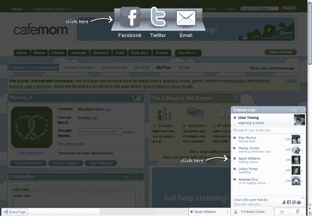

# 脸书将推出 Meebo 酒吧克隆版，寻求接管互联网

> 原文：<https://web.archive.org/web/https://techcrunch.com/2010/03/27/facebook-meebo-bar/>

# 脸书将推出 Meebo 酒吧克隆版，寻求接管互联网

在过去的几天里，我们发现了一些脸书将在 f8 开发者大会上宣布的主要新功能，包括它计划为整个互联网提供一个类似[的按钮](https://web.archive.org/web/20221206202320/https://beta.techcrunch.com/2010/03/25/facebook-to-release-a-like-button-for-the-whole-darn-internet/)和一个令人毛骨悚然的[自动连接](https://web.archive.org/web/20221206202320/https://beta.techcrunch.com/2010/03/26/facebooks-plan-to-automatically-share-your-data-with-sites-you-never-signed-up-for/)功能，该功能将与你从未注册过的网站共享你的数据。现在，我们从多个渠道获悉该公司计划推出的第三款主要产品:第三方网站可以集成的持久脸书工具栏，听起来很像 Meebo Bar。

关于脸书工具栏的细节仍然很少，但我们听说它将使用 AJAXy 技术停留在浏览器窗口的底部，就像 Meebo 的工具栏一样(以及之前集成到 Facebook.com 的聊天栏的方式)。我们可以期待脸书酒吧包括分享功能和聊天，就像 Meebo 酒吧一样。目前还不清楚脸书是否会推出带有广告的酒吧，但我们几乎可以肯定它最终会到来。

这三个新功能——一个全网范围的按钮、自动连接和一个持久工具栏——非常清楚地表明，脸书正在寻求将其触角延伸到尽可能多的网络，这不会是一个选择加入的体验。相反，脸书希望成为这些网站的一个无处不在的集成功能——一种旨在促进与朋友分享的网络主干。一切都指向脸书。

下面是 Meebo 酒吧在其合作伙伴网站上的一张照片。
