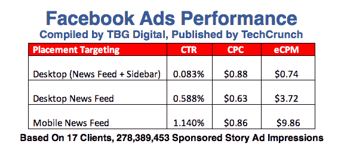
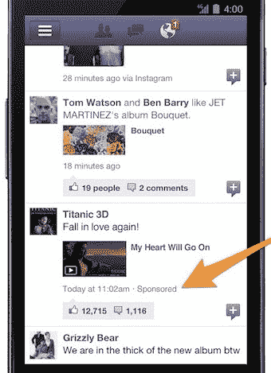
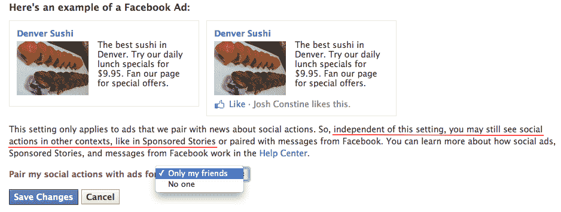

# 他们工作了！脸书移动广告的点击率比桌面广告高出 13 倍，收入高出 11 倍 TechCrunch

> 原文：<https://web.archive.org/web/https://techcrunch.com/2012/06/19/facebook-mobile-ads/>

脸书将如何从移动业务中赚钱？其看似有机的赞助故事广告形式可能是答案。与脸书的所有桌面广告相比，移动赞助故事的点击率超过了 13 倍，每印象收入(eCPM)是移动广告的 11.2 倍，自脸书开始与网络广告分开销售以来的两周内，网络赞助故事的点击率是 1.93 倍，每印象收入是 2.65 倍。

这些数据来自于脸书三大广告 API 合作伙伴 [TBG 数码](https://web.archive.org/web/20221206012330/http://www.tbgdigital.com/)、[广告厅](https://web.archive.org/web/20221206012330/http://www.adparlor.com/)、[纳尼根斯、](https://web.archive.org/web/20221206012330/http://www.nanigans.com/)和[云杉媒体](https://web.archive.org/web/20221206012330/http://sprucemedia.com/)的新研究，这三家公司帮助品牌购买广告。由于赞助故事可以无缝地嵌入内容提要，脸书可能比其他网络优先的科技公司更有能力处理向移动广告的转移。让我们看看早期的证据。

围绕脸书首次公开募股的许多疑问来自于社交网络的用户基础从网络转移到移动的证据，脸书在二月份才开始测试广告。在网络上，用户每页看到多达 7 个广告，有些人在社交游戏上花了大笔钱，但在移动设备上，他们每天只看到几个广告，很少有人为脸书 HTML5 游戏平台上的游戏付费。

对脸书移动未来的担忧是其股价从开盘价 38 美元跌至今天 31.50 美元的部分原因。但是本月早些时候，脸书开始允许广告商指定他们希望他们的广告只在移动设备上显示，现在全世界第一次深入了解脸书移动广告的表现。这些结果可能会让投资者更加乐观。

TBG 数字公司的首席执行官西蒙·曼塞尔告诉我，“这是一个巨大的消息，表明移动电话有可能成为脸书需要的巨大收入来源，特别是因为在那里的使用。”以下是 TechCrunch 独家分享的两组数据的结果，以及来自广告行业的更多证实。

#### 脸书广告表现:移动与网络

根据 [TBG 数字](https://web.archive.org/web/20221206012330/http://www.tbgdigital.com/)对 17 个客户端的 278，389，453 个赞助故事广告印象的一项新研究，移动新闻订阅赞助故事(脸书在移动设备上显示的唯一广告)的点击率为 1.14%，每次点击费为 0.86 美元。这意味着脸书每 1000 次展示的收入为 9.86 美元，随着更多的广告商意识到移动赞助故事的力量并在那里争夺展示，这一收入实际上可能会上升。

将这些数字与桌面新闻源赞助的故事进行比较，后者的点击率为 0.588%，每次点击费为 0.63 美元，脸书的 eCPM 为 3.72 美元，脸书的点击率为 1.93 倍，移动赞助故事的收入是其在网络上的 2.65 倍。

从整体上看脸书的桌面广告，包括赞助故事和传统的边栏广告。他们的点击率仅为 0.083%，每次点击费为 0.88 美元，脸书的 eCPM 仅为 0.74 美元，因此移动赞助的故事的点击率是其桌面广告组合的 13.7 倍，脸书是其桌面广告组合的 11.2 倍。

与此同时，[adparr](https://web.archive.org/web/20221206012330/http://www.adparlor.com/)快速浏览了一个价值数万美元的广告活动后发现，移动广告的点击率为 0.821%，而传统的脸书广告活动大多出现在网络侧边栏中，在网络和移动新闻订阅中也有一些，其常规广告的点击率仅为 0.032%。这是移动点击率的 25 倍。旨在为脸书页面赢得新粉丝的活动，虽然移动端的点击到粉丝的转化率略有下降——移动端为 55%，而广告位为 72%——但点击率的提高在很多时候都弥补了这一点。

广告行业的其他消息来源证实了脸书移动广告的高性能。另一个广告 API 巨头 [Spruce Media](https://web.archive.org/web/20221206012330/http://sprucemedia.com/) 告诉 MediaPost，它对脸书移动赞助的故事进行的测试显示，点击率从 0.8%到 1.7%，与 TBG 数字和 AdParlor 的范围相同。**更新** : [游戏公司中的顶级广告 API 选择 Nanigans](https://web.archive.org/web/20221206012330/http://www.nanigans.com/) 表示，移动赞助故事的平均点击率为 0.79%，但随着智能附加兴趣的分层，点击率高达 2%。

这看起来不像是用户只是出于好奇而点击相对较新的、三个月大的广告单元。看起来用户实际上将它们视为内容，并通过点击来了解他们的朋友与之互动的页面和应用程序的更多信息。

#### 破解手机广告的密码

移动赞助故事获得如此高的点击率对脸书来说是改变游戏规则的，因为它或任何服务在移动上做广告的空间都没有那么大了。

没有广告侧边栏的空间，如果太多的广告被注入内容提要，用户可能会生气并停止浏览。但令人印象深刻的高点击率和 eCPM 意味着脸书不必展示太多的赞助故事就能从中赚到一大笔钱。

广告客户正在排队购买它们，AdParlor 首席执行官 Hussein Fazal 说，“通过允许广告客户只在移动设备上显示广告，脸书肯定能够产生更多的收入。我们已经看到了很多想在手机上做广告的广告商的兴趣。”

Google+和 Twitter 等其他社交网站没有像脸书这样的规模、社交图或现场活动来提供有效的赞助故事。虽然 Twitter 和 G+的兴趣图可以帮助实现准确的广告定位，但只有脸书知道谁是你最亲密的朋友，这要归功于照片标签、墙贴、消息等等。其大量的现场时间也产生了许多与品牌和当地企业的互动，可以转化为赞助故事广告。

脸书才刚刚开始。有消息称，该公司正在开发一款超本地移动广告定位产品,可以向实体商店几百英尺范围内的用户提供极其相关的本地商业广告。得益于新的[脸书交易所实时竞价系统](https://web.archive.org/web/20221206012330/https://beta.techcrunch.com/2012/06/13/facebook-exchange/)，脸书可以通过让广告商竞相接触特定的移动用户，包括那些在访问表明购买意向的网站后被重新定向的用户，来抬高每次点击费或每次点击费的价格。

合法性是赞助故事成功的最后障碍之一。脸书[上周在加州解决了一起集体诉讼](https://web.archive.org/web/20221206012330/http://www.techmeme.com/120522/p50#a120522p50)，因为它在广告中使用了人们的肖像。It [目前不提供对赞助故事的选择退出](https://web.archive.org/web/20221206012330/http://www.facebook.com/settings?tab=ads&section=social)，但最终可能不得不这样做。尽管如此，这一背景可能会被埋得足够深，以避免太多人把这个提议变成赚钱的机会。

在过去的两周内，[脸书的股价上涨了近 20%](https://web.archive.org/web/20221206012330/http://www.techmeme.com/120618/p93#a120618p93) ，收复了自 IPO 以来的大部分失地。那些在底部买入的人现在看起来更明智了。高移动赞助故事点击率表明，至少一些用户不讨厌广告，如果他们看到更多就不会反抗。

现在，脸书必须在展示多少移动广告上找到合适的平衡点。如果成功的话，它可以在向移动业务的转变中走钢丝，最终成为一家非常富有的公司，并产生许多人所期望的回报。

*更多脸书广告新闻:*

*[脸书交易所:广告商通过实时竞价广告重新锁定特定用户的新途径](https://web.archive.org/web/20221206012330/https://beta.techcrunch.com/2012/06/13/facebook-exchange/)*

 **[传言中的脸书超本地实时广告将如何瞄准你](https://web.archive.org/web/20221206012330/https://beta.techcrunch.com/2012/06/18/facebook-local-ad-targeting/ "Facebook Did Not Confirm Hyper-Local Mobile Ad Product, But Here’s How It Would Target You")*

 *[广告人集合！脸书召集创意委员会对产品提出建议](https://web.archive.org/web/20221206012330/https://beta.techcrunch.com/2012/06/18/facebook-creative-council/)**