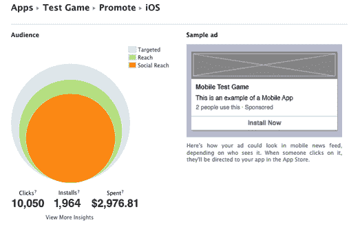
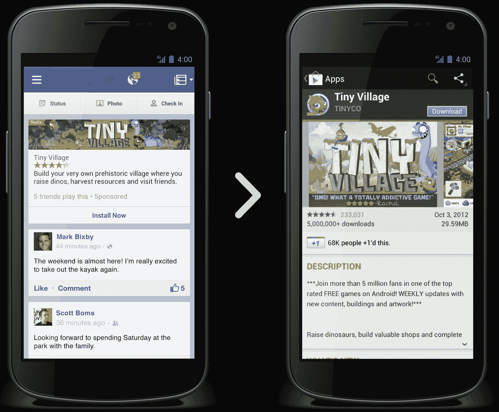

# 脸书希望通过现在允许任何开发者购买移动应用安装广告来主导付费发现

> 原文：<https://web.archive.org/web/https://techcrunch.com/2012/10/17/facebook-mobile-app-install-ads/>

# 脸书希望通过现在允许任何开发者购买移动应用安装广告来主导付费发现

应用程序开发者为获得安装的广告支付巨额费用，而脸书想要吞噬这笔支出。[所以今天脸书开始](https://web.archive.org/web/20230316224553/http://developers.facebook.com/blog/post/2012/10/17/drive-installs-and-discovery-with-mobile-app-install-ads/)允许所有开发者购买其[最近宣布的](https://web.archive.org/web/20230316224553/https://techcrunch.com/2012/08/07/facebook-mobile-app-ads/)应用，安装出现在移动新闻提要中的广告。直到现在，只有几个合伙人有权限。

脸书在应用经济上下了大赌注，希望成为应用商店之外最大的发现来源。

移动应用安装广告允许开发者购买在脸书移动新闻订阅中推广他们应用的磁贴。当点击时，这些按钮会立即打开苹果应用商店或谷歌应用市场，用户可以在那里下载应用。

广告已经起作用了。与其他安装渠道相比，TinyCo 的点击率和转换率高出 50%。脸书的广告也带来了更多的参与用户。广告技术初创公司 Nanigans 在购买脸书移动应用 install ads 时，其客户覆盖范围是传统移动广告的 8-10 倍。AdParlor 获得了稳定的 1-2%的点击率。

在两个月前开始的[试验中吸取了一些设计经验。人们不能只看一个应用程序的名称、简短描述和图标。他们想要社会证明，他们应该下载。这就是为什么广告现在会显示脸书应用中心对应用的评级，以及哪个朋友在使用它。新版本比旧广告好看多了。](https://web.archive.org/web/20230316224553/https://techcrunch.com/2012/08/07/facebook-mobile-app-ads/)

开发者可以通过 Ads API、Power Editor、脸书广告合作伙伴轻松购买这些广告，或者直接从应用仪表板购买，因为所有的创意都是预先固定的。脸书还提供深度分析，让开发者跟踪他们的广告点击和他们驱动的安装。在未来，开发者可能会获得更多的定位选项、个性化创意，以及让用户不用离开脸书就可以开始下载应用的选项。

现在要明确的是，这些仍然是非社交广告。他们不需要一个朋友已经喜欢或安装了应用程序，广告就可以到达你的新闻源。这意味着脸书必须小心不要展示太多，否则就有淹没有机朋友内容的风险。如果广告商没有将他们的活动瞄准那些不想要他们应用的人，脸书用户可能会觉得他们在滚动一个令人讨厌的广告牌，而不是朋友的状态更新和照片。

但如果用户喜欢，应用安装广告可能是脸书底线的巨大移动希望。移动应用安装是一个巨大的行业。随着时间花在脸书自己的应用程序上，这些广告可以确保任何时候一个公司推出一个新的应用程序，它是在向脸书付费。

