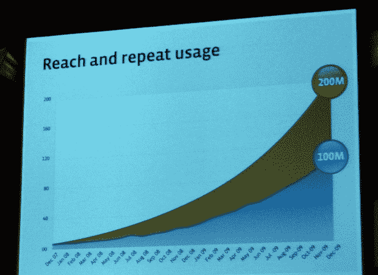
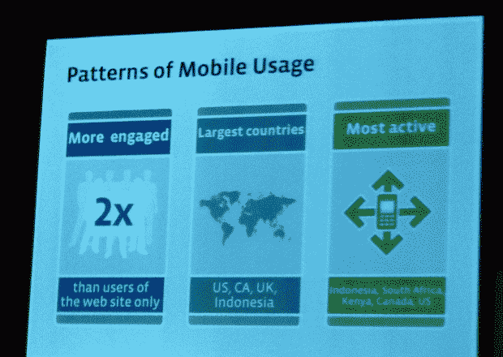

# 脸书的移动战略浓缩为 16 分钟(视频)

> 原文：<https://web.archive.org/web/https://techcrunch.com/2010/02/16/facebook-mobile-strategy/>

# 脸书的移动战略浓缩为 16 分钟(视频)

【YouTube = http://www . YouTube . com/watch？v = 1 vvhwqcpu 0 & HL = en _ US & fs = 1 & color 1 = 0x 234900 & color 2 = 0x 4 e9 e 00]

昨天，在巴塞罗纳世界移动通信大会的“移动通信 2.0”会议上，脸书的用户增长、移动和国际扩张副总裁 Chamath Palihapitiya 分享了社交网络巨头当前的移动战略及其未来的计划。

正是在这次会议上，该公司首次谈论了其最新产品 [Facebook Zero](https://web.archive.org/web/20221007230254/https://beta.techcrunch.com/2010/02/16/facebook-launches-zero-a-text-only-mobile-site-for-carriers/) ，这实际上是一个精简版的纯文本社交网站。该产品旨在为移动运营商提供一种方式，免费向用户提供基本的脸书体验，然后将这些用户转化为优质数据服务客户。

我们录制了整个 16 分钟的会议，并上传到我们的 YouTube 帐户上——以下是此次演示的亮点:

–脸书认为 2010 年将是移动
的分水岭之年–现在有超过**4 亿人积极使用该服务**
–他们希望让脸书变得更加无处不在，达到*数十亿*用户
–**1 亿用户**(占用户总数的 25%)每月至少一次积极使用脸书的移动产品
–**2 亿用户**在移动上与脸书互动过

–未来 5 到 10 年，脸书的目标是大力投资扩展用户的移动体验；他们期望在这个领域有更大的增长
——脸书现在与大约 **200 家移动运营商合作**——他们正努力说服更多人相信这种合作关系的附加值
——移动用户表现出的参与度是网络用户的两倍(浏览量、互动、 消费和生产)
–他们利用上述内容说服运营商，像脸书这样的服务可以帮助推动更强大的手机和更大的数据计划的销售
–脸书在英语国家传统上很强，但这并不是全部–例如，**印度尼西亚的每个用户**显然都使用脸书的移动产品

–脸书的移动战略有 3 个关键主题:
*移动网站:两个版本，一个用于普通手机，一个用于触屏手机——这些内容现在已经被翻译成 70 多种语言**，覆盖了全球约 98%的人口。
*短信:使用短代码通过脸书进行互动——迄今为止，已与 32 个国家的 80 家运营商达成**交易**
*设备:应用或“集成体验”，这意味着脸书打算将其服务更深地与运行核心操作系统的手机挂钩**

–新进展:
*沃达丰英国试用:该运营商向脸书移动免费提供一周的服务，这不仅导致了预期的使用高峰，还导致试用后继续使用和支付更重数据计划的人增加了 20% *** FACEBOOK ZERO:精简版，**脸书移动网站的纯文本版本**–运营商可以免费提供这项服务，只要他们愿意，并试图在稍后阶段将用户转移到收费模式**

–脸书的目标是将 FB Connect 变成网络的**【基础元素】**，无论是否可以通过手机访问。
–在未来，脸书互联应该在 OEM、应用和操作系统层面(以 iPhone、RIM、Windows Mobile 和 Android 为例)成为更多的核心集成 **–脸书打算在应用开发者生态系统中扮演更重要的角色
–该公司强调，他们的目标是不断推动用户、运营商、设备制造商和开发者的发展。**