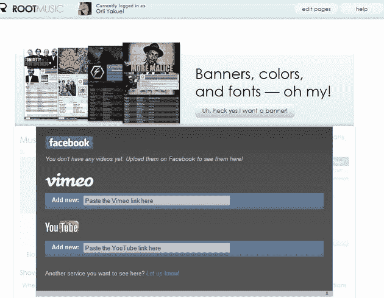
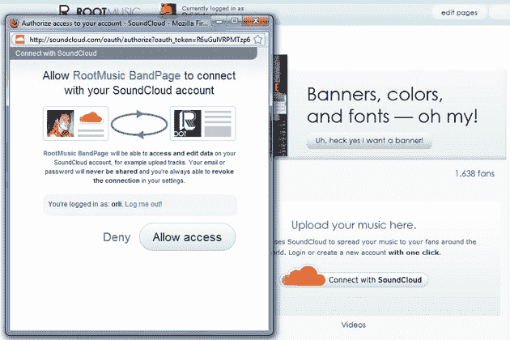
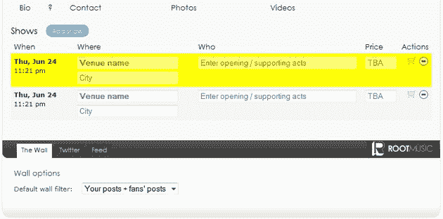
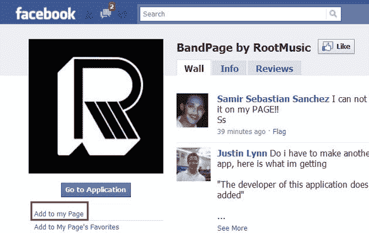
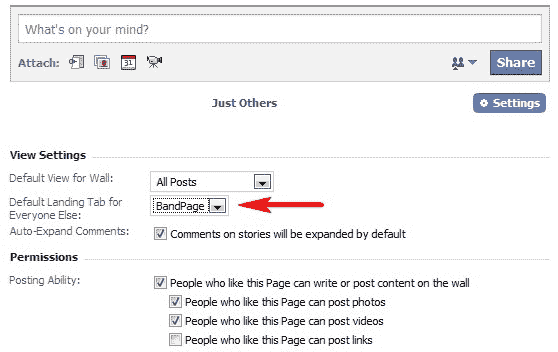
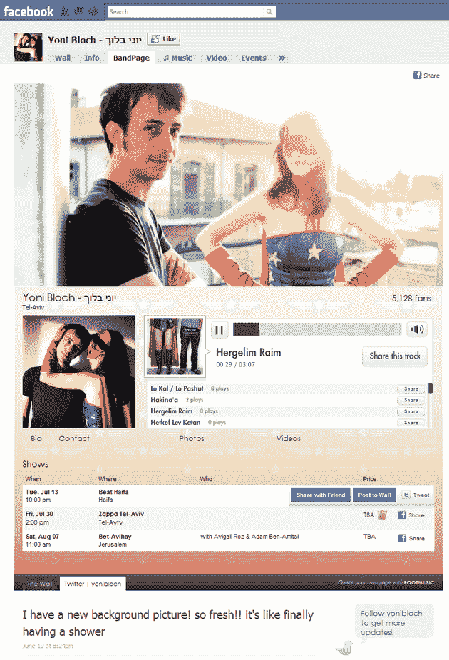

# 音乐家——这就是你如何创建一个好看的脸书页面

> 原文：<https://web.archive.org/web/http://techcrunch.com/2010/06/27/facebook-musicians-page/>

和你们大多数人一样，我也喜欢[脸书](https://web.archive.org/web/20230203010732/http://www.crunchbase.com/company/facebook)，自从我的上一篇 TechCrunch 帖子([如何建立吸引人的独一无二的脸书粉丝页面](https://web.archive.org/web/20230203010732/https://techcrunch.com/2010/03/28/how-to-build-engaging-one-of-kind-facebook-fan-pages/))以来，我一直在探索并试图找到改进页面创建过程的新方法。这一次，我想着重给你们当中的音乐家们一个指导。如果你是脸书上有才华的音乐家之一，这个简单的指南会对你大有用处。

首先，你需要注册一个 [SoundCloud](https://web.archive.org/web/20230203010732/http://soundcloud.com/) 账户。不管页面如何，这实际上是一件好事，因为 SoundCloud 是当今质量最好的音乐服务之一。这是一个易于使用的服务，布局优雅，允许你上传你的原创音乐，并让你根据你上传的质量播放文件。如果你质疑这个网站的潜力，请三思，因为像麦克·哈默、莫比等艺术家已经在使用它了。

除了粉丝页面以外的好处，你需要将歌曲上传到 SoundCloud 的原因是，我即将向你介绍的服务通过 SoundCloud 连接，允许你无缝地将所有音乐从 SoundCloud 上传到你的脸书页面。

现在，去[root music](https://web.archive.org/web/20230203010732/http://www.rootmusic.com/)——通过脸书连接注册——在那里你可以选择任何你想编辑的脸书页面。你不会后悔的。

RootMusic 很可能会成为改变脸书音乐面貌的服务(当然，这取决于从长远来看他们能吸引多少人)。是的，这有点像在脸书上放一个 MySpace 页面，但是，这是一个非常需要的功能，而不是我们已经知道和熟悉多年的任何一个网站的功能。

当你在 RootMusic 注册时，你可以选择免费通道，这使你能够用简单的编辑器定制你的页面，也允许你的粉丝在浏览你的照片、视频和巡演日期时听你的音乐。付费版将会给你一个更加丰富的编辑器，可以添加一个独特的横幅来吸引你粉丝的注意力，还有一个添加自定义背景图片的工具箱。而且，对于每月 1.99 美元的非常合理的价格，你可能会考虑付费版本——但同样，这可能取决于你希望你的音乐页面的关注增长速度。

假设你想从免费选项开始——选择它，你会得到一个屏幕，在那里你可以填写一些关于你自己或你的乐队的信息:姓名，地点，简历，联系方式和网站信息等。你会看到 RootMusic 已经直接从你的脸书页面上下载了你现有的照片(所以要确保你已经有一些照片在里面了)。接下来，你可以从 YouTube 或 Vimeo 上传一些视频，同样非常容易:你只需要视频的网址，就可以开始了。

正如我上面提到的，你可以将所有的 SoundCloud 音乐连接到你的脸书页面。该服务生成你的音乐播放列表，并在一个非常漂亮的播放器上显示出来，访问者无需注册或登录任何服务就可以轻松使用。你也可以从你的电脑上传音乐到 SoundCloud 音乐平台。请注意，SoundCloud 是一个专门面向原创音乐人的社区。如果你没有任何合法权利，我不建议你在那里上传音乐。该网站的目的是为音乐家提供一个机会，让他们的音乐被发现和分享，并为其他人探索新的音乐。

添加演出/演出–root music 让您添加演出日期变得极其简单。一切都是可定制的，所有你需要添加的是活动的细节(何时何地谁)和价格。你甚至可以添加一个链接，链接到你的粉丝可以在线购买门票的地方。对我来说，这证明了 RootMusic 真正专注于艺术家真正需要的东西。

RootMusic 还允许你上传你的帖子和粉丝的帖子。您可以选择过滤它们，只显示您的内容。此外，你可以将你的推文以及博客或任何你选择的其他网站的内容进行流式传输。

最后——将所有操作导出到您的页面。

只需进入脸书的[http://www.facebook.com/bandpage](https://web.archive.org/web/20230203010732/http://www.facebook.com/bandpage)，点击左侧边栏的“添加到我的页面”按钮(如下图所示)，选择你想添加到哪个页面。

现在，进入你的页面，点击最后一个标签，带有箭头符号的标签(在一些页面中可能在+符号下面)来查看 RootMusic 标签。点击它，并将其拖动到“信息”选项卡之后的某个位置。

您可能还想做的是，转到您的页面，单击“Wall”选项卡，然后单击“options”链接(在右侧的文本框下)。它会变成一个“设置”按钮，点击那个按钮。将打开一个视图设置-现在只需进入:其他人的默认登录选项卡-并选择“BandPage”选项卡。这将确保任何人在点击“喜欢”按钮之前登陆您的页面，将首先看到您刚刚制作的美丽页面。

虽然 RootMusic 是我最近见过的最有趣的服务之一，特别是因为人们越来越多地试图从他们的脸书页面中获得最大价值，但我仍然认为至少有一件事可能会让个别艺术家感到困惑——标签名称。不知道是不是技术问题，RootMusic 应该让艺人自定义标签，而不是强迫他们都存在于通用的 BandPage 标签下。如果你不能让用户选择标签名称，那就选择既适合乐队又适合艺术家的名字(音乐页面听起来可能很宽泛，但更有意义)。不是每个人都会自动知道“BandPage”标签里有什么。

另一个令人惊讶但却很明显的特征(至少对我来说)是脸书活动和艺术家/乐队自己的活动之间的联系——对我来说，使用像这样一个非常著名和常用的特征并将其结合起来似乎是唯一合乎逻辑的。即使只是作为“添加节目”特征的补充。

无论哪种方式，结果都将是真正惊人的([参见示例](https://web.archive.org/web/20230203010732/http://www.facebook.com/yonibloch))。我几乎为自己不是音乐家而感到难过——我希望我能写这么酷的一页。不过说实话，仅仅是看到 RootMusic 这样的服务就让我有希望在脸书看到更多创新的东西。如果他们是为音乐空间做的，那么肯定有人可以为任何东西创建一个粉丝页面编辑服务。这样我们就不必为了创建自己的网页而如此努力，而且我们会有更多的选择。

【T2