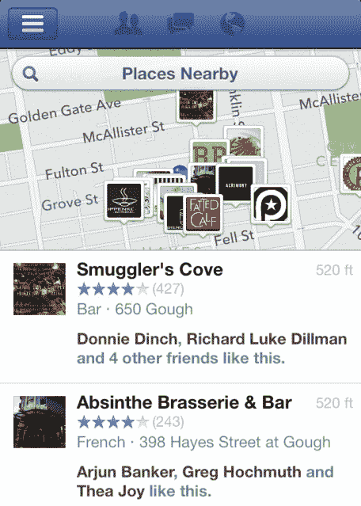

# 手握脸书附近，一个新的本地商业探索功能，挑战 Yelp 和 Foursquare | TechCrunch

> 原文：<https://web.archive.org/web/https://techcrunch.com/2012/12/17/facebook-nearby/>

每个月有 2.5 亿脸书用户在帖子上标注位置。今天[这些数据开始为你工作](https://web.archive.org/web/20230404120606/http://www.facebook-studio.com/news/item/new-ways-for-people-to-discover-your-business-with-nearby)在[脸书的 iOS 和 Android 应用的附近功能](https://web.archive.org/web/20230404120606/http://newsroom.fb.com/News/555/Discover-New-Places-with-Nearby)的一次重大改进中。Nearby 由乔希·威廉姆斯和脸书去年收购的 Gowalla 团队创建，它可以根据你朋友和其他用户的喜欢、签到和推荐，帮助你发现夜生活、购物、餐馆等。

我花了一个周末的时间来测试这项功能，今天晚些时候，这项功能将首先向 1%的用户推出，很快将向所有用户推出。在这里，我将回顾脸书在本地商业发现方面令人印象深刻的首次尝试，讨论它在取悦用户的同时赚钱的潜力，并解释为什么它会给 Yelp 和 Foursquare 等应用带来麻烦。

#### 脸书附近如何工作

从今天开始，当你从脸书的 iOS 或 Android 导航菜单中打开附近标签时，你将不会像以前一样只看到一个登记入住的地点列表。相反，你会看到一份按相关性排序的当地企业和地标列表，脸书认为你会感兴趣。与新闻提要中的故事排序类似，Nearby 会查看大量信号，以确定首先向您显示什么，包括喜欢某个企业、登记入住、留下简短文字推荐或给该地方评级的朋友。

除了全方位的位置列表，你还可以搜索特定的地点或按类别浏览，包括咖啡、酒店、户外和夜生活。还有详细的子类别，所以你可以浏览墨西哥餐馆，早午餐，或运动酒吧，或购物零售商，如服装，电子产品，杂货，或书籍。

结果显示在一个分屏地图和列表上，它们给你提供了大量的背景信息，让你知道你在看什么。每个列表显示了一个企业的名称，类别，个人资料图片，地址，距离，星级，以及喜欢它的朋友的名字。移动或调整地图大小，您可以看到任何地区的最佳结果。

点击其中一个，你会看到脸书全新的移动位置页面设计，可以快速进入营业时间；喜欢、打电话或在某处签到的按钮；其他用户的建议；还有一个巧妙的方法，留下你自己关于最好的菜肴或夜晚的热门建议。如果你想访问，一个方向按钮打开你的设备的默认地图应用程序。你也可以切换查看这个地方最近更新的时间表。

#### 有帮助吗？

是的。附近是一个真正的移动优先界面，设计用于浏览而不是打字。相关性排序算法的效果给我留下了深刻的印象。我很喜欢夜生活，我的朋友也是，所以很高兴看到附近有我喜欢的地方，比如音乐厅和户外酒吧。

通过将排名和推荐与朋友的喜欢和签到结合起来，我不仅知道一个地方是高质量的，而且这是我的风格——这是 Yelp 无法做到的。我不知道离我公寓不远的街上有一家克里奥尔餐馆，但是一个好朋友给了我四星级的赞，在附近找到了我很想尝试的东西。

在你自己的城市，脸书丰富的数据提供了准确的建议，让你了解什么，但当你旅行时，这也可能是一个很大的帮助。你可以跟踪住在你要去的地方的几个你认识的朋友，或者根据陌生人的评价和推荐。脸书在 2011 年年中开始让人们在网上留下推荐，并在一月份通过 T2 的移动网站留下推荐。现在，一旦你决定去一个地方，这些东西就会出现在附近，帮助你弄清楚在那里点什么或者做什么。

当然有一些问题需要解决。“户外”类别的场所有时实际上是室内场所。如果你搜索“墨西哥”，它会显示浏览墨西哥餐馆类别的选项，但是如果你搜索“墨西哥玉米卷”，脸书不知道怎么做它只会给你名字里有“taco”的餐馆。

#### 附近接下来是什么？

现在附近非常静。它甚至没有显示你的朋友目前入住的地方。这种情况必须改变。如果一个朋友在附近登记入住，这应该在结果中显示出来，并作为一个强烈的相关性信号。

脸书事件也是这次经历中缺失的一部分。脸书应该参加我被邀请参加的附近的结果活动，以及我的朋友正在参加的建议活动，这样我就不会错过街区的聚会。

#### 它会对脸书有利吗？

目前，附近没有广告，但脸书肯定有很多方法可以添加广告。最明显的是，脸书可以让企业为结果中的赞助植入付费。“你的业务会出现在第四位，如果收费，它会出现在第一位”。在手机上，人们没有时间做大量的比较，这些广告可以为企业带来大量的客流量和销售额，并成为脸书的重要收入来源。如果你在附近搜索一家企业，类似的广告也会出现。

脸书也可以开始在标准新闻源中加入超本地广告。如果脸书检测到你在它认为与你相关的商家的半英里范围内，它可以向你显示一个链接到那个地方附近移动页面的广告。

#### Yelp、Foursquare 和其他本地探索初创公司应该担心吗？

是的。简而言之，人们已经在脸书上花了这么多时间，他们可能很乐意留在那里寻找当地企业，而不是打开另一个应用程序。本地发现服务只有在拥有大量数据的情况下才有效。Foursquare 仍然只有大约 3000 万用户。脸书的定位服务每月有 2.5 亿用户。它可能没有评论的长尾效应或 Yelp 先进的垃圾邮件防护，但它知道你真正的朋友去了哪里。

该功能也是脸书首次大举进军搜索领域。在 Disrupt，首席执行官马克·扎克伯格通过谈论脸书如何独一无二地解决你通常会问搜索引擎的问题，让投资者垂涎三尺。他举了一个例子，想知道“在过去的六个月里，我的朋友们去了纽约的哪些寿司店，他们喜欢吗？”附近有答案。

最终，人们希望得到他们可以信任的推荐，而这些推荐不会来自陌生人。它们来自你认识的和你品味相同的人——你的朋友。附近让你通过他们的眼睛发现世界。

*要在附近试用，下载上周发布的最新版本的 iOS 版[脸书](https://web.archive.org/web/20230404120606/https://itunes.apple.com/us/app/facebook/id284882215?mt=8)或安卓版[应用](https://web.archive.org/web/20230404120606/https://play.google.com/store/apps/details?id=com.facebook.katana&hl=en)，今天晚些时候尝试滑出导航菜单并点击“附近”*