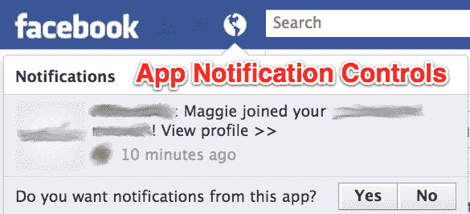
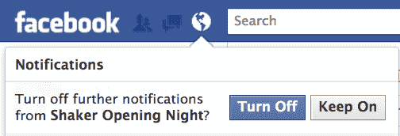
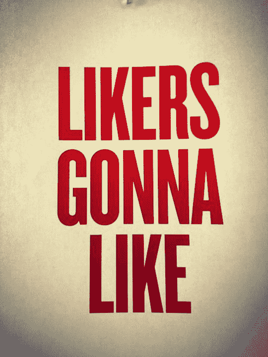

# 脸书继续发货。现在，您可以通过新的通知控制来阻止垃圾应用等 

> 原文：<https://web.archive.org/web/https://techcrunch.com/2012/05/17/facebook-notification-controls/>

# 脸书继续发货。现在，您可以通过新的通知控件来阻止垃圾应用等

如果脸书上有什么东西不停地向你发送通知，告诉它使用脸书新的精细的内嵌通知控件立即关闭。将鼠标悬停在 Facebook.com 主页的全球图标下拉列表中的警报上，然后单击“x”以选择关闭来自您评论的应用程序、群组、事件或帖子的通知。整个下拉菜单有一个漂亮的新外观，你也可以向下滚动到更老的通知。

以前，你必须找到专用的[通知设置页面](https://web.archive.org/web/20221206100440/http://www.facebook.com/settings?tab=notifications)来进行这些更改，并且没有办法关闭特定的警报来源——你必须让所有事件或所有帖子静音。脸书已经和我确认了通知的大部分改变将会在今晚向所有人推出，除了仍在测试中的应用提醒控件。

随着我们积累更多的朋友和应用程序，脸书的通知可能会从令人愉快的指针变成打扰我们生活的恼人的干扰。这些新的控制意味着如果你想要一个更禅意的脸书体验，你可以做到这一点。

[上面的截图是我在更新通知下拉列表中看到的第一个应用。它包含在截图中并不能反映应用程序的质量。]

现在我们中的一些人已经在脸书呆了八年，脸书需要注意耗尽其最活跃的用户。这些人上传照片，创建群组，举办活动，吸引其他更随意地使用社交网络的人。通过提供[通知摘要](https://web.archive.org/web/20221206100440/https://beta.techcrunch.com/2011/09/20/facebook-sends-users-an-email-to-tell-them-its-going-to-send-them-less-email/)而不是单独的电子邮件，它已经在朝着正确的方向前进

如果超级用户对脸书提醒他们小事件的频率感到有点恼火，并且他们不觉得他们有严格的控制，他们可能会逐渐远离并停止产生同样多的内容。这可能会对整体在线时间和参与度产生连锁反应，从而损害脸书的广告业务。

【T2

新的控制措施应该特别有助于平息吵闹的人群。前一分钟有人未经你同意就把你加入了一个群，下一分钟你就会收到几十条关于怪异音乐流派或蹩脚俱乐部之夜的通知。脸书最近使得在群组页面上找到通知控件变得更加容易，但现在你甚至不必访问就可以关闭这些提醒。

[ **更新**:脸书告诉我“改变背后的意图是使用户界面现代化，增加一些功能，帮助用户更容易地消费和管理他们的通知。”]

与

[IPO tomorrow](https://web.archive.org/web/20221206100440/https://beta.techcrunch.com/tag/facebook-ipo/)

，很高兴看到脸书今天推出新功能。看来这件事真的很严重

[message plastered all over](https://web.archive.org/web/20221206100440/https://beta.techcrunch.com/2012/02/02/stay-focused-and-keep-shipping/)

其总部。“保持专注&继续出货”，即使你即将成为纸媒百万富翁。现在它有了一个

[new poster](//web.archive.org/web/20221206100440/http://www.facebook.com/ahaugen/posts/267002940064563)

对于所有憎恨新发现的财富的人来说…

