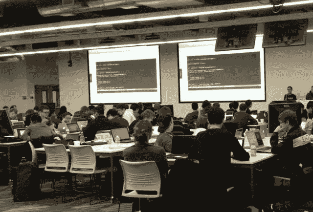

# 脸书推出开放学院，为孩子的开源贡献授予大学学分 TechCrunch

> 原文：<https://web.archive.org/web/https://techcrunch.com/2013/11/13/facebook-open-academy/>

# 脸书启动开放学院，给孩子的开源贡献大学学分

完美的平均绩点并不酷。你知道什么很酷吗？推进开源项目。为了帮助计算机科学专业的学生为就业做准备(并促进其自身的招聘工作)，脸书今天[公开推出了开放学院](https://web.archive.org/web/20221207183306/https://www.facebook.com/notes/facebook-engineering/facebook-open-academy-bringing-open-source-to-cs-curricula/10151806121378920)。与顶级 CS 大学的合作设立了一个特殊的班级，学生可以因为对开源项目做出贡献而获得大学学分。

去年在斯坦福成功试点后，开放学院正在扩展到总共 22 所大学。

开放学院的学生与导师和一个开源项目配对，他们将在这个项目中添加代码。在学期开始时，所有的导师和学生都会来到脸书的门洛帕克总部参加一个密集的开球周末。然后他们在学校的虚拟团队中工作。导师向学生讲授开源知识，审查学生的代码，也可能会讲课。2014 年冬季课程将于 2 月开始。

通过与滑铁卢大学和麻省理工学院等其他大学的试点和“私人测试”，学生们参与了 MongoDB、Mozilla Open Badge、Ruby On Rails 和更多开源项目。此次扩张将该项目引入了包括宾夕法尼亚大学、加州大学伯克利分校和卡内基梅隆大学在内的学校。

该计划可以将孩子们从致力于解决课堂编码难题的理论学生变成构建人们实际使用的系统的现实世界工程师。

“作为一种职业，软件开发有许多不同于作为一门学术学科的计算机科学的特征，”脸书解释道。“项目通常比参与其中的人规模更大；项目管理和人际关系对软件设计的影响不亚于技术问题；系统最终是由用户满意度而不是技术优势来评估的。”

需要说明的是，开放学院并不完全是利他的。毫无疑问，被该项目录取的顶尖计算机科学学生将会在毕业后进入脸书工作。脸书一直在与其他科技巨头争夺顶级工程人才，从计算机科学拨款到大学黑客马拉松，再到开放学院，各种项目都在试图吸引并帮助年轻的代码忍者。